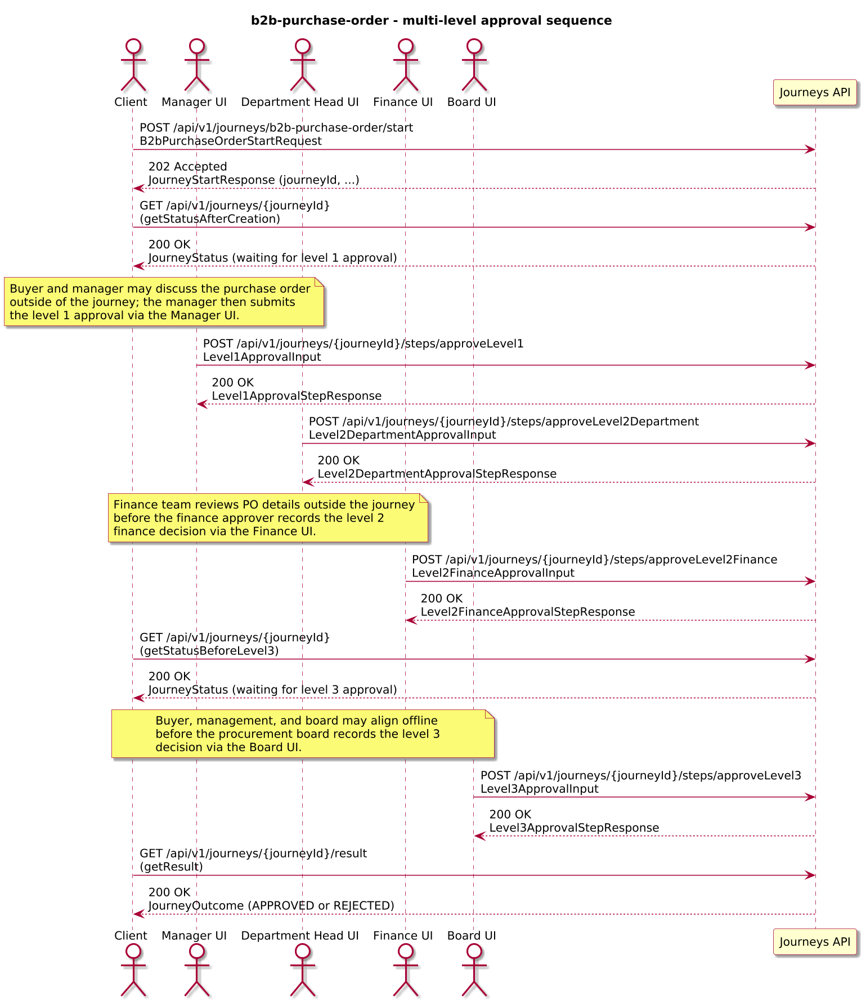
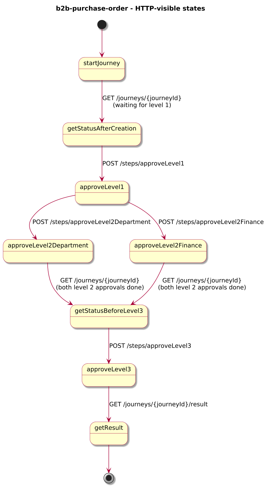
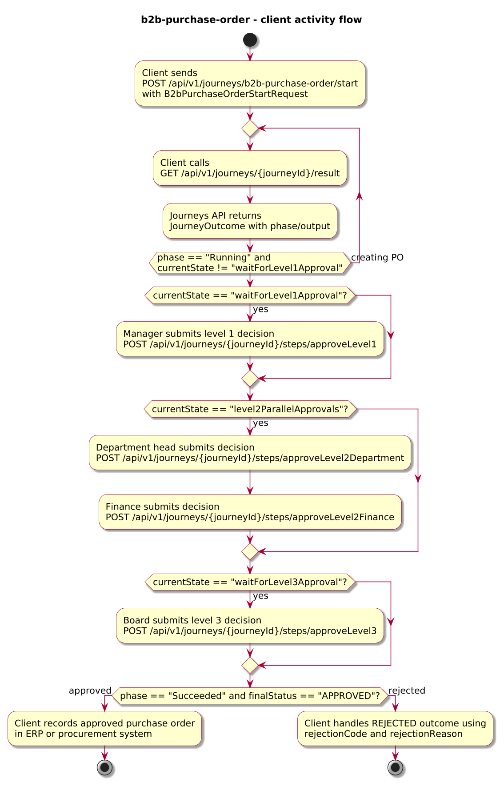
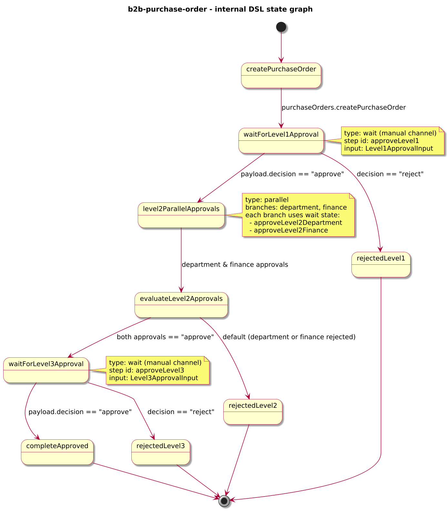

# Journey – b2b-purchase-order

> B2B purchase order journey that creates a purchase order and drives three approval levels (manager, parallel department+finance, procurement board) to an approved or rejected outcome.

## Quick links

| Artifact | File |
|---------|------|
| Journey definition | [b2b-purchase-order.journey.yaml](b2b-purchase-order.journey.yaml) |
| OpenAPI (per-journey) | [b2b-purchase-order.openapi.yaml](b2b-purchase-order.openapi.yaml) |
| Arazzo workflow | [b2b-purchase-order.arazzo.yaml](b2b-purchase-order.arazzo.yaml) |
| Docs (this page) | [b2b-purchase-order.md](b2b-purchase-order.md) |

## Summary

This journey models a multi-level B2B purchase order approval process:

- It creates a purchase order in a Purchase Orders API based on buyer, supplier, and line item details.
- It then collects approvals at three levels: first from a manager, then in parallel from a department head and finance, and finally from a procurement board.
- Any rejection at any level ends the journey with a Failed phase and a level-specific rejection code; a fully approved path ends with an APPROVED outcome.

The journey is long-lived: clients start it once, track progress via status calls, submit approval decisions via dedicated steps for each level, and finally read an outcome that summarises the approval history and whether the purchase order was approved or rejected. Design and scope for this example are captured under Q-014 in `docs/4-architecture/open-questions.md`.

Actors & systems:
- Buyer-side client (for example a purchasing portal or back-office system) that starts the journey and polls status/result.
- Manager, department head, finance, and procurement board users interacting via approval UIs that call the level-specific approval steps.
- Purchase Orders API called by the journey to create and update the purchase order.
- Journeys API as the orchestrator and HTTP surface for start/status/steps/result.

## Contracts at a glance

- **Input schema** – `B2bPurchaseOrderStartRequest` with required `purchaseOrderId`, `buyerId`, `supplierId`, `lineItems[]` (each with `sku`, `quantity`, `unitPrice`); optional `currency`, `requestedDeliveryDate`, `notes`, `channel`.
- **Approval inputs**:
  - `Level1ApprovalInput` – manager approval with `decision: "approve" | "reject"`, optional `comment`.
  - `Level2DepartmentApprovalInput` – department head approval with `decision: "approve" | "reject"`, optional `comment`.
  - `Level2FinanceApprovalInput` – finance approval with `decision: "approve" | "reject"`, optional `comment`.
  - `Level3ApprovalInput` – procurement board approval with `decision: "approve" | "reject"`, optional `comment`.
- **Output schema** – `B2bPurchaseOrderOutcome` exposed via `JourneyOutcome.output` with:
  - `purchaseOrderId`, `finalStatus: APPROVED | REJECTED`, optional `approvals` object summarising each level, plus optional `rejectionCode`, `rejectionReason`.

## Step overview (Arazzo + HTTP surface)

Here’s a breakdown of the steps you’ll call over the Journeys API for the main approved workflow described in `b2b-purchase-order.arazzo.yaml`.

| # | Step ID | Description | Operation ID | Parameters | Success Criteria | Outputs |
|---:|---------|-------------|--------------|------------|------------------|---------|
| 1 | `startJourney` | Start a new `b2b-purchase-order` journey instance (synchronous to the first wait step). | `b2bPurchaseOrder_start` | Body: `startRequest` with purchase order id, buyer/supplier, and line items. | `$statusCode == 200`; `currentState == "waitForLevel1Approval"`. | `JourneyStatus` with `phase` and `currentState`. |
| 2 | `getStatusAfterCreation` | (Optional) Re-fetch status while the journey is waiting for manager approval. | `b2bPurchaseOrder_getStatus` | Path: `journeyId` from step 1 (or from `JourneyStatus.journeyId`). | `$statusCode == 200`; `currentState == "waitForLevel1Approval"`. | `JourneyStatus` with `phase` and `currentState`. |
| 3 | `approveLevel1` | Provide manager approval for the purchase order (level 1). | `b2bPurchaseOrder_approveLevel1` | Path: `journeyId`; body: `level1ApprovalInput`. | `$statusCode == 200`; `JourneyStatus.phase` and `currentState` progress to level 2 parallel approvals. | `Level1ApprovalStepResponse` with projected decision fields. |
| 4 | `approveLevel2Department` | Provide department head approval for the purchase order (level 2 – department). | `b2bPurchaseOrder_approveLevel2Department` | Path: `journeyId`; body: `level2DepartmentApprovalInput`. | `$statusCode == 200`; journey continues while waiting for both level 2 approvals. | `Level2DepartmentApprovalStepResponse` with decision and comment. |
| 5 | `approveLevel2Finance` | Provide finance approval for the purchase order (level 2 – finance). | `b2bPurchaseOrder_approveLevel2Finance` | Path: `journeyId`; body: `level2FinanceApprovalInput`. | `$statusCode == 200`; once both level 2 approvals are in, the journey moves toward level 3. | `Level2FinanceApprovalStepResponse` with decision and comment. |
| 6 | `getStatusBeforeLevel3` | Poll status until the journey is waiting for procurement board approval. | `b2bPurchaseOrder_getStatus` | Path: `journeyId` from step 1. | `$statusCode == 200`; `currentState == "waitForLevel3Approval"`. | `JourneyStatus` indicating level 3 approval can proceed. |
| 7 | `approveLevel3` | Provide procurement board approval for the purchase order (level 3). | `b2bPurchaseOrder_approveLevel3` | Path: `journeyId`; body: `level3ApprovalInput`. | `$statusCode == 200`; `JourneyStatus.phase` becomes `Succeeded` once final approval is applied. | `Level3ApprovalStepResponse` with decision and comment. |
| 8 | `getResult` | Retrieve the final outcome after all approvals have been processed. | `b2bPurchaseOrder_getResult` | Path: `journeyId` from step 1. | `$statusCode == 200`, `phase == "SUCCEEDED"` or `phase == "FAILED"`. | `JourneyOutcome` with `output.finalStatus`, `approvals`, and any `rejectionCode` / `rejectionReason`. |

The second workflow in the Arazzo file shows a rejecting approval path that leads to a REJECTED outcome with a level-specific rejection code.

## Graphical overview

### Sequence diagram

### State diagram

### Activity diagram

## Internal workflow (DSL state graph)

## Implementation notes

- `createPurchaseOrder` calls `purchaseOrders.createPurchaseOrder` to create the purchase order and persist commercial details.
- `waitForLevel1Approval` exposes the `approveLevel1` step for manager approval and records the decision under `approvals.level1`.
- `level2ParallelApprovals` runs department and finance approvals in parallel using two `wait` states; each branch records its decision under `approvals.level2.department` and `approvals.level2.finance`.
- `evaluateLevel2Approvals` requires both department and finance to approve; otherwise the journey fails as `PO_REJECTED_LEVEL2`.
- `waitForLevel3Approval` exposes the `approveLevel3` step for procurement board approval, recorded under `approvals.level3`.
- `completeApproved` completes the journey successfully when all three levels approve; any rejection routes to one of the `PO_REJECTED_LEVEL*` failure states, which map to `JourneyOutcome.phase = FAILED` with a level-specific error code and reason.
