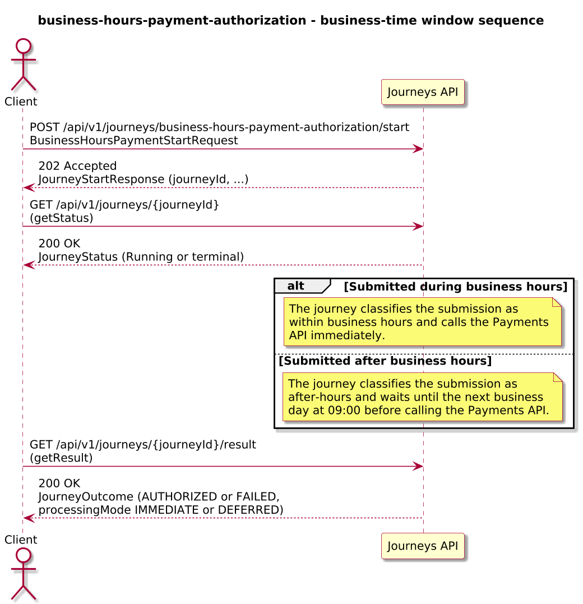
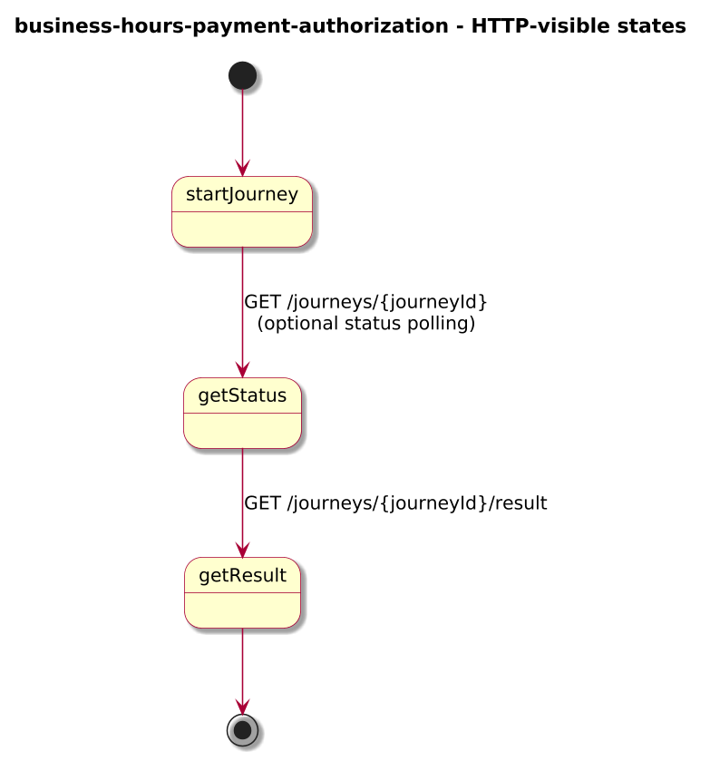
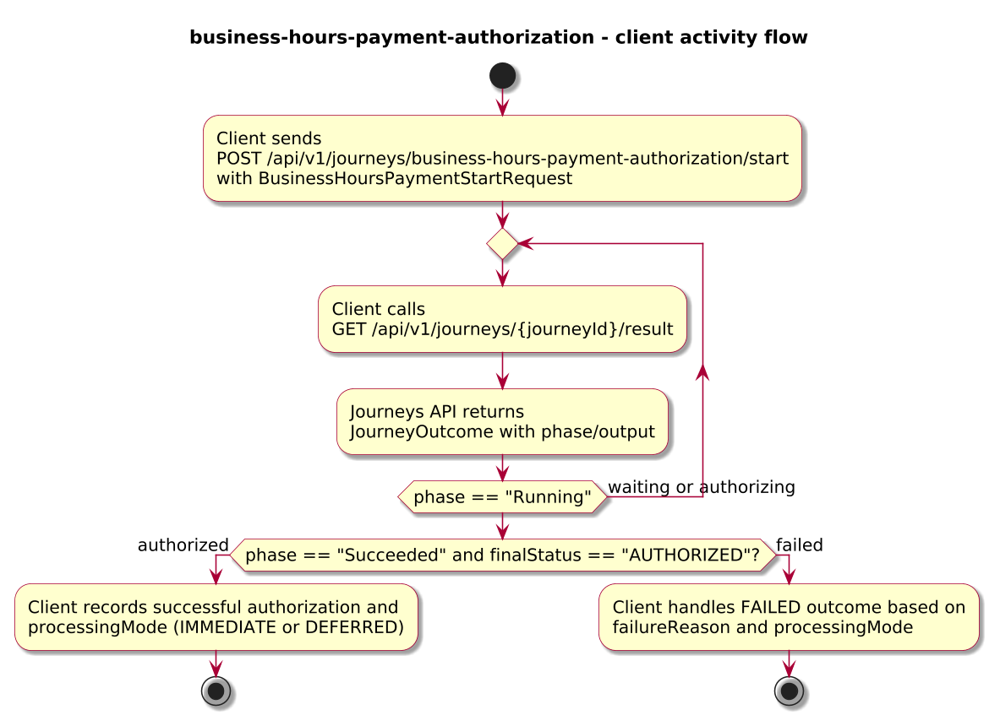
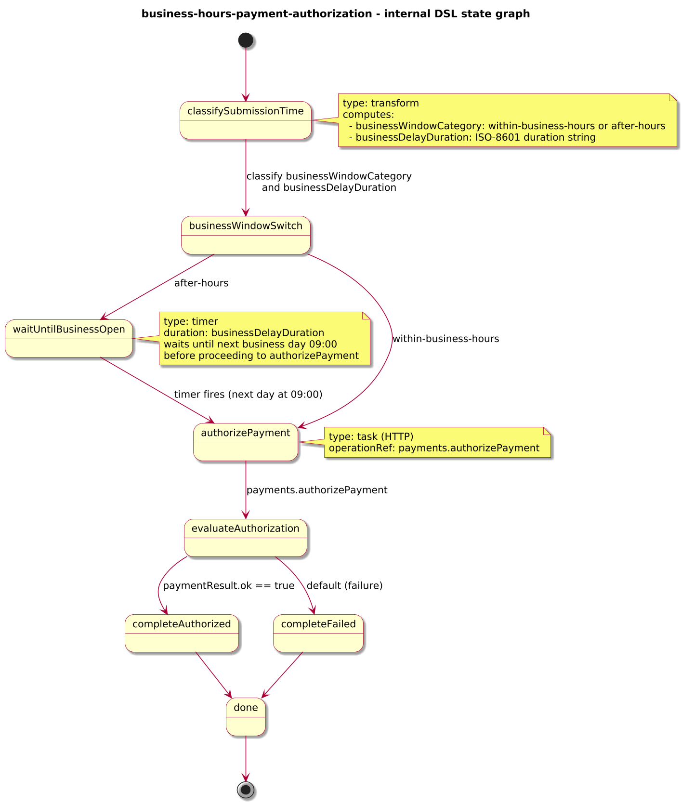

# Journey – business-hours-payment-authorization

> Payment authorization journey that authorizes payments immediately during business hours and defers after-hours submissions until the next business day at 09:00.

## Quick links

| Artifact | File |
|---------|------|
| Journey definition | [business-hours-payment-authorization.journey.yaml](business-hours-payment-authorization.journey.yaml) |
| OpenAPI (per-journey) | [business-hours-payment-authorization.openapi.yaml](business-hours-payment-authorization.openapi.yaml) |
| Arazzo workflow | [business-hours-payment-authorization.arazzo.yaml](business-hours-payment-authorization.arazzo.yaml) |
| Docs (this page) | [business-hours-payment-authorization.md](business-hours-payment-authorization.md) |

## Summary

This journey models a simple business-time window around payment authorization:

- It receives a payment authorization request with `paymentId`, `customerId`, `amount`, and `currency`.
- If the request arrives during business hours (09:00–17:00 in the engine’s local time), it authorizes the payment immediately.
- If the request arrives outside business hours, it waits until the next business day at 09:00 before calling the Payments API to authorize the payment.

The journey is long-lived: clients start it once, optionally inspect status while the payment is waiting for business hours, and finally read an outcome that indicates whether the payment was authorized or failed, and whether it was processed immediately or after deferral.

Actors & systems:
- Client or backend service that starts the journey and polls status/result.
- Payments API called by the journey to authorize the payment.
- Journeys API as the orchestrator and HTTP surface for start/status/result.

## Contracts at a glance

- **Input schema** – `BusinessHoursPaymentStartRequest` with required `paymentId`, `customerId`, `amount`, `currency`; optional `channel`.
- **Output schema** – `BusinessHoursPaymentOutcome` exposed via `JourneyOutcome.output` with:
  - `paymentId`, `finalStatus: AUTHORIZED | FAILED`, `processingMode: IMMEDIATE | DEFERRED`, optional `authorizedAt`, `failureReason`.

## Step overview (Arazzo + HTTP surface)

Here’s a breakdown of the steps you’ll call over the Journeys API for the main workflows described in `business-hours-payment-authorization.arazzo.yaml`.

### Payment during business hours

| # | Step ID | Description | Operation ID | Parameters | Success Criteria | Outputs |
|---:|---------|-------------|--------------|------------|------------------|---------|
| 1 | `startJourney` | Start a new `business-hours-payment-authorization` journey instance (synchronous). | `businessHoursPaymentAuthorization_start` | Body: `startRequest` with payment details submitted during business hours. | `$statusCode == 200`, `phase == "SUCCEEDED"` or `phase == "FAILED"`. | `JourneyOutcome` with `output.finalStatus` and `processingMode = "IMMEDIATE"`. |
| 2 | `getStatusBeforeAuthorization` | (Optional) Re-fetch status shortly after start to confirm that the payment is ready to authorize. | `businessHoursPaymentAuthorization_getStatus` | Path: `journeyId` from step 1 (or from `JourneyOutcome.journeyId`). | `$statusCode == 200`; `phase` is `Running` or already `Succeeded` depending on timing. | `JourneyStatus` with `phase` and `currentState`. |
| 3 | `getResult` | (Optional) Re-fetch the final outcome once authorization has completed. | `businessHoursPaymentAuthorization_getResult` | Path: `journeyId` from step 1 (or from `JourneyOutcome.journeyId`). | `$statusCode == 200`, `phase == "SUCCEEDED"` or `phase == "FAILED"`. | `JourneyOutcome` with `output.finalStatus` and `processingMode = "IMMEDIATE"`. |

### Payment after business hours

| # | Step ID | Description | Operation ID | Parameters | Success Criteria | Outputs |
|---:|---------|-------------|--------------|------------|------------------|---------|
| 1 | `startJourney` | Start a new `business-hours-payment-authorization` journey instance (synchronous). | `businessHoursPaymentAuthorization_start` | Body: `startRequest` with payment details submitted after business hours. | `$statusCode == 200`, `phase == "RUNNING"` or `"SUCCEEDED"` depending on timing; for the deferral path, `currentState` reflects the timer/wait state. | `JourneyOutcome` or `JourneyStatus` depending on whether authorization has already completed. |
| 2 | `getStatusDuringDeferral` | Poll status while the payment is waiting for the next business day at 09:00. | `businessHoursPaymentAuthorization_getStatus` | Path: `journeyId` from step 1 (or from `JourneyOutcome.journeyId`). | `$statusCode == 200`; `phase == "RUNNING"` and `currentState` indicates the waiting state. | `JourneyStatus` with `phase` and `currentState`. |
| 3 | `getResult` | (Optional) Re-fetch the final outcome after the deferral window has passed and authorization has completed. | `businessHoursPaymentAuthorization_getResult` | Path: `journeyId` from step 1 (or from `JourneyOutcome.journeyId`). | `$statusCode == 200`, `phase == "SUCCEEDED"` or `phase == "FAILED"`. | `JourneyOutcome` with `output.finalStatus` and `processingMode = "DEFERRED"`. |

## Graphical overview

### Sequence diagram

### State diagram

### Activity diagram

## Internal workflow (DSL state graph)

## Implementation notes

- `classifySubmissionTime` uses the engine’s current time to classify the request as within or outside business hours (09:00–17:00) and computes a delay duration when needed.
- `businessWindowSwitch` routes directly to `authorizePayment` for in-hours submissions, or to `waitUntilBusinessOpen` for after-hours submissions.
- `waitUntilBusinessOpen` uses a `timer` with the computed duration to wait until the next business day’s 09:00 (for this example, “next business day” is modelled as “next day” and does not skip weekends).
- `authorizePayment` calls `payments.authorizePayment` to authorize the payment.
- `evaluateAuthorization` determines whether the authorization succeeded and routes to `completeAuthorized` or `completeFailed`.
- `completeAuthorized` and `completeFailed` build the `BusinessHoursPaymentOutcome` with `processingMode` set to `IMMEDIATE` or `DEFERRED` based on the original classification.
