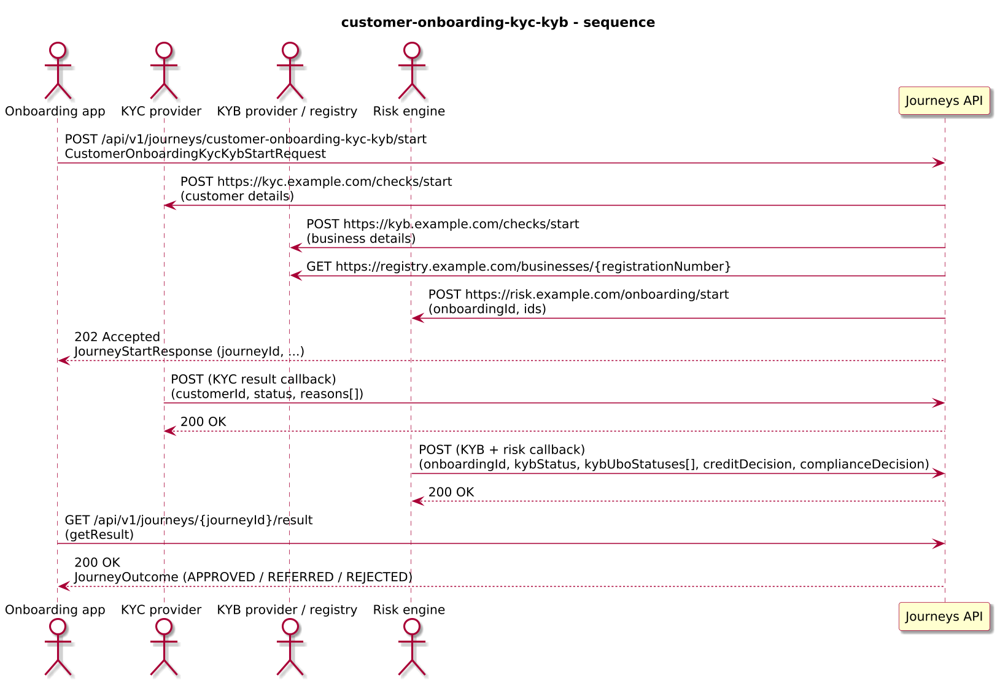
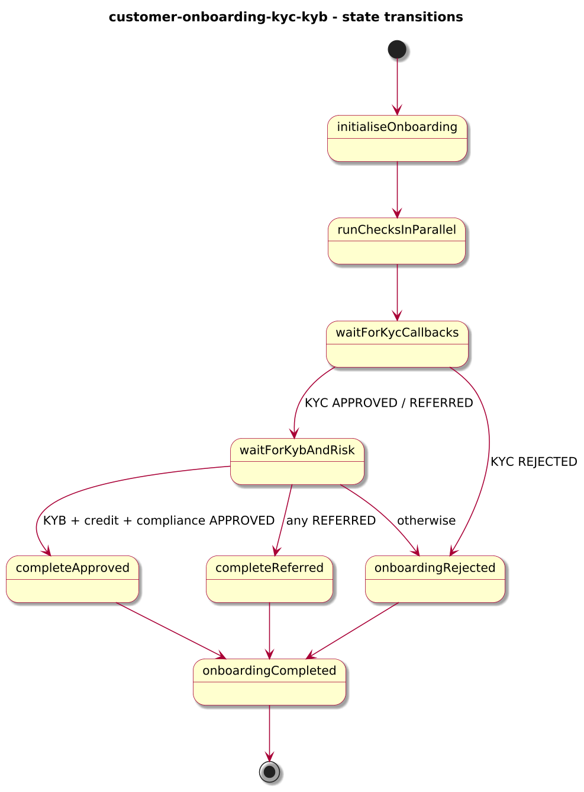
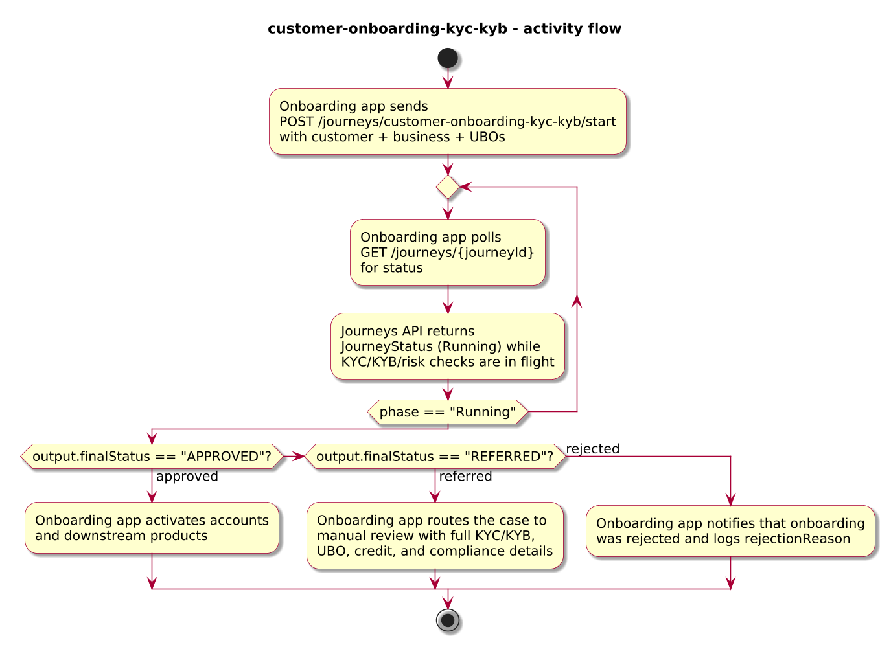

# Journey – customer-onboarding-kyc-kyb

> Combined individual KYC + business KYB onboarding journey with parallel checks, per-UBO status, and separate credit vs compliance decisions.

## Quick links

| Artifact | File |
|---------|------|
| Journey definition | [customer-onboarding-kyc-kyb.journey.yaml](customer-onboarding-kyc-kyb.journey.yaml) |
| OpenAPI (per-journey) | [customer-onboarding-kyc-kyb.openapi.yaml](customer-onboarding-kyc-kyb.openapi.yaml) |
| Arazzo workflow | [customer-onboarding-kyc-kyb.arazzo.yaml](customer-onboarding-kyc-kyb.arazzo.yaml) |
| Docs (this page) | [customer-onboarding-kyc-kyb.md](customer-onboarding-kyc-kyb.md) |

## Summary

This journey models a combined onboarding flow for an individual customer and their business (KYB):

- Each journey instance is identified by `onboardingId` and covers both:
  - **KYC** checks for the individual customer, and
  - **KYB** checks for the business entity and its UBOs.
- It runs:
  - A KYC provider,
  - A KYB provider + corporate registry lookup, and
  - A risk engine that produces separate `creditDecision` and `complianceDecision`,
  in parallel.
- It collects callbacks:
  - A KYC result callback.
  - A combined KYB + risk callback that includes per-UBO statuses, credit decision, and compliance decision.
- It aggregates these into:
  - A top-level `finalStatus: APPROVED | REFERRED | REJECTED`.
  - Per-UBO statuses and reasons.
  - Separate `creditDecision` and `complianceDecision` objects.

Actors & systems:
- Client or onboarding system that starts the journey and reads the final outcome.
- KYC provider that returns individual KYC results via callback.
- KYB provider and corporate registry used for business checks.
- Risk engine that aggregates credit and compliance decisions.
- Journeys API as the orchestrator and HTTP surface for start/status/result.

## Contracts at a glance

- **Input schema** – `CustomerOnboardingKycKybStartRequest` with required:
  - `onboardingId: string`.
  - `customer` object:
    - `customerId`, `fullName`, `email` (required).
    - optional `dateOfBirth`, `nationality`.
  - `business` object:
    - `businessId`, `legalName`, `country` (required).
    - optional `registrationNumber`.
    - `ubos[]` with each UBO having `uboId`, `fullName`, optional `ownershipPercent`, `country`.
- **Output schema** – `CustomerOnboardingKycKybOutcome` via `JourneyOutcome.output` with:
  - `onboardingId`, `customerId`, `businessId`.
  - `finalStatus: "APPROVED" | "REFERRED" | "REJECTED"`.
  - `kycResult`, `kybResult`.
  - `ubos[]` with `uboId`, `fullName`, `status: "APPROVED" | "REFERRED" | "REJECTED"`, and `reasons[]`.
  - `creditDecision`, `complianceDecision`.
  - optional `rejectionReason` for rejected outcomes.

## Step overview (Arazzo + HTTP surface)

The Arazzo workflow `customer-onboarding-kyc-kyb.arazzo.yaml` focuses on start/status/result; callbacks are represented conceptually rather than as concrete step paths.

| # | Step ID | Description | Operation ID | Parameters | Success Criteria | Outputs |
|---:|---------|-------------|--------------|------------|------------------|---------|
| 1 | `startJourney` | Start a new `customer-onboarding-kyc-kyb` journey instance. | `customerOnboardingKycKyb_start` | Body: `startRequest` with customer + business details and UBOs. | `$statusCode == 202` and a `journeyId` is returned. | `journeyId` for the onboarding instance. |
| 2 | `getStatusRunning` | Optional status check while KYC, KYB, registry, and risk checks are in progress. | `customerOnboardingKycKyb_getStatus` | Path: `journeyId` from step 1. | `$statusCode == 200`; `phase == "Running"`. | `JourneyStatus` with `phase` and `currentState`. |
| 3 | `getResult` | Retrieve the final APPROVED, REFERRED, or REJECTED outcome. | `customerOnboardingKycKyb_getResult` | Path: `journeyId` from step 1. | `$statusCode == 200`, `phase == "Succeeded"` or `phase == "Failed"`. | `JourneyOutcome` with `CustomerOnboardingKycKybOutcome`. |

Network flows for the external providers (KYC, KYB, registry, risk) are described conceptually in the Implementation notes rather than surfaced as separate Arazzo steps.

## Graphical overview

### Sequence diagram

### State diagram

### Activity diagram

## Internal workflow (DSL state graph)

## Implementation notes

- `initialiseOnboarding`:
  - Copies `onboardingId`, `customerId`, and `businessId` into top-level context.
  - Initialises `ubos[]` from `business.ubos[]` with default `status: "REFERRED"` and empty `reasons[]` until KYB results arrive.
- `runChecksInParallel` (`type: parallel`):
  - `kyc` branch: starts individual KYC checks via HTTP task.
  - `kybAndRegistry` branch: starts KYB checks and performs a registry lookup.
  - `creditAndCompliance` branch: starts an aggregated risk request that will eventually produce `creditDecision` + `complianceDecision`.
- `waitForKycCallbacks`:
  - Webhook that updates `kycResult` in context.
  - Only when KYC status is `APPROVED` or `REFERRED` does onboarding proceed to `waitForKybAndRisk`; a direct rejection flows to `onboardingRejected`.
- `waitForKybAndRisk`:
  - Webhook that carries:
    - Overall `kybStatus`.
    - Per-UBO statuses and reasons.
    - `creditDecision` and `complianceDecision` objects.
  - Merges the incoming UBO statuses into `context.ubos`.
  - Branches:
    - When KYB is approved and both `creditDecision.overallStatus` and `complianceDecision.overallStatus` are `APPROVED`, the journey routes to `completeApproved`.
    - When any of KYB, credit, or compliance indicates `REFERRED`, the journey routes to `completeReferred`.
    - Any other combination goes to `onboardingRejected`.
- `completeApproved` / `completeReferred` / `onboardingRejected`:
  - Build `CustomerOnboardingKycKybOutcome` with `finalStatus` set appropriately, plus:
    - `kycResult`, `kybResult`, merged `ubos`, and `creditDecision` / `complianceDecision`.
- `onboardingCompleted`:
  - `succeed` state that returns the built outcome via `outputVar: outcome`.

