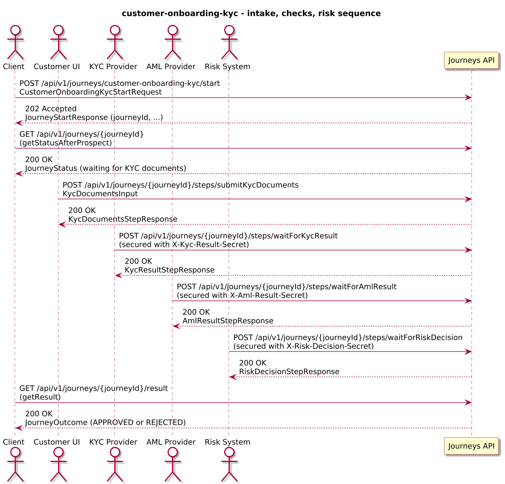
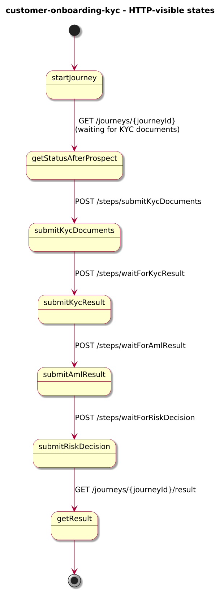
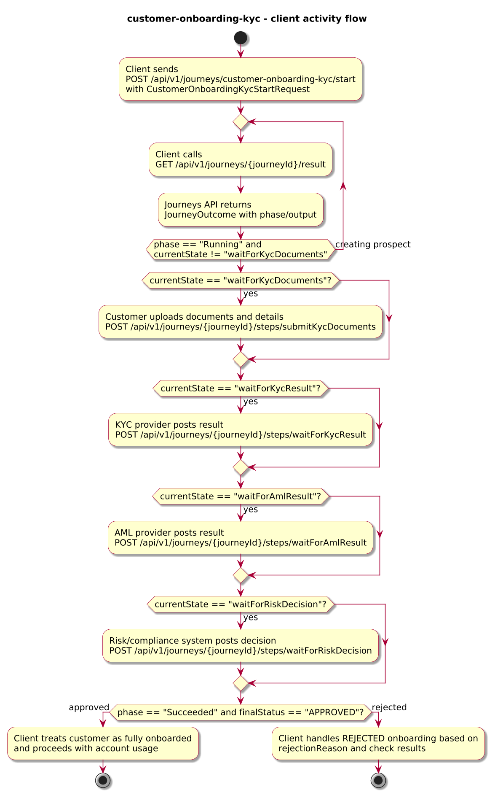

# Journey – customer-onboarding-kyc

> Customer onboarding journey for an individual that collects KYC documents, runs external KYC and AML checks, applies a risk/compliance decision, and provisions an account.

## Quick links

| Artifact | File |
|---------|------|
| Journey definition | [customer-onboarding-kyc.journey.yaml](customer-onboarding-kyc.journey.yaml) |
| OpenAPI (per-journey) | [customer-onboarding-kyc.openapi.yaml](customer-onboarding-kyc.openapi.yaml) |
| Arazzo workflow | [customer-onboarding-kyc.arazzo.yaml](customer-onboarding-kyc.arazzo.yaml) |
| Docs (this page) | [customer-onboarding-kyc.md](customer-onboarding-kyc.md) |

## Summary

This journey models individual customer onboarding with multi-party checks:

- It creates an initial prospect record in a Customers API.
- It collects KYC documents and additional details from the customer.
- It starts external KYC and AML checks in parallel.
- It receives KYC and AML results via webhooks, followed by a risk/compliance decision via another webhook.
- On approval, it creates an account for the customer.

The journey is long-lived: clients start it once, track progress via status calls, submit KYC documents via a dedicated step, and then let KYC/AML providers and a risk/compliance system drive the remaining steps via webhooks. The final outcome summarises whether onboarding was approved or rejected, and includes check results and provisioning details.

Actors & systems:
- Onboarding client (for example a customer portal or mobile app) that starts the journey, uploads KYC documents, and polls status/result.
- KYC and AML providers that send results via secured webhooks into the journey.
- Risk/compliance system that posts the final risk decision via webhook.
- Customers API called by the journey to create and update the customer record.
- Accounts or core banking API called by the journey to provision accounts when onboarding is approved.
- Journeys API as the orchestrator and HTTP surface for start/status/steps/webhooks/result.

## Contracts at a glance

- **Input schema** – `CustomerOnboardingKycStartRequest` with required `customerId`, `fullName`, `email`; optional `dateOfBirth`, `nationality`, `channel`.
- **Step inputs**:
  - `KycDocumentsInput` – customer documents and details with `decision: "submit"`, optional `documents[]`, `notes`.
  - Webhook payloads:
    - KYC result – `status: APPROVED | REFERRED | REJECTED`, `reasons[]`.
    - AML result – `status: CLEAR | REFERRED | REJECTED`, `reasons[]`.
    - Risk decision – `decision: APPROVE | REJECT`, optional `riskRating`, `reason`.
- **Output schema** – `CustomerOnboardingKycOutcome` exposed via `JourneyOutcome.output` with:
  - `customerId`, `finalStatus: APPROVED | REJECTED`, optional `kycResult`, `amlResult`, `riskDecision`, `customerRecord`, `account`, `rejectionReason`.

## Step overview (Arazzo + HTTP surface)

Here’s a breakdown of the steps you’ll call over the Journeys API for the main approved workflow described in `customer-onboarding-kyc.arazzo.yaml`.

| # | Step ID | Description | Operation ID | Parameters | Success Criteria | Outputs |
|---:|---------|-------------|--------------|------------|------------------|---------|
| 1 | `startJourney` | Start a new `customer-onboarding-kyc` journey instance (synchronous to the first wait/webhook step). | `customerOnboardingKyc_start` | Body: `startRequest` with basic identity data. | `$statusCode == 200`; `phase == "RUNNING"` and `currentState == "waitForKycDocuments"` once the prospect has been created. | `JourneyStatus` with `phase` and `currentState`. |
| 2 | `getStatusAfterProspect` | (Optional) Re-fetch status while the journey is waiting for KYC documents. | `customerOnboardingKyc_getStatus` | Path: `journeyId` from step 1 (or from `JourneyStatus.journeyId`). | `$statusCode == 200`; `currentState == "waitForKycDocuments"`. | `JourneyStatus` with `phase` and `currentState`. |
| 3 | `submitKycDocuments` | Provide KYC documents and additional details from the customer. | `customerOnboardingKyc_submitKycDocuments` | Path: `journeyId`; body: `kycDocumentsInput`. | `$statusCode == 200`; journey starts external checks. | `KycDocumentsStepResponse` with projected decision and notes. |
| 4 | `submitKycResult` | Provide KYC provider result via webhook. | `customerOnboardingKyc_waitForKycResult` | Path: `journeyId`; header: `X-Kyc-Result-Secret`; body: `kycResultInput`. | `$statusCode == 200`; `JourneyStatus.phase` advances to waiting for AML result. | `KycResultStepResponse` with status and reasons. |
| 5 | `submitAmlResult` | Provide AML provider result via webhook. | `customerOnboardingKyc_waitForAmlResult` | Path: `journeyId`; header: `X-Aml-Result-Secret`; body: `amlResultInput`. | `$statusCode == 200`; `JourneyStatus.phase` advances to waiting for risk decision. | `AmlResultStepResponse` with status and reasons. |
| 6 | `submitRiskDecision` | Provide risk/compliance decision via webhook. | `customerOnboardingKyc_waitForRiskDecision` | Path: `journeyId`; header: `X-Risk-Decision-Secret`; body: `riskDecisionInput`. | `$statusCode == 200`; journey proceeds to account creation or rejection. | `RiskDecisionStepResponse` with decision, riskRating, and reason. |
| 7 | `getResult` | Retrieve the final outcome after account provisioning or rejection. | `customerOnboardingKyc_getResult` | Path: `journeyId` from step 1. | `$statusCode == 200`, `phase == "SUCCEEDED"` or `phase == "FAILED"`. | `JourneyOutcome` with `output.finalStatus`, check results, and any account details. |

The second workflow in the Arazzo file shows a direct rejection path driven by the risk decision.

## Graphical overview

### Sequence diagram

### State diagram

### Activity diagram

## Internal workflow (DSL state graph)

## Implementation notes

- `createProspect` calls `customers.createCustomer` to create a prospect record using basic identity data.
- `waitForKycDocuments` exposes the `submitKycDocuments` step and records uploaded documents and notes.
- `triggerChecks` is a `parallel` state that starts external KYC and AML checks using `startKycCheck` and `startAmlScreening`.
- `waitForKycResult` and `waitForAmlResult` are `webhook` states secured by shared secrets that record KYC/AML results and gate progression.
- `waitForRiskDecision` is a `webhook` state for risk/compliance decisions; APPROVE leads to `createAccount`, REJECT leads to `ONBOARDING_REJECTED`.
- `createAccount` calls `accounts.createAccount` to provision an account for the customer; `completeApproved` completes the journey with an APPROVED outcome.
