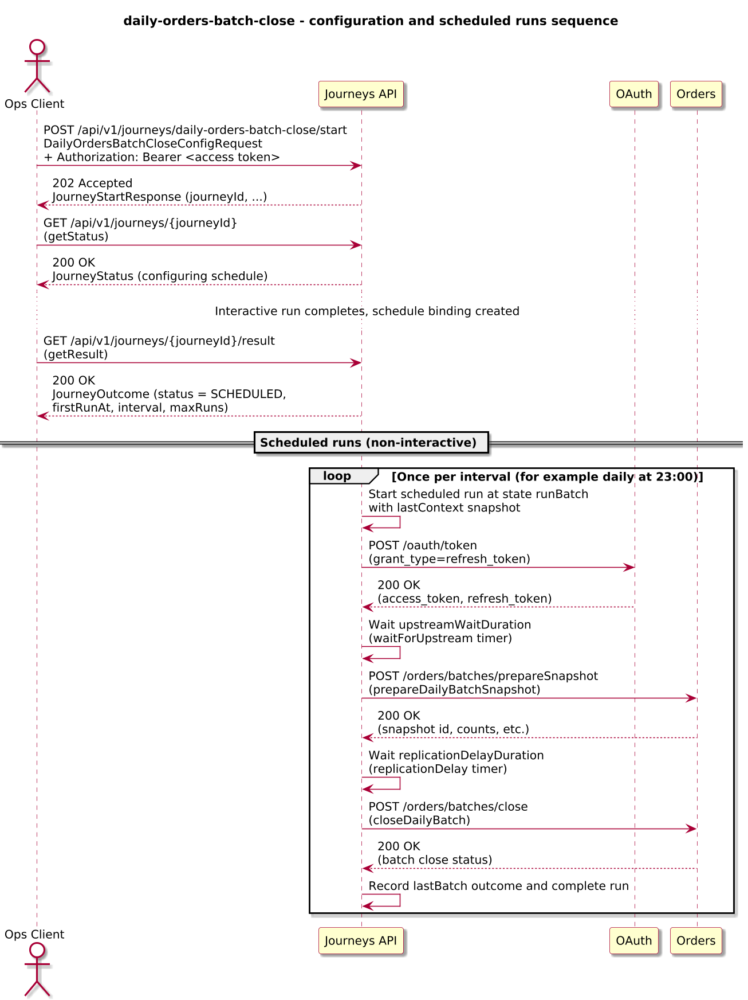
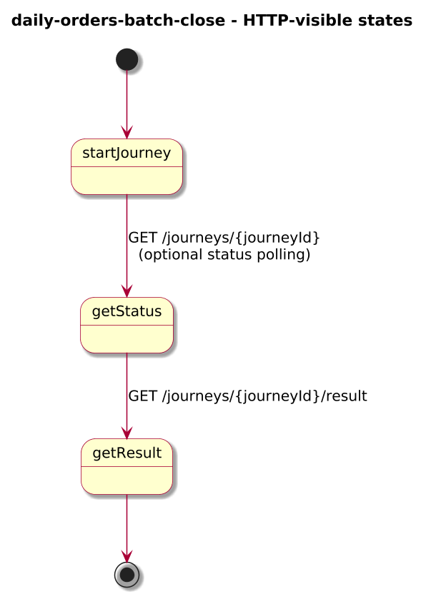
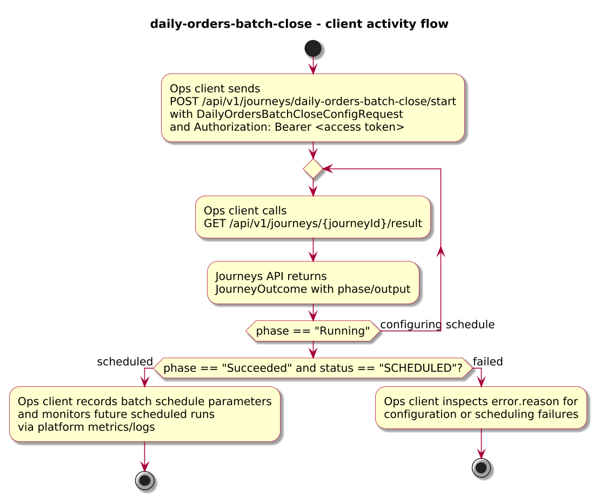
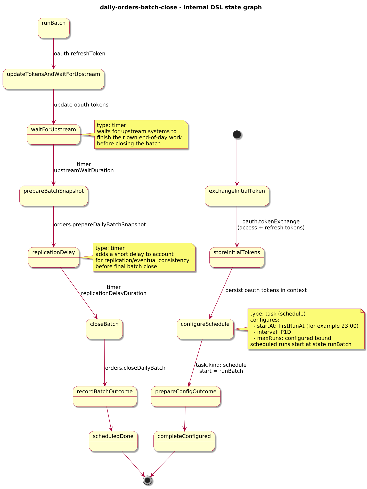

# Journey – daily-orders-batch-close

> Daily orders batch-close journey that configures a scheduled end-of-day run, exchanges the caller's access token for OAuth access/refresh tokens, and uses token refresh in scheduled runs to close the batch after upstream systems and replication have caught up.

## Quick links

| Artifact | File |
|---------|------|
| Journey definition | [daily-orders-batch-close.journey.yaml](daily-orders-batch-close.journey.yaml) |
| OpenAPI (per-journey) | [daily-orders-batch-close.openapi.yaml](daily-orders-batch-close.openapi.yaml) |
| Arazzo workflow | [daily-orders-batch-close.arazzo.yaml](daily-orders-batch-close.arazzo.yaml) |
| Docs (this page) | [daily-orders-batch-close.md](daily-orders-batch-close.md) |

## Summary

This journey models a daily end-of-day batch-close for orders:

- An interactive run configures the batch for a tenant and batch id, exchanges the caller's access token (from the Authorization header) for OAuth access/refresh tokens, and schedules daily non-interactive runs starting at a configured time (for example 23:00).
- Each scheduled run refreshes the OAuth access token using the stored refresh token, waits for upstream systems to finish their own processing, accounts for a replication/consistency delay, and only then calls an Orders API to prepare a batch snapshot and close the batch.

The journey is long-lived: clients configure it once, then rely on the scheduler to trigger daily batch-close runs without direct interaction, while the journey evolves its `context` across runs (including updated OAuth tokens and last batch status).

Actors & systems:
- Operations or configuration UI that starts the journey, supplies batch parameters, and polls status/result for the configuration run.
- OAuth server that exchanges the caller's access token for access/refresh tokens and later refreshes the access token from the refresh token.
- Orders API called by scheduled runs to prepare batch snapshots and close the batch.
- Journeys API as the orchestrator and HTTP surface for start/status/result.

## Contracts at a glance

- **Config input** – `DailyOrdersBatchCloseConfigRequest` with required `tenantId`, `batchId`, `firstRunAt` (RFC 3339 timestamp, typically 23:00 local), `interval` (ISO-8601 duration, for example `P1D`), `maxRuns`; optional `upstreamWaitDuration`, `replicationDelayDuration`.
- **Config outcome** – `DailyOrdersBatchCloseConfigOutcome` exposed via `JourneyOutcome.output` (initial run) with:
  - `status: SCHEDULED`, `tenantId`, `batchId`, `firstRunAt`, `interval`, `maxRuns`.
- **Scheduled runs** – non-interactive; their internal state and last batch status are reflected in `context.lastBatch` but do not change the config outcome surface.

## Step overview (Arazzo + HTTP surface)

Here’s a breakdown of the steps you’ll call over the Journeys API for the configuration flow described in `daily-orders-batch-close.arazzo.yaml`.

| # | Step ID | Description | Operation ID | Parameters | Success Criteria | Outputs |
|---:|---------|-------------|--------------|------------|------------------|---------|
| 1 | `startJourney` | Configure and schedule the `daily-orders-batch-close` journey. | `dailyOrdersBatchClose_start` | Body: `startRequest` with tenant/batch parameters; Authorization header carries the caller's access token. | `$statusCode == 202` and a `journeyId` is returned. | `journeyId` for the configuration instance. |
| 2 | `getStatus` | Poll status while token exchange and schedule configuration are in progress. | `dailyOrdersBatchClose_getStatus` | Path: `journeyId` from step 1. | `$statusCode == 200`; `phase` is `Running` until configuration completes. | `JourneyStatus` with `phase` and `currentState`. |
| 3 | `getResult` | Retrieve the configuration outcome once the interactive run has completed. | `dailyOrdersBatchClose_getResult` | Path: `journeyId` from step 1. | `$statusCode == 200`, `phase == "Succeeded"` or `phase == "Failed"`. | `JourneyOutcome` with `output.status = "SCHEDULED"` and batch parameters. |

Scheduled runs are triggered by the scheduler according to the configured `firstRunAt`, `interval`, and `maxRuns`; they do not expose separate steps, but their behaviour is described below.

## Graphical overview

### Sequence diagram

### State diagram

### Activity diagram

## Internal workflow (DSL state graph)

## Implementation notes

- `exchangeInitialToken` calls `oauth.tokenExchange` using the caller's access token (conceptually provided in `context.initialAccessToken` from the Authorization header) to obtain an access token and a refresh token.
- `storeInitialTokens` writes `oauth.accessToken` and `oauth.refreshToken` into `context`.
- `configureSchedule` uses `task.kind: schedule` to configure daily non-interactive runs starting at `firstRunAt` (for example 23:00) with cadence `interval` (for example `P1D`) and bound `maxRuns`; it passes the current `context` (minus the initial access token) as the context snapshot for the first scheduled run.
- `prepareConfigOutcome` and `completeConfigured` build and return the configuration outcome for the interactive run.
- `runBatch` is the entry state for scheduled runs; it calls `oauth.refreshToken` using `context.oauth.refreshToken` to obtain fresh tokens, then updates `context.oauth`.
- `waitForUpstream` is a timer that waits `upstreamWaitDuration` (default `PT15M`) after the scheduled start time to give upstream systems time to finish their own end-of-day work.
- `prepareBatchSnapshot` calls `orders.prepareDailyBatchSnapshot` with the current OAuth access token to compute a batch snapshot for the tenant and batch id.
- `replicationDelay` is a timer that waits `replicationDelayDuration` (default `PT5M`) before the final close to account for eventual consistency/replication.
- `closeBatch` calls `orders.closeDailyBatch` with the snapshot id and OAuth access token to close the batch.
- `recordBatchOutcome` records the last batch status (`context.lastBatch`) for observability across runs; `scheduledDone` completes the scheduled run.
