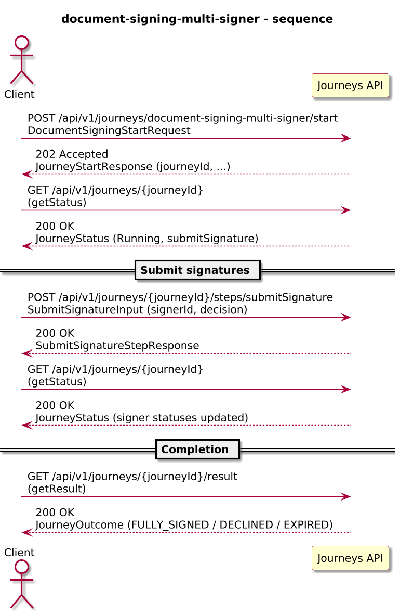
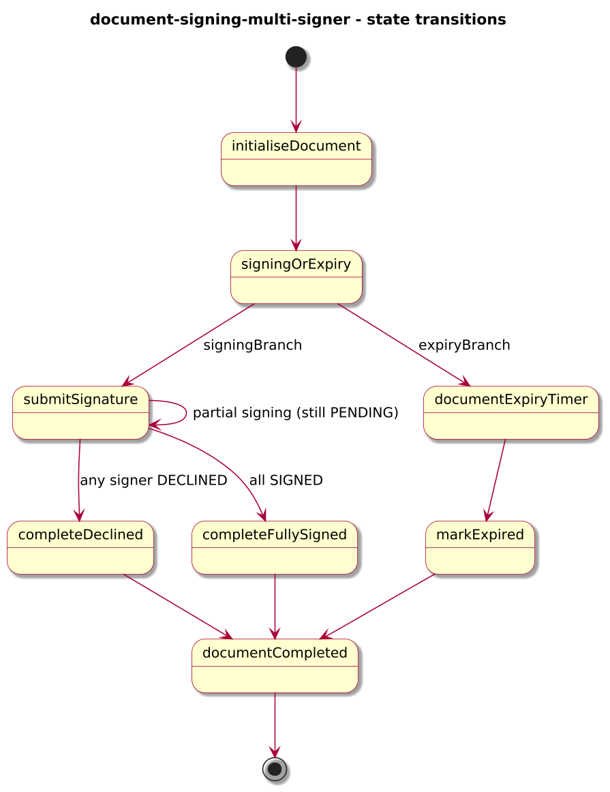
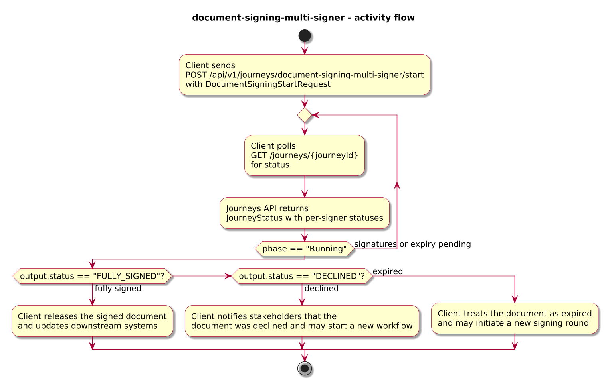
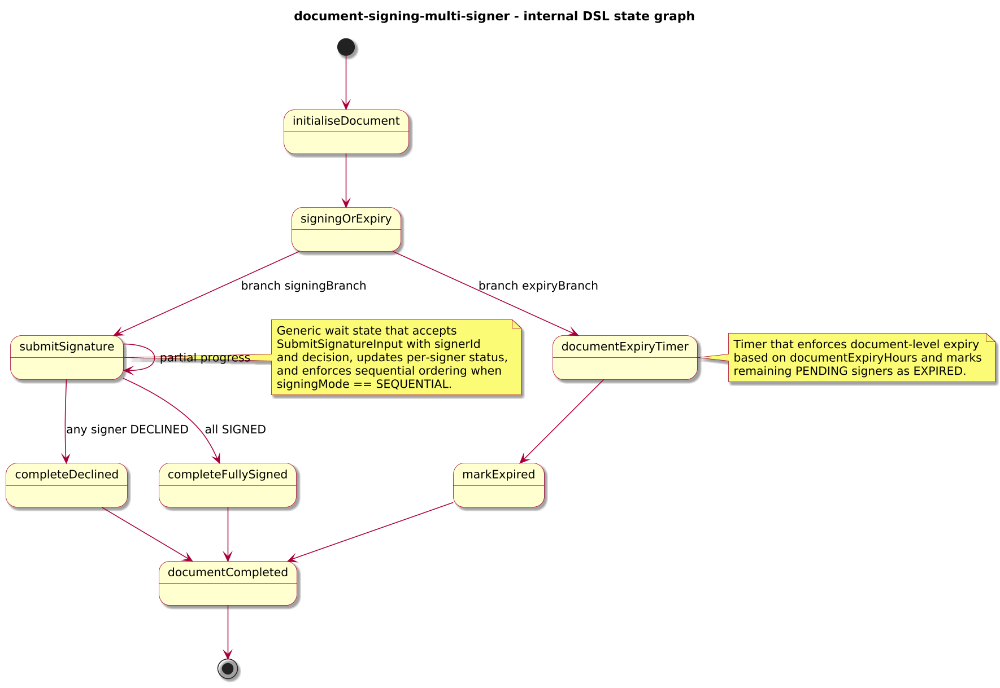

# Journey – document-signing-multi-signer

> Multi-signer document signing journey that supports sequential or parallel signing, a generic submitSignature step, document-level expiry, and per-signer status tracking.

## Quick links

| Artifact | File |
|---------|------|
| Journey definition | [document-signing-multi-signer.journey.yaml](document-signing-multi-signer.journey.yaml) |
| OpenAPI (per-journey) | [document-signing-multi-signer.openapi.yaml](document-signing-multi-signer.openapi.yaml) |
| Arazzo workflow | [document-signing-multi-signer.arazzo.yaml](document-signing-multi-signer.arazzo.yaml) |
| Docs (this page) | [document-signing-multi-signer.md](document-signing-multi-signer.md) |

## Summary

This journey models a document that must be signed by multiple signers:

- Each journey instance represents a single document signing workflow, identified by `documentId`.
- The document can be configured for **sequential** signing (signers must sign in order) or **parallel** signing (signers may sign in any order).
- A single generic `submitSignature` step accepts signer decisions and updates per-signer status in the journey context.
- A document-level expiry window runs in parallel; if the timer fires before all signatures are collected, the document is marked as `EXPIRED` and any remaining signers are recorded as expired.
- Partial signing (some signers signed, others pending) is visible via `JourneyStatus` and the per-signer status fields but is not a separate terminal outcome.
- If any signer declines, the document is immediately marked as `DECLINED`.

Actors & systems:
- Client application (for example a document signing UI or back-office system) that starts the journey, polls status, submits signatures, and reads the final outcome.
- Human signers who interact with the client and whose decisions are submitted via the generic `submitSignature` step.
- Journeys API as the orchestrator and HTTP surface for start/status/steps/result.

## Contracts at a glance

- **Input schema** – `DocumentSigningStartRequest` with required:
  - `documentId: string`
  - `title: string`
  - `signingMode: "SEQUENTIAL" | "PARALLEL"`.
  - `signers: SignerConfig[]` with each signer having:
    - `signerId: string`
    - `email: string`
    - optional `displayName: string`
    - optional `order: integer` (used when `signingMode == "SEQUENTIAL"`).
    - optional `deadlineHours: integer` (metadata; useful for displaying per-signer expectations).
  - optional `documentExpiryHours: integer` (document-level expiry; defaults to 7 days when omitted).
- **Signature input** – `SubmitSignatureInput` for the generic `submitSignature` step:
  - `signerId: string`
  - `decision: "SIGNED" | "DECLINED"`.
  - optional `comment: string`.
- **Output schema** – `DocumentSigningOutcome` via `JourneyOutcome.output` with:
  - `documentId`, `title`.
  - `status: "FULLY_SIGNED" | "DECLINED" | "EXPIRED"`.
  - `signingMode`.
  - optional `expiredAt`, `declinedAt`, `declinedBy`.
  - `signers: SignerStatus[]` capturing each signer’s `signerId`, `email`, optional `displayName`, `status: "PENDING" | "SIGNED" | "DECLINED" | "EXPIRED"`, optional `order`, `deadlineHours`, and `signedAt`.

## Step overview (Arazzo + HTTP surface)

Here’s a breakdown of the main steps you’ll call over the Journeys API as described in `document-signing-multi-signer.arazzo.yaml`.

### Sequential signing

| # | Step ID | Description | Operation ID | Parameters | Success Criteria | Outputs |
|---:|---------|-------------|--------------|------------|------------------|---------|
| 1 | `startJourney` | Start a new `document-signing-multi-signer` journey in SEQUENTIAL mode (synchronous to the first signing/expiry branches). | `documentSigningMultiSigner_start` | Body: `startRequest` with `documentId`, `title`, `signingMode: "SEQUENTIAL"`, ordered signers. | `$statusCode == 200`; `JourneyStatus.currentState` reflects that the journey is waiting at `submitSignature` (with the expiry timer active in parallel). | `JourneyStatus` for the document instance. |
| 2 | `getStatusBeforeSigning` | Optional status check before collecting signatures. | `documentSigningMultiSigner_getStatus` | Path: `journeyId` from step 1 (or from `JourneyStatus.journeyId`). | `$statusCode == 200`; `phase == "Running"` and `currentState == "submitSignature"`. | `JourneyStatus` with `phase` and `currentState`. |
| 3 | `submitSignature` | Submit each signer’s decision in order using the generic step. | `documentSigningMultiSigner_submitSignature` | Path: `journeyId`; body: `SubmitSignatureInput` with `signerId` and `decision`. | `$statusCode == 200`; `phase` remains `Running` until a terminal condition is reached (fully signed, declined, or expired). | `SubmitSignatureStepResponse` extending `JourneyStatus`. |
| 4 | `getResult` | Retrieve the final outcome once all required signatures are collected or the document is declined/expired. | `documentSigningMultiSigner_getResult` | Path: `journeyId` from step 1. | `$statusCode == 200`, `phase == "SUCCEEDED"` or `phase == "FAILED"`. | `JourneyOutcome` with `output.status == "FULLY_SIGNED" \| "DECLINED" \| "EXPIRED"`. |

### Parallel signing with expiry

| # | Step ID | Description | Operation ID | Parameters | Success Criteria | Outputs |
|---:|---------|-------------|--------------|------------|------------------|---------|
| 1 | `startJourney` | Start a new `document-signing-multi-signer` journey in PARALLEL mode (synchronous to the first signing/expiry branches). | `documentSigningMultiSigner_start` | Body: `startRequest` with `documentId`, `title`, `signingMode: "PARALLEL"`, signers, and optional `documentExpiryHours`. | `$statusCode == 200`; `JourneyStatus.currentState` reflects that the journey is waiting at `submitSignature` (with the expiry timer active in parallel). | `JourneyStatus` for the document instance. |
| 2 | `getStatusInProgress` | Poll status while signatures are still being collected. | `documentSigningMultiSigner_getStatus` | Path: `journeyId` from step 1 (or from `JourneyStatus.journeyId`). | `$statusCode == 200`; `phase == "Running"` and `currentState == "submitSignature"`. | `JourneyStatus` with `phase` and `currentState`. |
| 3 | `submitSignature` | Submit signer decisions in any order; a single decline immediately ends the journey as DECLINED. | `documentSigningMultiSigner_submitSignature` | Path: `journeyId`; body: `SubmitSignatureInput`. | `$statusCode == 200`; `phase` stays `Running` until terminal conditions are met. | `SubmitSignatureStepResponse` extending `JourneyStatus`. |
| 4 | `getResult` | Retrieve the final outcome once the document is fully signed, declined, or expired. | `documentSigningMultiSigner_getResult` | Path: `journeyId` from step 1. | `$statusCode == 200`, `phase == "SUCCEEDED"` or `phase == "FAILED"`. | `JourneyOutcome` with the final `DocumentSigningOutcome`. |

Clients can infer partial progress and per-signer status from `JourneyStatus` projections if the journey exposes them via context or additional outputs; this example focuses on the final outcome and per-signer statuses in `DocumentSigningOutcome`.

## Graphical overview

### Sequence diagram

### State diagram

### Activity diagram

## Internal workflow (DSL state graph)

## Implementation notes

- `initialiseDocument` normalises input into a document-level context:
  - Copies `signingMode` and `documentExpiryHours` (defaulting to 7 days when omitted).
  - Initialises each signer with `status: "PENDING"` and preserves any `order`/`deadlineHours` metadata.
- `signingOrExpiry` is a `parallel` state with two branches:
  - `signingBranch`:
    - `submitSignature` is a generic `wait` state that accepts signer decisions with `signerId` and `decision`.
    - Its `apply` mapper:
      - For **sequential** mode, determines the next allowed signer based on the lowest `order` among `PENDING` signers and only applies updates when the payload’s `signerId` matches that expected signer.
      - For **parallel** mode, allows any `PENDING` signer to sign or decline.
      - Updates the matching signer’s `status` and `signedAt` timestamp.
    - Branch predicates:
      - If any signer has `status == "DECLINED"`, the journey routes to `completeDeclined`, which sets a `DECLINED` outcome and records `declinedAt` and `declinedBy`.
      - If all signers have `status == "SIGNED"`, the journey routes to `completeFullySigned`, which sets a `FULLY_SIGNED` outcome.
      - Otherwise, it loops back to `submitSignature`, keeping the journey in a partial-progress state visible via status.
  - `expiryBranch`:
    - `documentExpiryTimer` is a `timer` that uses `documentExpiryHours` to compute an ISO-8601 duration.
    - When it fires first, `markExpired` updates all remaining `PENDING` signers to `EXPIRED` and sets an `EXPIRED` outcome with `expiredAt`.
- `documentCompleted` is a `succeed` state returning the built `DocumentSigningOutcome` via `outputVar: outcome`.
- Partial signing is intentionally not modelled as a terminal `status`: when some signers have signed and others are still pending, the journey’s `phase == "Running"` and `currentState == "submitSignature"` until a full success, decline, or expiry condition is reached.
