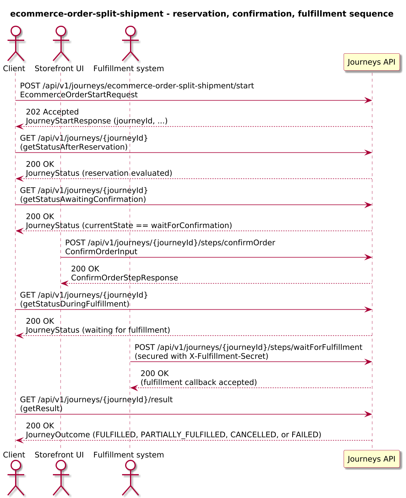
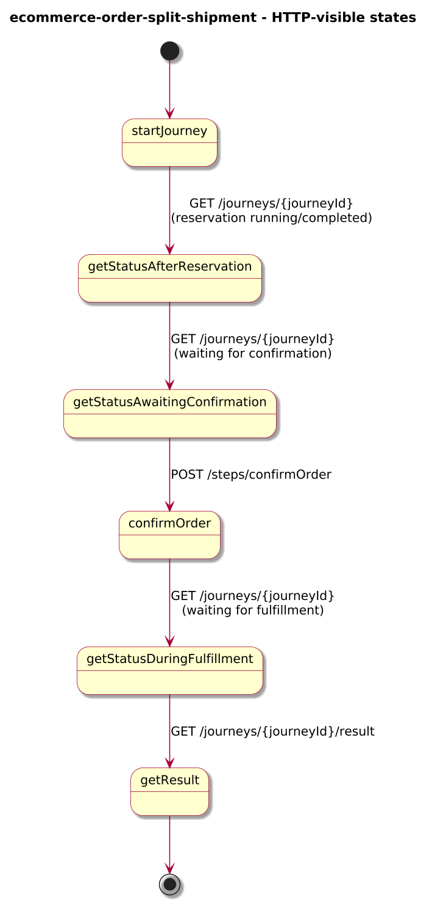
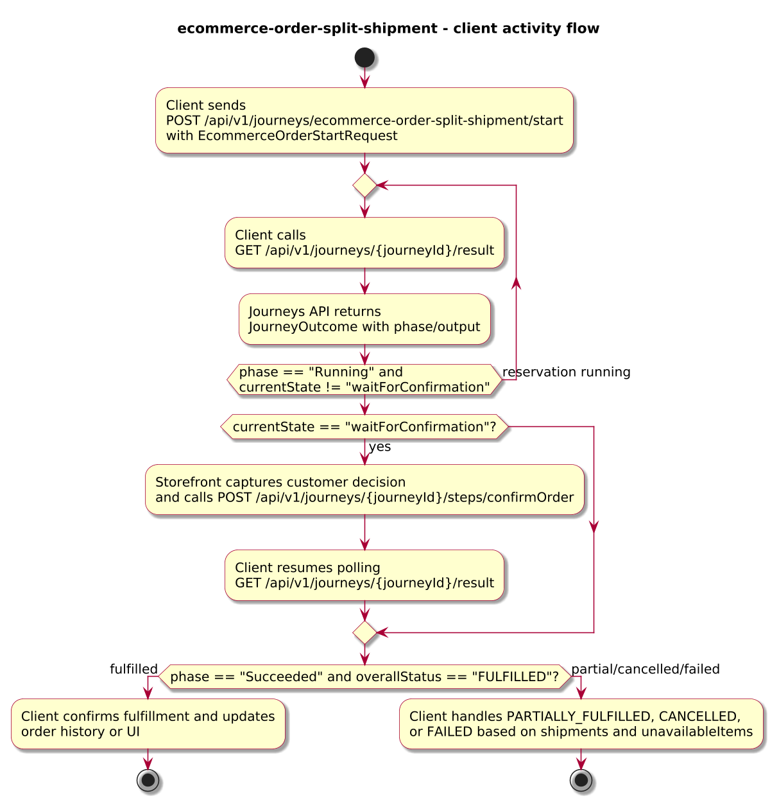
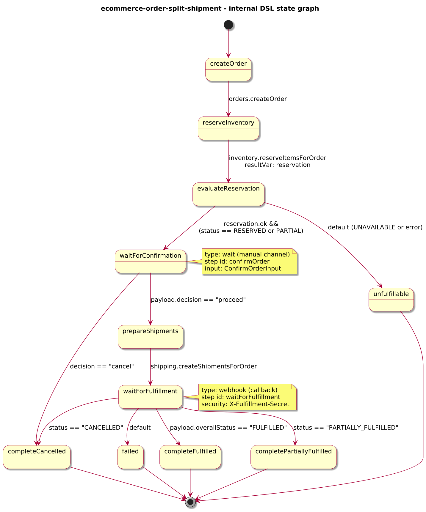

# Journey – ecommerce-order-split-shipment

> E-commerce order journey that reserves inventory, proposes split shipments, waits for customer confirmation, creates shipments, and completes when fulfillment finishes (including partial fulfillment and cancellation).

## Quick links

| Artifact | File |
|---------|------|
| Journey definition | [ecommerce-order-split-shipment.journey.yaml](ecommerce-order-split-shipment.journey.yaml) |
| OpenAPI (per-journey) | [ecommerce-order-split-shipment.openapi.yaml](ecommerce-order-split-shipment.openapi.yaml) |
| Arazzo workflow | [ecommerce-order-split-shipment.arazzo.yaml](ecommerce-order-split-shipment.arazzo.yaml) |
| Docs (this page) | [ecommerce-order-split-shipment.md](ecommerce-order-split-shipment.md) |

## Summary

This journey orchestrates an e-commerce order that may require split shipments:

- It creates an order, reserves inventory for all items, and receives a reservation decision that may be fully reserved, partially available, or unavailable.
- When at least some items are available, it proposes split shipments and waits for the customer to confirm whether to proceed or cancel.
- On confirmation, it requests shipments and then waits for a fulfillment callback that reports whether the order was fully fulfilled, partially fulfilled, cancelled, or failed.

The journey is long-lived: clients start it once, track progress via status calls, submit a confirmation decision via a dedicated step, and poll for a final outcome that summarises the overall fulfillment status and any split shipments. Design and scope for this example are captured under Q-013 in `docs/4-architecture/open-questions.md`.

Actors & systems:
- E-commerce frontend or order management system that starts the journey, surfaces split-shipment proposals, and polls status/result.
- Customer UI that presents proposed split shipments and captures the confirmation/cancellation decision via a step endpoint.
- Orders API called by the journey to create and update orders.
- Inventory and Shipping APIs called by the journey to reserve inventory and create shipments.
- Fulfillment system that sends trip/fulfillment updates via webhook into the journey.
- Journeys API as the orchestrator and HTTP surface for start/status/steps/webhooks/result.

## Contracts at a glance

- **Input schema** – `EcommerceOrderStartRequest` with required `orderId`, `customerId`, `items`, `shippingAddress`; optional `channel`.
- **Confirmation input** – `ConfirmOrderInput` with:
  - `decision: "proceed" | "cancel"`.
  - optional `notes`.
- **Output schema** – `EcommerceOrderOutcome` exposed via `JourneyOutcome.output` with:
  - `orderId`, `overallStatus: FULFILLED | PARTIALLY_FULFILLED | CANCELLED | FAILED`, optional `shipments[]`, `unavailableItems[]`.

## Step overview (Arazzo + HTTP surface)

Here’s a breakdown of the steps you’ll call over the Journeys API for the main fulfilled workflow described in `ecommerce-order-split-shipment.arazzo.yaml`.

| # | Step ID | Description | Operation ID | Parameters | Success Criteria | Outputs |
|---:|---------|-------------|--------------|------------|------------------|---------|
| 1 | `startJourney` | Start a new `ecommerce-order-split-shipment` journey instance (synchronous to the first confirmation/webhook branch). | `ecommerceOrderSplitShipment_start` | Body: `startRequest` with order id, customer id, items, and shipping address. | `$statusCode == 200`; `JourneyStatus.currentState` reflects progress through reservation and towards `waitForConfirmation`. | `JourneyStatus` for the order instance. |
| 2 | `getStatusAfterReservation` | (Optional) Re-fetch status after reservation and while awaiting confirmation. | `ecommerceOrderSplitShipment_getStatus` | Path: `journeyId` from step 1 (or from `JourneyStatus.journeyId`). | `$statusCode == 200`; `currentState` progresses past `reserveInventory`. | `JourneyStatus` with `phase` and `currentState`. |
| 3 | `getStatusAwaitingConfirmation` | Poll status until the journey is waiting for customer confirmation. | `ecommerceOrderSplitShipment_getStatus` | Path: `journeyId` from step 1. | `$statusCode == 200`; `currentState == "waitForConfirmation"`. | `JourneyStatus` indicating the customer can now confirm or cancel. |
| 4 | `confirmOrder` | Provide the customer’s decision to proceed or cancel based on proposed split shipments. | `ecommerceOrderSplitShipment_confirmOrder` | Path: `journeyId`; body: `confirmationInput` (`decision`, optional `notes`). | `$statusCode == 200`; `JourneyStatus.phase` and `currentState` progress based on decision. | `ConfirmOrderStepResponse` with projected decision fields. |
| 5 | `getStatusDuringFulfillment` | Poll status while shipments are being prepared and fulfilled after confirmation. | `ecommerceOrderSplitShipment_getStatus` | Path: `journeyId` from step 1. | `$statusCode == 200`; `currentState` moves through `prepareShipments` / `waitForFulfillment`. | `JourneyStatus` with updated `phase` and `currentState`. |
| 6 | `getResult` | Retrieve the final outcome once fulfillment has completed or the order has been cancelled or failed. | `ecommerceOrderSplitShipment_getResult` | Path: `journeyId` from step 1. | `$statusCode == 200`, `phase == "SUCCEEDED"` or `phase == "FAILED"`. | `JourneyOutcome` with `output.overallStatus`, `shipments`, and any unavailable items. |

The second workflow in the Arazzo file covers partial availability and cancellation variants.

## Graphical overview

### Sequence diagram

### State diagram

### Activity diagram

## Internal workflow (DSL state graph)

## Implementation notes

- `createOrder` calls `orders.createOrder` to create the order and persist high-level details.
- `reserveInventory` calls `inventory.reserveItemsForOrder` and records the reservation decision and any proposed split shipments.
- `evaluateReservation` routes to `waitForConfirmation` when at least some items are available; otherwise it fails as `ORDER_UNFULFILLABLE`.
- `waitForConfirmation` exposes the `confirmOrder` step for customer confirmation and projects the decision into `confirmationResponse`. Proceed decisions route to `prepareShipments`; cancel decisions complete as `completeCancelled`.
- `prepareShipments` calls `shipping.createShipmentsForOrder` using the proposed split shipments.
- `waitForFulfillment` is a `webhook` state (secured with `X-Fulfillment-Secret`) that projects fulfillment details into `fulfillmentResponse` and routes to `completeFulfilled`, `completePartiallyFulfilled`, `completeCancelled`, or `failed` based on `overallStatus`.
