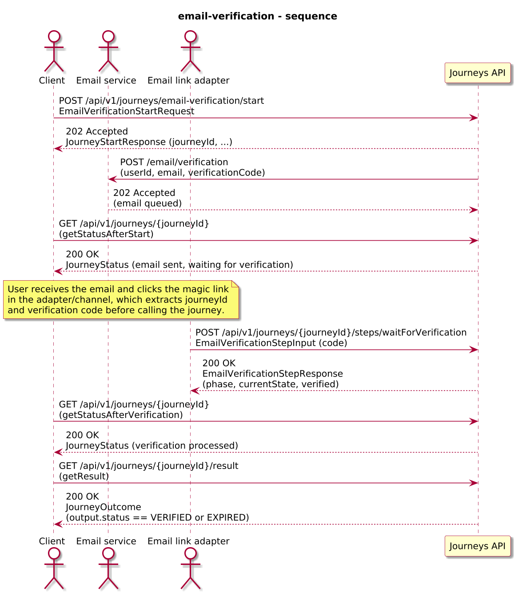
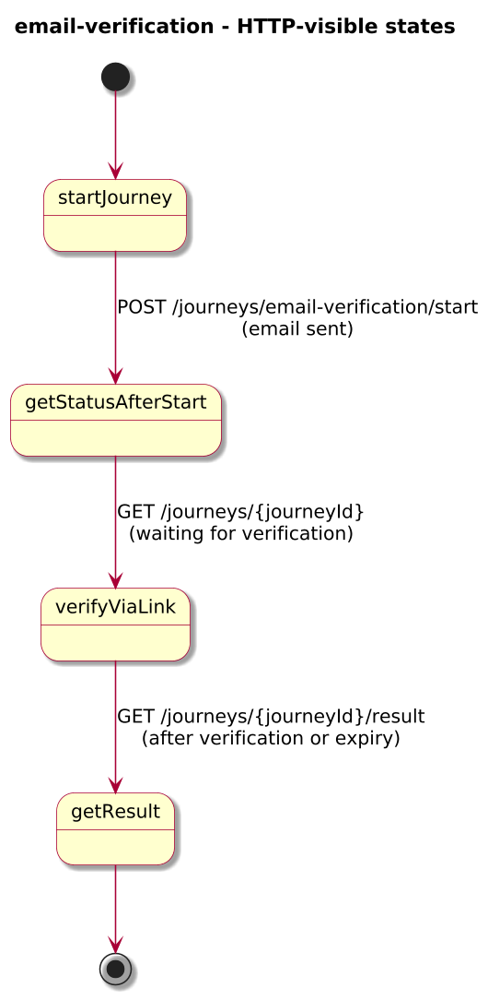
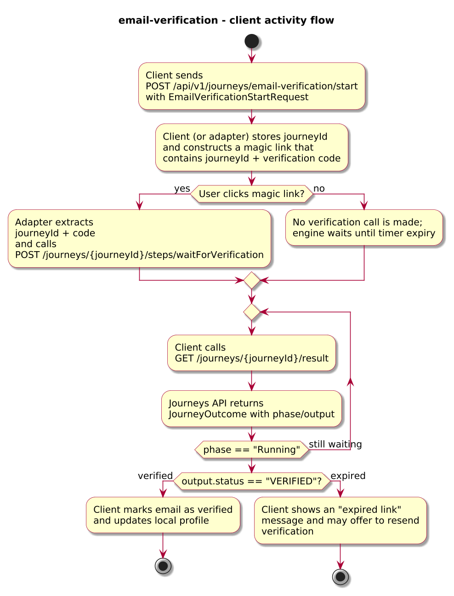
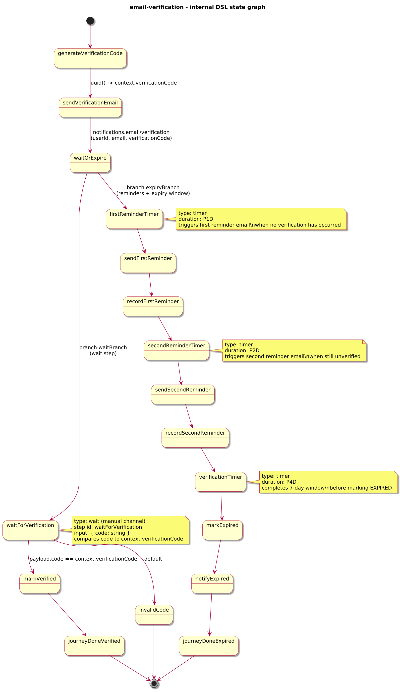

# Journey – email-verification

> Email verification journey that sends a verification email, waits for the user to confirm, and uses reminders and a timer-based expiry window (with follow-up) to mark unverified emails as expired.

## Quick links

| Artifact | File |
|---------|------|
| Journey definition | [email-verification.journey.yaml](email-verification.journey.yaml) |
| OpenAPI (per-journey) | [email-verification.openapi.yaml](email-verification.openapi.yaml) |
| Arazzo workflow | [email-verification.arazzo.yaml](email-verification.arazzo.yaml) |
| Docs (this page) | [email-verification.md](email-verification.md) |

## Summary

This journey models an email verification flow with a bounded verification window and built-in reminders:

- It starts when a client submits an email verification request with `userId` and `email`.
- The journey generates a one-time verification code inside the journey (for example using `uuid()` in DataWeave) and calls a Notifications-style HTTP endpoint to send a verification email that embeds this code in a magic link.
- It then enters a `parallel` state with two branches:
  - A `wait` branch that exposes a `waitForVerification` step; calling this step marks the email as verified.
  - A reminder/expiry branch that runs a 7-day window with internal timers:
    - After 1 day without verification, it sends a first reminder email.
    - After another 2 days without verification, it sends a second reminder email.
    - After a further 4 days (7 days in total), it marks the verification as expired and sends a post-expiry notification.
- Whichever branch completes first determines the final outcome:
  - If the user verifies the email before the window completes, the journey succeeds with `status: "VERIFIED"`.
  - If the window completes first, the journey succeeds with `status: "EXPIRED"` and records how many reminders were sent.

The journey illustrates how to combine `timer` with `parallel`, `wait`, and internal HTTP calls to express “user action OR timeout after N, with reminders and follow-up” in a business context.

## Contracts at a glance

- **Input schema** – `EmailVerificationStartRequest` with required:
  - `userId: string`
  - `email: string (email)`
  - optional `channel: string`.
- **Verification step input** – `EmailVerificationStepInput` with:
  - `code: string` (the verification code extracted from the magic link by a thin HTTP adapter or frontend).
- **Output schema** – `EmailVerificationOutcome` exposed via `JourneyOutcome.output` with:
  - `status: "VERIFIED" | "EXPIRED"`.
  - `userId`, `email`, optional `verifiedAt`, `expiredAt`, and `reminderCount` (number of reminders sent before verification or expiry).

## Step overview (Arazzo + HTTP surface)

The main workflows are described in `email-verification.arazzo.yaml`. At a high level:

| # | Step ID | Description | Operation ID | Parameters | Success Criteria | Outputs |
|---:|---------|-------------|--------------|------------|------------------|---------|
| 1 | `startJourney` | Start a new `email-verification` journey instance (synchronous to the first wait/timer branch). | `emailVerification_start` | Body: `startRequest` with `userId` and `email`. | `$statusCode == 200`; `JourneyStatus.currentState` reflects that the journey is waiting for verification. | `JourneyStatus` with `phase` and `currentState`. |
| 2 | `getStatusAfterStart` | Optional status check after the verification email has been sent. | `emailVerification_getStatus` | Path: `journeyId` from step 1 (or from `JourneyStatus.journeyId`). | `$statusCode == 200`; `JourneyStatus.currentState` reflects that the journey is waiting for verification. | `JourneyStatus` with `phase` and `currentState`. |
| 3 | `waitForVerification` | (Verified path) Provide the verification code from the magic link to the `waitForVerification` step. | `emailVerification_waitForVerification` | Path: `journeyId` from step 1; body: `verificationInput` with `code` extracted from the link. | `$statusCode == 200`; `JourneyStatus.phase` remains `Running` until the journey reaches its terminal state. | `EmailVerificationStepResponse` extending `JourneyStatus`. |
| 4 | `getStatusAfterVerification` | Check status after the verification step has been processed. | `emailVerification_getStatus` | Path: `journeyId` from step 1. | `$statusCode == 200`; `currentState` moves beyond `waitForVerification`. | `JourneyStatus` with updated `phase` and `currentState`. |
| 5 | `getResult` | Retrieve the final verification outcome. | `emailVerification_getResult` | Path: `journeyId` from step 1. | `$statusCode == 200`, `phase == "SUCCEEDED"` or `phase == "FAILED"`. | `JourneyOutcome` with `output.status == "VERIFIED"` (when step 3 was called) or `output.status == "EXPIRED"` (when the timer fired first). |

Clients that want to observe expiry without explicit verification would typically call steps 1, 2, and 5 only, after allowing the expiry window (for example 7 days) to elapse.

## Scenarios and variations

- **Happy path – verified within window**:
  - Client starts the journey and sends the verification email.
  - User clicks the magic link; an adapter calls `waitForVerification` with the correct `code`.
  - The journey completes with `status: "VERIFIED"`, `verifiedAt` set, and `reminderCount` reflecting how many reminders were sent before verification (often 0).
- **Expired – no verification**:
  - Client starts the journey but no verification call is made.
  - The reminder/expiry branch completes after 7 days, sending up to two reminders in between; the journey completes with `status: "EXPIRED"`, `expiredAt` set, and `reminderCount` (typically 2).
- **Invalid or reused link**:
  - Adapter calls `waitForVerification` with a wrong or stale `code`.
  - The journey fails with `errorCode: INVALID_VERIFICATION_CODE`, and clients can map this to “invalid link” UX or offer a resend.

## Graphical overview

### Sequence diagram

### State diagram

### Activity diagram

## Internal workflow (DSL state graph)

## Implementation notes

- `generateVerificationCode` uses a DataWeave function such as `uuid()` to create a one-time verification code inside the journey and stores it in `context.verificationCode`.
- `sendVerificationEmail` calls a notifications endpoint and passes `verificationCode` so the email service can embed it into a magic link.
- `waitForVerification` is a `wait` state that expects `EmailVerificationStepInput` with `code`; it compares this to `context.verificationCode` and either routes to `markVerified` or `invalidCode`.
- `verificationTimer` is a `timer` state (`duration: "P7D"`) that implements the expiry window; together with `parallel` it forms the “user action OR timeout” pattern.
