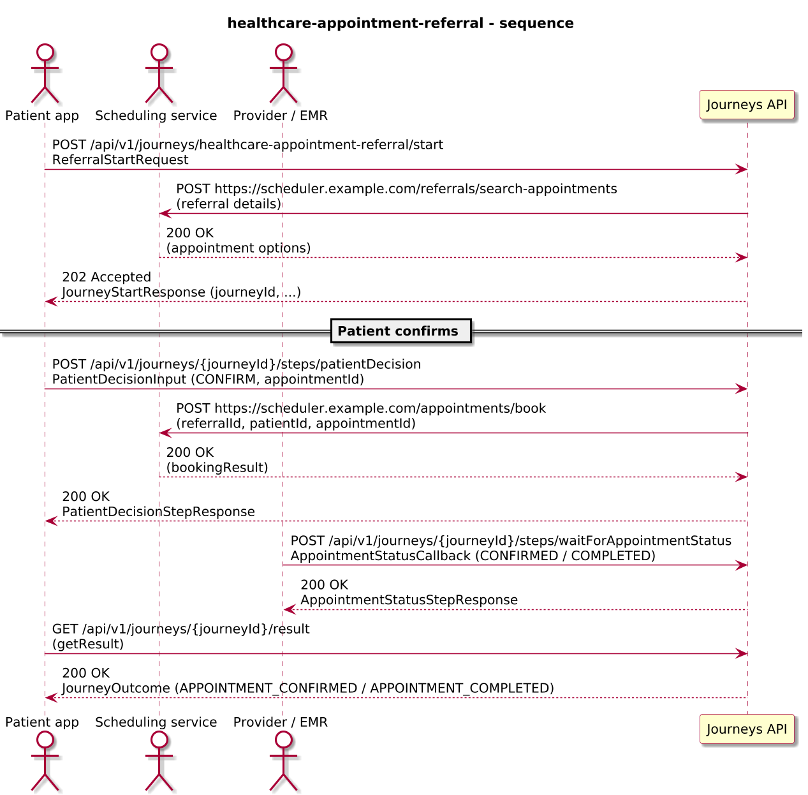
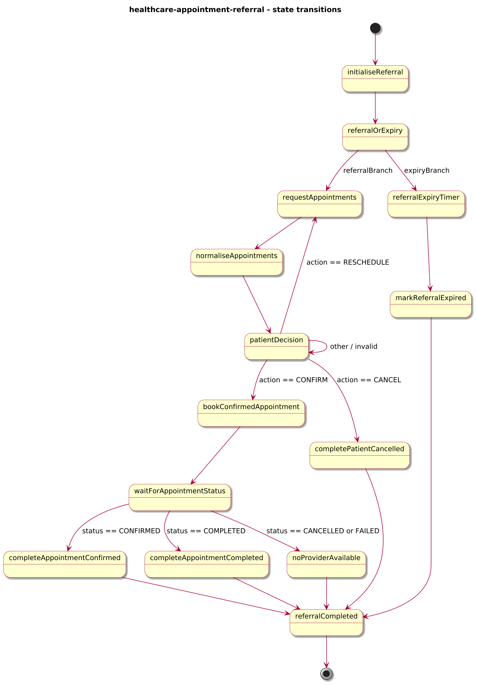
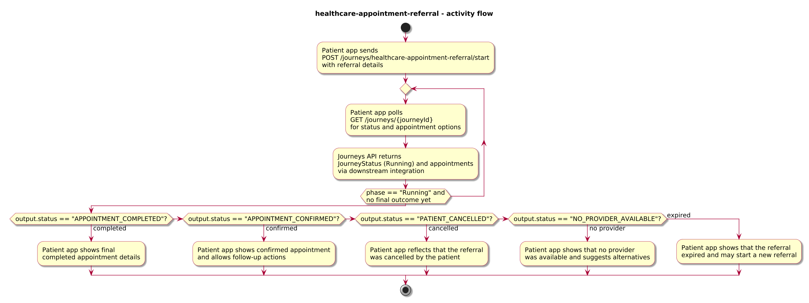
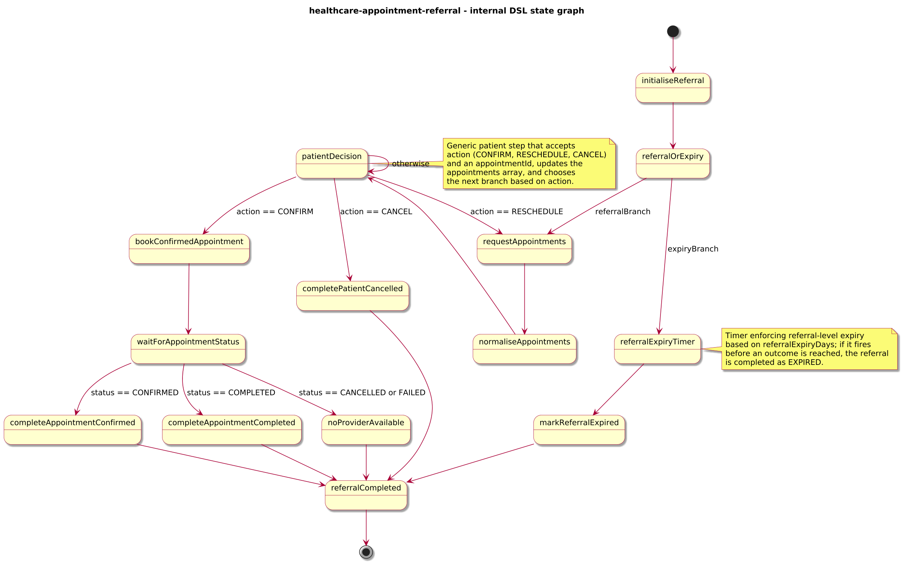

# Journey – healthcare-appointment-referral

> Healthcare referral journey that proposes appointments, lets the patient confirm/reschedule/cancel via a generic step, waits for provider/EMR callbacks, and enforces a referral-level expiry window.

## Quick links

| Artifact | File |
|---------|------|
| Journey definition | [healthcare-appointment-referral.journey.yaml](healthcare-appointment-referral.journey.yaml) |
| OpenAPI (per-journey) | [healthcare-appointment-referral.openapi.yaml](healthcare-appointment-referral.openapi.yaml) |
| Arazzo workflow | [healthcare-appointment-referral.arazzo.yaml](healthcare-appointment-referral.arazzo.yaml) |
| Docs (this page) | [healthcare-appointment-referral.md](healthcare-appointment-referral.md) |

## Summary

This journey models a healthcare referral that may lead to one or more appointments:

- Each journey instance represents a single **referral** (`referralId`) for a patient and a requested `specialty`.
- The journey calls a scheduling service to propose appointment options and stores them as an `appointments[]` array.
- A generic `patientDecision` step lets the patient:
  - **CONFIRM** one of the proposed appointments.
  - **RESCHEDULE** by cancelling the current proposal and requesting a new set of options.
  - **CANCEL** the referral entirely.
- Once the patient confirms an appointment, the journey books it and waits for a provider/EMR callback that reports appointment status (`CONFIRMED`, `COMPLETED`, `CANCELLED`, `FAILED`).
- A referral-level expiry window runs in parallel; if it fires first, the journey completes as `EXPIRED`.

Actors & systems:
- Patient-facing app or care coordinator system that starts the referral, surfaces appointment options, calls the `patientDecision` step, and reads the final outcome.
- Scheduling service that returns proposed appointment options and performs booking.
- Provider/EMR system that posts appointment status callbacks.
- Journeys API as the orchestrator and HTTP surface for start/status/steps/result.

## Contracts at a glance

- **Input schema** – `ReferralStartRequest` with required:
  - `referralId: string`
  - `patientId: string`
  - `reason: string`
  - `specialty: string`
  - optional `preferredWindowStart`, `preferredWindowEnd` (date-time).
  - optional `referralExpiryDays: integer` (defaults to 30).
- **Patient decision input** – `PatientDecisionInput` for the `patientDecision` step:
  - `action: "CONFIRM" | "RESCHEDULE" | "CANCEL"`.
  - optional `appointmentId: string` (required for `CONFIRM` and `RESCHEDULE`).
  - optional `comment: string`.
- **Provider callback input** – `AppointmentStatusCallback` for the `waitForAppointmentStatus` step:
  - `appointmentId: string`
  - `status: "CONFIRMED" | "COMPLETED" | "CANCELLED" | "FAILED"`.
- **Output schema** – `ReferralOutcome` via `JourneyOutcome.output` with:
  - `status: "APPOINTMENT_CONFIRMED" | "APPOINTMENT_COMPLETED" | "PATIENT_CANCELLED" | "NO_PROVIDER_AVAILABLE" | "EXPIRED"`.
  - `referralId`, `patientId`.
  - `primaryAppointmentId` when a confirmed or completed appointment exists.
  - `appointments[]` describing each appointment (`appointmentId`, `providerId`, `location`, `startTime`, `endTime`, `status`).
  - optional `expiryAt` for expired referrals.

## Step overview (Arazzo + HTTP surface)

Here’s a breakdown of key steps over the Journeys API, aligned with `healthcare-appointment-referral.arazzo.yaml`.

### Referral with confirmed appointment

| # | Step ID | Description | Operation ID | Parameters | Success Criteria | Outputs |
|---:|---------|-------------|--------------|------------|------------------|---------|
| 1 | `startJourney` | Start a new `healthcare-appointment-referral` journey instance (synchronous to the first patient decision step). | `healthcareAppointmentReferral_start` | Body: `startRequest` with referral and specialty details. | `$statusCode == 200`; `phase == "RUNNING"` and `currentState` reflects the patient decision step. | `JourneyStatus` for the referral. |
| 2 | `getStatusAfterSearch` | Optional status check after appointment options have been proposed. | `healthcareAppointmentReferral_getStatus` | Path: `journeyId` from step 1. | `$statusCode == 200`; `phase == "RUNNING"` and `currentState` reflects the patient decision step. | `JourneyStatus` with `phase` and `currentState`. |
| 3 | `patientConfirm` | Patient confirms one of the proposed appointments via the generic `patientDecision` step. | `healthcareAppointmentReferral_patientDecision` | Path: `journeyId`; body: `patientDecision` with `action: "CONFIRM"` and `appointmentId`. | `$statusCode == 200`; booking request has been sent. | `PatientDecisionStepResponse` extending `JourneyStatus`. |
| 4 | `providerConfirms` | Provider/EMR posts a `CONFIRMED` status for the appointment. | `healthcareAppointmentReferral_waitForAppointmentStatus` | Path: `journeyId`; body: `providerCallback` with `appointmentId`, `status: "CONFIRMED"`. | `$statusCode == 200`; journey transitions toward completion. | `AppointmentStatusStepResponse` extending `JourneyStatus`. |
| 5 | `getResult` | Retrieve the final `APPOINTMENT_CONFIRMED` or `APPOINTMENT_COMPLETED` outcome. | `healthcareAppointmentReferral_getResult` | Path: `journeyId` from step 1. | `$statusCode == 200`, `phase == "SUCCEEDED"` or `phase == "FAILED"`. | `JourneyOutcome` with `ReferralOutcome`. |

### Referral cancelled by patient

| # | Step ID | Description | Operation ID | Parameters | Success Criteria | Outputs |
|---:|---------|-------------|--------------|------------|------------------|---------|
| 1 | `startJourney` | Start a new `healthcare-appointment-referral` journey instance (synchronous to the first patient decision step). | `healthcareAppointmentReferral_start` | Body: `startRequest` with referral details. | `$statusCode == 200`; `phase == "RUNNING"` and `currentState` reflects the patient decision step. | `JourneyStatus` for the referral. |
| 2 | `patientCancels` | Patient cancels the referral via `patientDecision`. | `healthcareAppointmentReferral_patientDecision` | Path: `journeyId`; body: `patientDecision` with `action: "CANCEL"`. | `$statusCode == 200`; journey transitions to a terminal state. | `PatientDecisionStepResponse` extending `JourneyStatus`. |
| 3 | `getResult` | Retrieve the final `PATIENT_CANCELLED` outcome. | `healthcareAppointmentReferral_getResult` | Path: `journeyId` from step 1. | `$statusCode == 200`. | `JourneyOutcome` with `ReferralOutcome.status == "PATIENT_CANCELLED"`. |

## Graphical overview

### Sequence diagram

### State diagram

### Activity diagram

## Internal workflow (DSL state graph)

## Implementation notes

- `initialiseReferral`:
  - Normalises `referralExpiryDays` (default 30 days) and initialises `appointments` as an empty array.
- `referralOrExpiry` (`type: parallel`):
  - **Referral branch**:
    - `requestAppointments` calls a scheduling service to discover candidate appointments for the referral.
    - `normaliseAppointments` maps the returned appointments into `context.appointments` with `status: "PENDING_PATIENT"`.
    - `patientDecision` is a generic `wait` that accepts `PatientDecisionInput` and:
      - For `CONFIRM`, marks the chosen appointment as `PENDING_PROVIDER` and cancels other `PENDING_PATIENT` options.
      - For `RESCHEDULE`, cancels the selected appointment and loops back to `requestAppointments` to fetch new proposals.
      - For `CANCEL`, routes to `completePatientCancelled`.
    - `bookConfirmedAppointment` books the chosen appointment via the scheduler.
    - `waitForAppointmentStatus` is a `webhook` that updates the matching appointment’s `status` based on provider/EMR callbacks and routes to:
      - `completeAppointmentConfirmed` when the appointment is `CONFIRMED`.
      - `completeAppointmentCompleted` when the appointment is `COMPLETED`.
      - `noProviderAvailable` when the appointment is `CANCELLED` or `FAILED`.
    - These terminal states set the appropriate `ReferralOutcome.status` (for example `APPOINTMENT_CONFIRMED`, `APPOINTMENT_COMPLETED`, `NO_PROVIDER_AVAILABLE`).
  - **Expiry branch**:
    - `referralExpiryTimer` is a `timer` that converts `referralExpiryDays` into an ISO-8601 duration.
    - When it fires first, `markReferralExpired` sets `status: "EXPIRED"`, `expiryAt`, and carries current `appointments` into the outcome.
- `referralCompleted` is a `succeed` state returning `ReferralOutcome` via `outputVar: outcome`.
