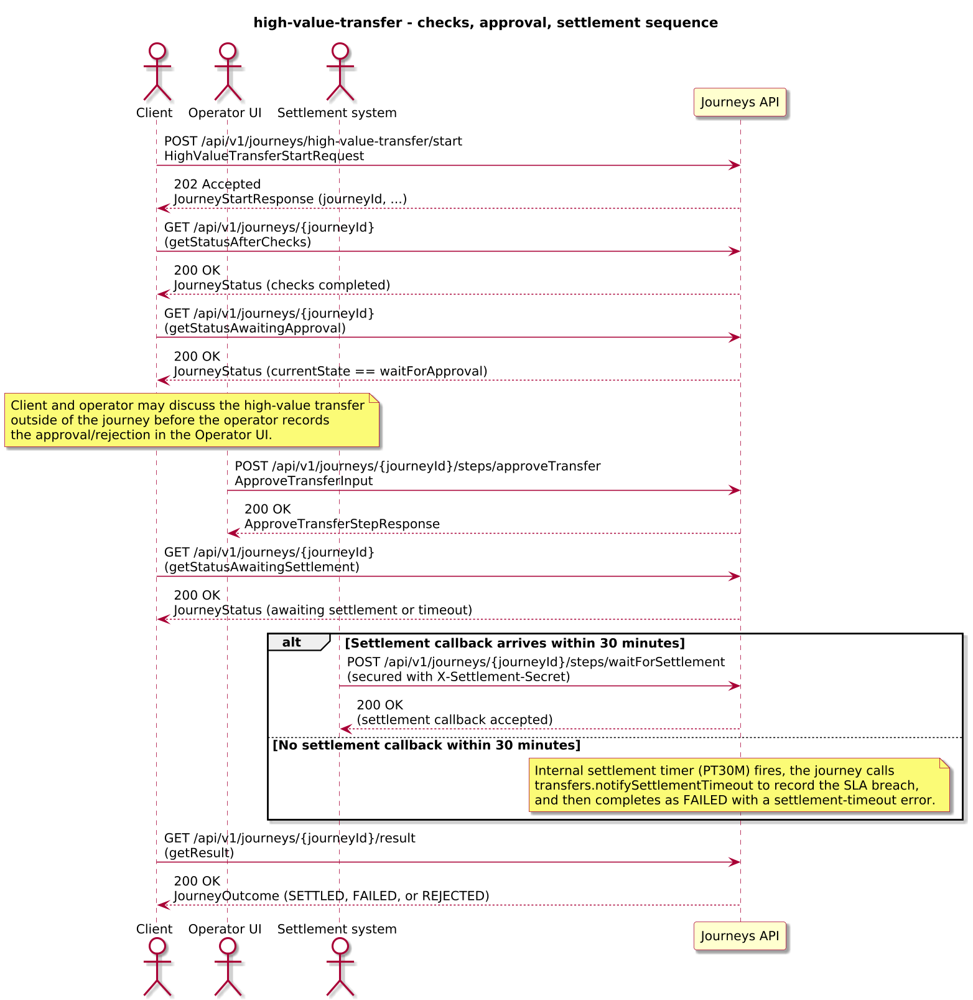
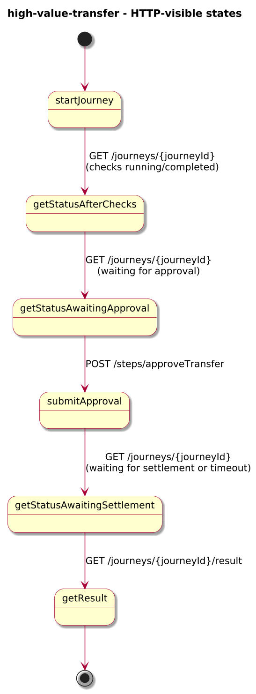
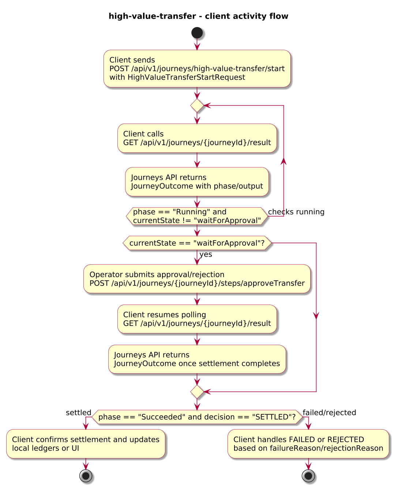
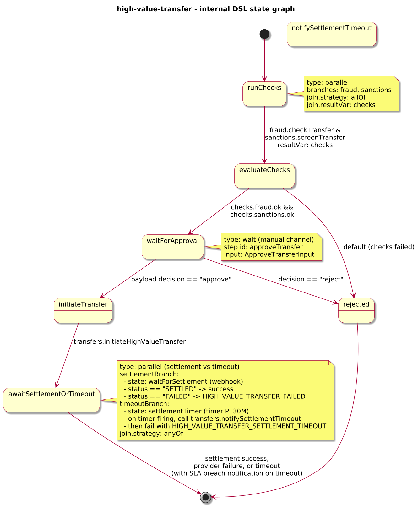

# Journey – high-value-transfer

> High-value transfer journey that runs fraud and sanctions checks, waits for operator approval, initiates the transfer, and completes when settlement succeeds, fails, or times out.

## Quick links

| Artifact | File |
|---------|------|
| Journey definition | [high-value-transfer.journey.yaml](high-value-transfer.journey.yaml) |
| OpenAPI (per-journey) | [high-value-transfer.openapi.yaml](high-value-transfer.openapi.yaml) |
| Arazzo workflow | [high-value-transfer.arazzo.yaml](high-value-transfer.arazzo.yaml) |
| Docs (this page) | [high-value-transfer.md](high-value-transfer.md) |

## Summary

This journey orchestrates a high-value funds transfer:

- It validates a transfer request and runs fraud and sanctions checks in parallel.
- If checks pass, it pauses at a manual approval step so an operator can approve or reject the transfer.
- On approval, it calls a Transfers API to initiate the transfer and then waits for either a settlement callback from the provider or a timeout.

The journey is long-lived: clients start it once, track progress via status calls, submit approval via a dedicated step, and poll for the final settled or failed outcome (including timeout-treated-as-failure) while the provider processes the transfer.

Actors & systems:
- Client application or back-office system that starts the transfer journey and polls status/result.
- Operator UI used by an operator to approve or reject the high-value transfer via a step endpoint.
- Fraud and sanctions services called by the journey via HTTP tasks to validate the transfer.
- Settlement system that calls back into the journey via a webhook once settlement completes or fails; if no callback arrives within the configured window, the journey times out the settlement step.
- Journeys API as the orchestrator and HTTP surface for start/status/steps/result.

## Contracts at a glance

- **Input schema** – `HighValueTransferStartRequest` with required `transferId`, `customerId`, `sourceAccountId`, `destinationAccountId`, `amount`, `currency`; optional `channel`.
- **Approval input** – `ApproveTransferInput` with:
  - `decision: "approve" | "reject"`.
  - optional `comment`.
- **Output schema** – `HighValueTransferOutcome` exposed via `JourneyOutcome.output` with:
  - `decision: SETTLED | FAILED | REJECTED` (FAILED covers provider failures and settlement timeouts).
  - `transferId`, `amount`, `currency`, optional `settlementTime`, `failureReason`, `rejectionReason`, `riskSummary`.

## Step overview (Arazzo + HTTP surface)

Here’s a breakdown of the steps you’ll call over the Journeys API for the main workflow described in `high-value-transfer.arazzo.yaml`.

| # | Step ID | Description | Operation ID | Parameters | Success Criteria | Outputs |
|---:|---------|-------------|--------------|------------|------------------|---------|
| 1 | `startJourney` | Start a new `high-value-transfer` journey instance. | `highValueTransfer_start` | Body: `startRequest` with transfer details. | `$statusCode == 202` and a `journeyId` is returned. | `journeyId` for the transfer instance. |
| 2 | `getStatusAfterChecks` | Poll status until fraud and sanctions checks have completed. | `highValueTransfer_getStatus` | Path: `journeyId` from step 1. | `$statusCode == 200`; `phase` is `Running` and `currentState` progresses past `runChecks`. | `JourneyStatus` with `phase` and `currentState`. |
| 3 | `getStatusAwaitingApproval` | Poll status until the journey is waiting for operator approval. | `highValueTransfer_getStatus` | Path: `journeyId` from step 1. | `$statusCode == 200`; `currentState == "waitForApproval"`. | `JourneyStatus` indicating the operator can now approve/reject the transfer. |
| 4 | `submitApproval` | Provide operator approval (or rejection) for the transfer. | `highValueTransfer_approveTransfer` | Path: `journeyId`; body: `approvalInput` (`decision`, optional `comment`). | `$statusCode == 200`; `JourneyStatus.phase` and `currentState` progress based on decision. | `ApproveTransferStepResponse` with projected decision fields. |
| 5 | `getStatusAwaitingSettlement` | Poll status while the engine waits for settlement callback or timeout after initiating the transfer. | `highValueTransfer_getStatus` | Path: `journeyId` from step 1. | `$statusCode == 200`; `currentState` moves through `initiateTransfer` / `awaitSettlementOrTimeout`. | `JourneyStatus` with updated `phase` and `currentState`. |
| 6 | `getResult` | Retrieve the final outcome once settlement has completed or failed. | `highValueTransfer_getResult` | Path: `journeyId` from step 1. | `$statusCode == 200`, `phase == "Succeeded"` or `phase == "Failed"`. | `JourneyOutcome` with `output.decision` and settlement or rejection details. |

Cases rejected by checks or manual decision typically use steps 1, 2, 3, 4, and 6 and end with `decision: REJECTED`.

## Graphical overview

### Sequence diagram

### State diagram

### Activity diagram

## Internal workflow (DSL state graph)

## Implementation notes

- `runChecks` is a `parallel` state that calls the Fraud and Sanctions APIs in parallel and aggregates results into `checks`.
- `evaluateChecks` determines whether the transfer is eligible; failures route directly to `HIGH_VALUE_TRANSFER_REJECTED`.
- `waitForApproval` exposes the `approveTransfer` step for operator review and projects the decision into `approvalResponse`.
- `initiateTransfer` calls `transfers.initiateHighValueTransfer` to trigger the transfer and then hands off to `awaitSettlementOrTimeout`.
- `awaitSettlementOrTimeout` is a `parallel` state that races the `waitForSettlement` webhook (secured by `X-Settlement-Secret`) against a 30-minute timer; the settlement branch projects settlement details into `settlementResponse` and completes as success or failure, while the timer branch completes as a timeout failure with a dedicated error code.
