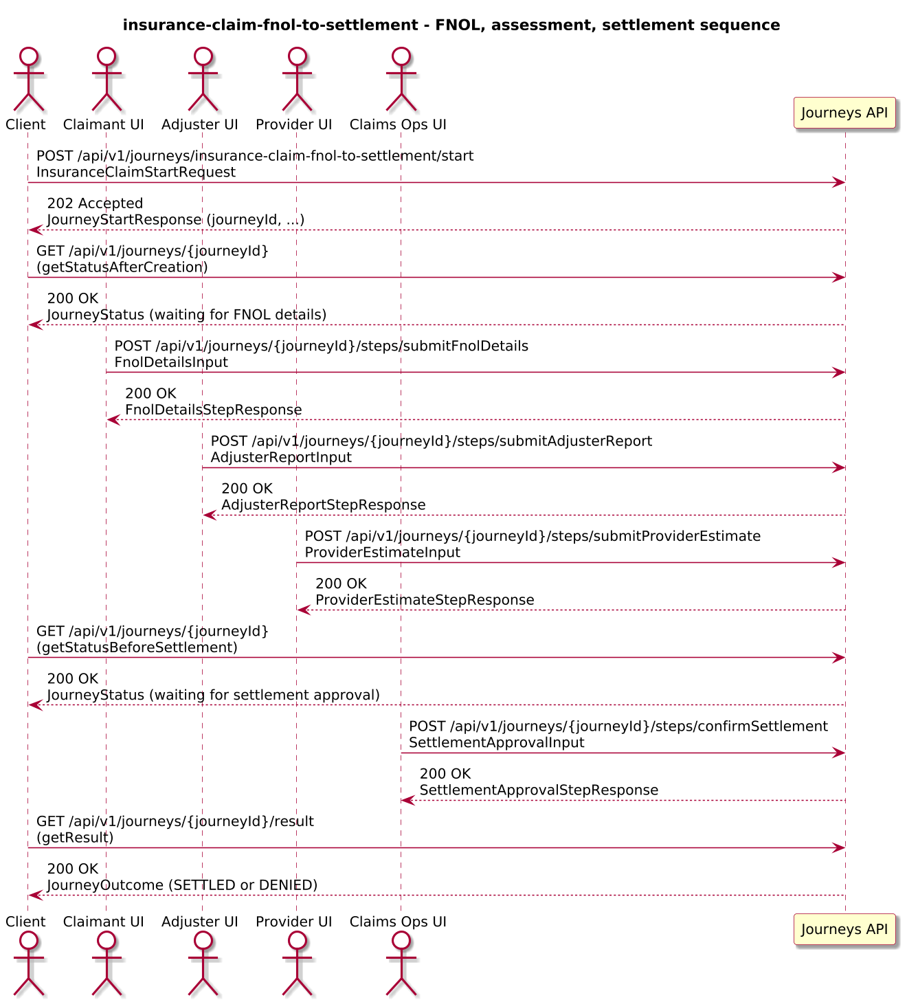
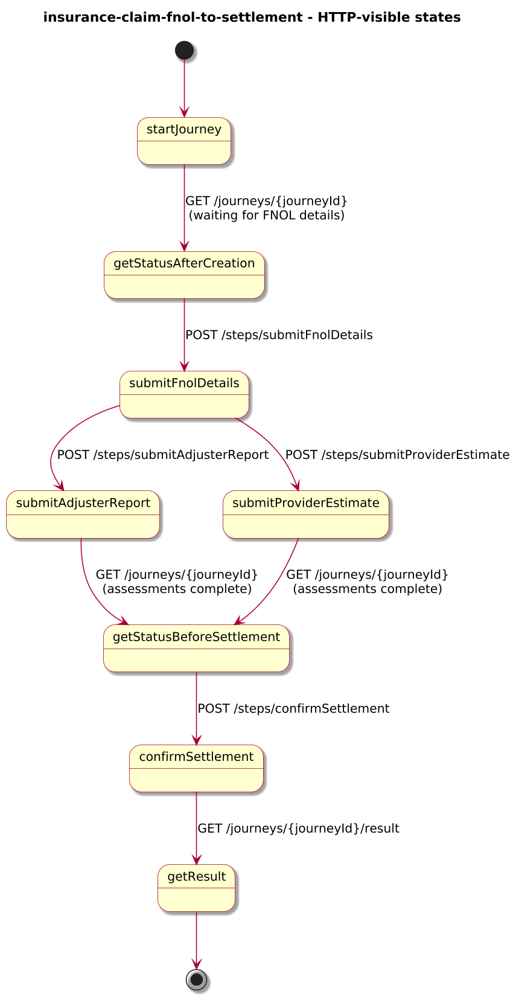
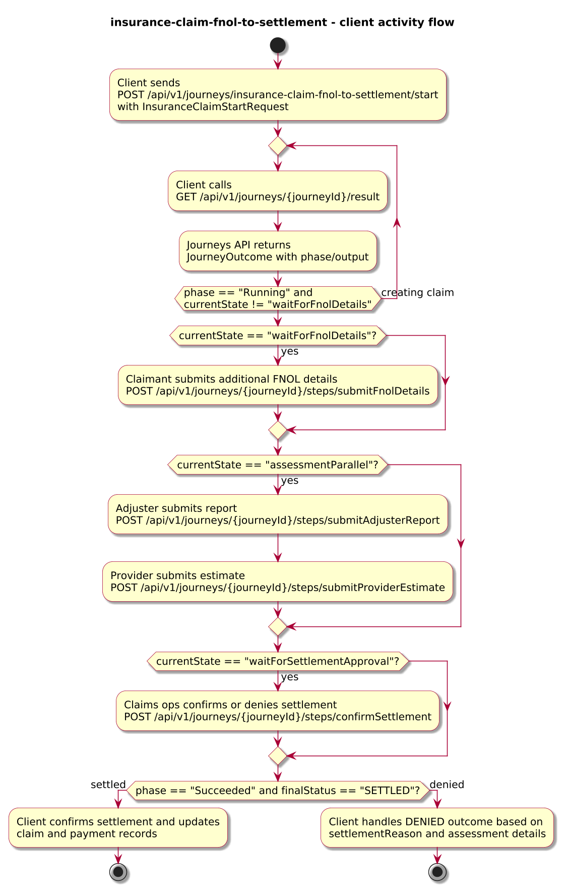
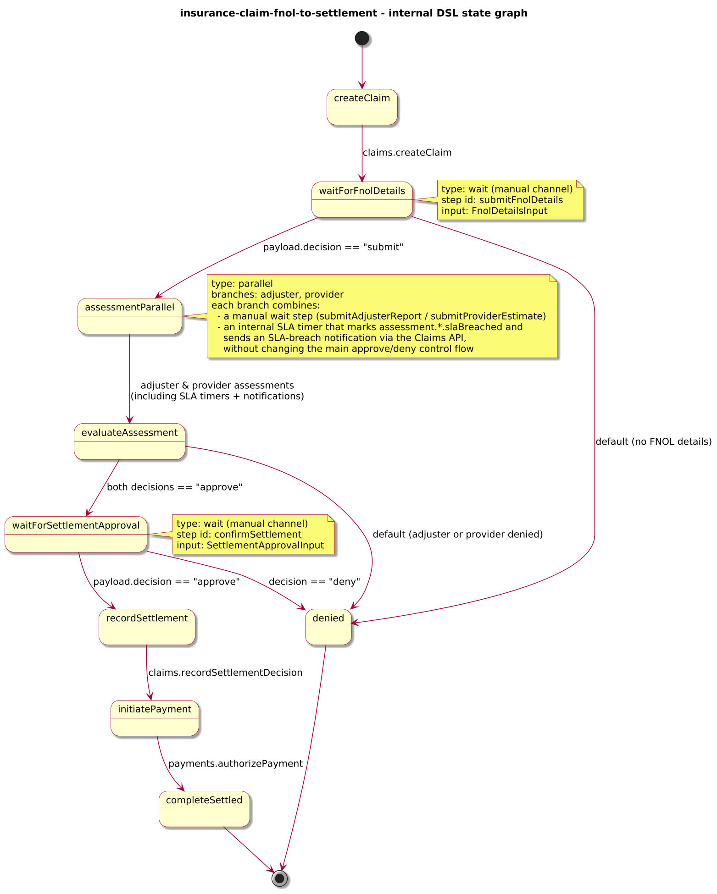

# Journey – insurance-claim-fnol-to-settlement

> Insurance claim journey that starts at FNOL, collects additional claimant details, coordinates parallel adjuster and provider assessments, confirms settlement, and triggers payment.

## Quick links

| Artifact | File |
|---------|------|
| Journey definition | [insurance-claim-fnol-to-settlement.journey.yaml](insurance-claim-fnol-to-settlement.journey.yaml) |
| OpenAPI (per-journey) | [insurance-claim-fnol-to-settlement.openapi.yaml](insurance-claim-fnol-to-settlement.openapi.yaml) |
| Arazzo workflow | [insurance-claim-fnol-to-settlement.arazzo.yaml](insurance-claim-fnol-to-settlement.arazzo.yaml) |
| Docs (this page) | [insurance-claim-fnol-to-settlement.md](insurance-claim-fnol-to-settlement.md) |

## Summary

This journey models a simplified insurance claim from FNOL to settlement:

- It creates a claim in a Claims API using core FNOL data (claim id, policy id, claimant, loss date, type, description).
- It collects additional FNOL details from the claimant (documents, photos, notes).
- It then runs parallel assessments from an adjuster and a repair/medical provider, each providing their own decision and recommended amounts.
- If both assessments support approval, it moves to an internal settlement approval step; approved settlements are recorded in the Claims API and a payment is authorised via the Payments API.

The journey is long-lived: clients start it once, track progress via status calls, submit FNOL details and assessment decisions via dedicated steps, and finally read an outcome that summarises whether the claim was settled or denied and what assessment data led to that decision. Design and scope for this example are captured under Q-015 in `docs/4-architecture/open-questions.md`.

Actors & systems:
- Claims intake channel or back-office system that starts the journey, submits FNOL details, and polls status/result.
- Adjuster and provider UIs through which adjusters and providers submit assessment reports via dedicated steps.
- Claims API called by the journey to create the claim and record settlement decisions.
- Payments API called by the journey to authorise and trigger claim payments.
- Journeys API as the orchestrator and HTTP surface for start/status/steps/result.

## Contracts at a glance

- **Input schema** – `InsuranceClaimStartRequest` with required `claimId`, `policyId`, `claimantId`, `lossDate`; optional `lossType`, `description`, `estimatedLossAmount`, `currency`, `channel`.
- **Step inputs**:
  - `FnolDetailsInput` – claimant details with `decision: "submit"`, optional `documents[]`, `notes`.
  - `AdjusterReportInput` – adjuster decision with `decision: "approve" | "deny"`, optional `recommendedAmount`, `notes`.
  - `ProviderEstimateInput` – provider decision with `decision: "approve" | "deny"`, optional `estimatedCost`, `notes`.
  - `SettlementApprovalInput` – internal settlement decision with `decision: "approve" | "deny"`, optional `settlementAmount`, `notes`.
- **Output schema** – `InsuranceClaimOutcome` exposed via `JourneyOutcome.output` with:
  - `claimId`, `finalStatus: SETTLED | DENIED`, optional `settlementAmount`, `currency`, `assessment.adjuster`, `assessment.provider`, `settlementCode`, `settlementReason`.

## Step overview (Arazzo + HTTP surface)

Here’s a breakdown of the steps you’ll call over the Journeys API for the main settled workflow described in `insurance-claim-fnol-to-settlement.arazzo.yaml`.

| # | Step ID | Description | Operation ID | Parameters | Success Criteria | Outputs |
|---:|---------|-------------|--------------|------------|------------------|---------|
| 1 | `startJourney` | Start a new `insurance-claim-fnol-to-settlement` journey instance. | `insuranceClaimFnolToSettlement_start` | Body: `startRequest` with core FNOL data (claim id, policy id, claimant, loss date, etc.). | `$statusCode == 202` and a `journeyId` is returned. | `journeyId` for the claim instance. |
| 2 | `getStatusAfterCreation` | Poll status until the claim has been created and the journey is waiting for additional FNOL details. | `insuranceClaimFnolToSettlement_getStatus` | Path: `journeyId` from step 1. | `$statusCode == 200`; `currentState == "waitForFnolDetails"`. | `JourneyStatus` with `phase` and `currentState`. |
| 3 | `submitFnolDetails` | Provide additional FNOL details from the claimant. | `insuranceClaimFnolToSettlement_submitFnolDetails` | Path: `journeyId`; body: `fnolDetailsInput`. | `$statusCode == 200`; `JourneyStatus` progresses toward assessment. | `FnolDetailsStepResponse` with projected decision and notes. |
| 4 | `submitAdjusterReport` | Provide adjuster report approving the claim. | `insuranceClaimFnolToSettlement_submitAdjusterReport` | Path: `journeyId`; body: `adjusterReportInput`. | `$statusCode == 200`; journey state reflects adjuster assessment while waiting for provider. | `AdjusterReportStepResponse` with decision and `recommendedAmount`. |
| 5 | `submitProviderEstimate` | Provide provider estimate approving the claim. | `insuranceClaimFnolToSettlement_submitProviderEstimate` | Path: `journeyId`; body: `providerEstimateInput`. | `$statusCode == 200`; once both assessments are in, journey moves toward settlement approval. | `ProviderEstimateStepResponse` with decision and `estimatedCost`. |
| 6 | `getStatusBeforeSettlement` | Poll status until the journey is waiting for settlement approval. | `insuranceClaimFnolToSettlement_getStatus` | Path: `journeyId` from step 1. | `$statusCode == 200`; `currentState == "waitForSettlementApproval"`. | `JourneyStatus` indicating internal settlement approval can proceed. |
| 7 | `confirmSettlement` | Provide internal approval for the settlement amount. | `insuranceClaimFnolToSettlement_confirmSettlement` | Path: `journeyId`; body: `settlementApprovalInput`. | `$statusCode == 200`; `JourneyStatus.phase` advances as settlement is recorded and payment is authorised. | `SettlementApprovalStepResponse` with projected decision and `settlementAmount`. |
| 8 | `getResult` | Retrieve the final outcome after settlement and payment have been processed. | `insuranceClaimFnolToSettlement_getResult` | Path: `journeyId` from step 1. | `$statusCode == 200`, `phase == "Succeeded"` or `phase == "Failed"`. | `JourneyOutcome` with `output.finalStatus`, `settlementAmount`, and assessment details. |

The second workflow in the Arazzo file shows a denial path where one of the steps (for example settlement approval) denies the claim and the journey finishes with `finalStatus: DENIED`.

## Graphical overview

### Sequence diagram

### State diagram

### Activity diagram

## Internal workflow (DSL state graph)

## Implementation notes

- `createClaim` calls `claims.createClaim` to register the claim on FNOL.
- `waitForFnolDetails` exposes the `submitFnolDetails` step for the claimant to provide additional documents and notes.
- `assessmentParallel` runs adjuster and provider assessments in parallel via `waitForAdjusterReport` and `waitForProviderEstimate`, each using a separate external step.
- `evaluateAssessment` ensures both adjuster and provider decisions are `approve` before proceeding; otherwise the journey fails as `CLAIM_DENIED`.
- `waitForSettlementApproval` exposes the `confirmSettlement` step for internal settlement approval and records the chosen settlement amount.
- `recordSettlement` calls `claims.recordSettlementDecision` to store the settlement decision; `initiatePayment` calls `payments.authorizePayment` to authorise payout; `completeSettled` completes the journey successfully with the settlement decision in `output`.
