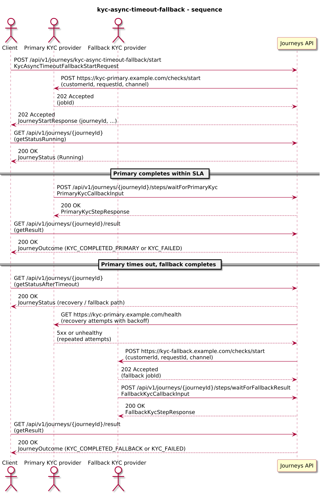
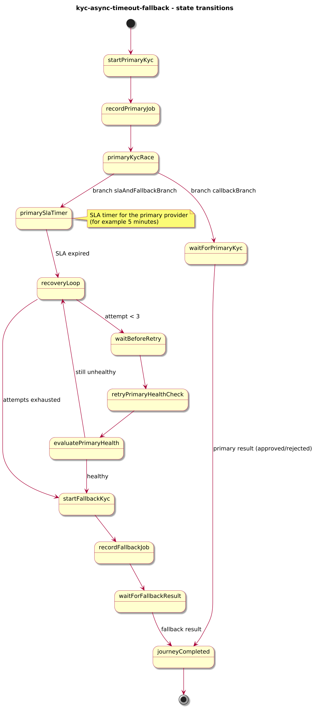
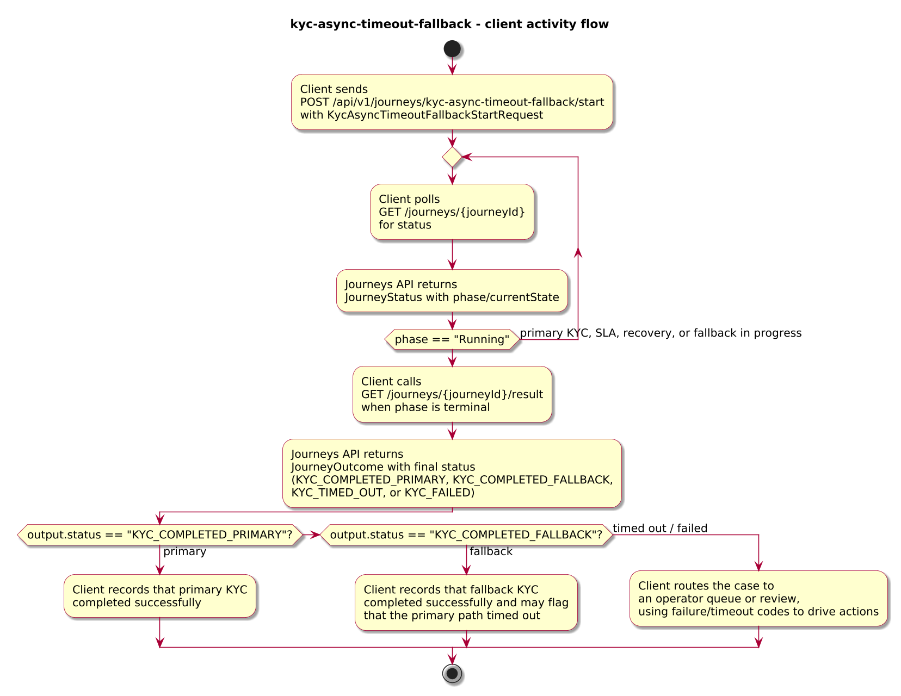
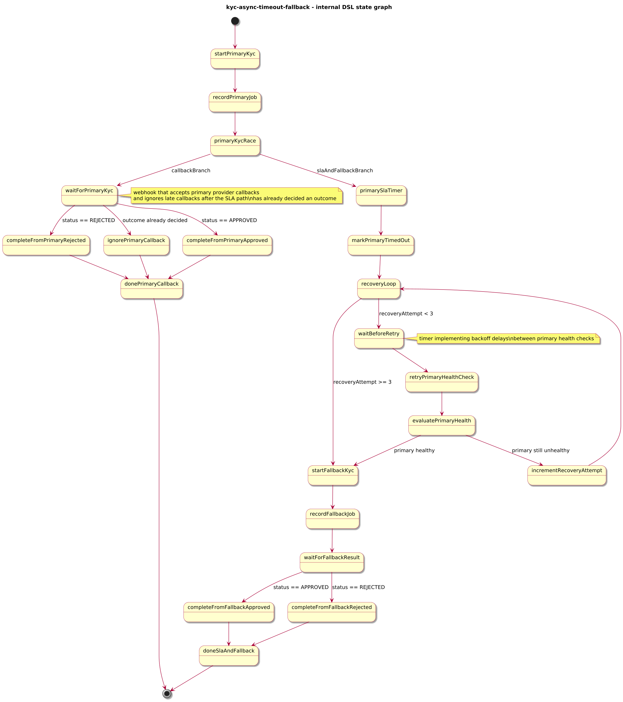

# Journey – kyc-async-timeout-fallback

> KYC check journey that starts an async primary provider, races its callback against an SLA timer, retries with backoff while the provider is unhealthy, and falls back to a secondary provider when the primary path does not complete in time.

## Quick links

| Artifact | File |
|---------|------|
| Journey definition | [kyc-async-timeout-fallback.journey.yaml](kyc-async-timeout-fallback.journey.yaml) |
| OpenAPI (per-journey) | [kyc-async-timeout-fallback.openapi.yaml](kyc-async-timeout-fallback.openapi.yaml) |
| Arazzo workflow | [kyc-async-timeout-fallback.arazzo.yaml](kyc-async-timeout-fallback.arazzo.yaml) |
| Docs (this page) | [kyc-async-timeout-fallback.md](kyc-async-timeout-fallback.md) |

## Summary

This journey models an async KYC check with an explicit SLA and fallback provider:

- It starts an async KYC check with a **primary provider** and records a `jobId` for that check.
- It races the primary provider’s **callback** against a **durable SLA timer**:
  - If the callback arrives first, the journey completes from the primary provider with a `KYC_COMPLETED_PRIMARY` or `KYC_FAILED` outcome.
  - If the SLA timer fires first, the journey marks the request as `KYC_TIMED_OUT` for reporting and moves into a recovery/fallback flow.
- After a timeout, it runs a short **recovery loop** that periodically checks the primary provider’s health with increasing delays before deciding to use a **fallback provider**.
- It starts an async KYC check with the fallback provider and completes from the fallback callback with `KYC_COMPLETED_FALLBACK` or `KYC_FAILED`.

Primary focus: show how to combine **callback vs timer races**, **ignore late callbacks once a decision is made**, and **wait-then-fallback recovery** inside a single journey.

Actors & systems:
- Client or onboarding system that starts the journey and polls status/result.
- Primary KYC provider that accepts KYC checks and posts async callbacks.
- Fallback KYC provider used when the primary path times out or remains unhealthy.
- Journeys API as the orchestrator and HTTP surface for start/status/steps/result.

## Contracts at a glance

- **Input schema** – `KycAsyncTimeoutFallbackStartRequest` with required:
  - `customerId: string`
  - `requestId: string`
  - optional `primaryProvider: string`, `fallbackProvider: string`, `channel: string`.
- **Primary provider callback input** – `PrimaryKycCallbackInput` with:
  - `jobId: string`
  - `status: "APPROVED" | "REJECTED"`.
  - optional `reasons: string[]`.
- **Fallback provider callback input** – `FallbackKycCallbackInput` with:
  - `jobId: string`
  - `status: "APPROVED" | "REJECTED"`.
- **Output schema** – `KycAsyncTimeoutFallbackOutcome` exposed via `JourneyOutcome.output` with:
  - `status: "KYC_COMPLETED_PRIMARY" | "KYC_COMPLETED_FALLBACK" | "KYC_TIMED_OUT" | "KYC_FAILED"`.
  - `customerId`, optional `primaryProvider`, `fallbackProvider`, `primaryJobId`, `fallbackJobId`.
  - `completionSource` (for example `"PRIMARY_CALLBACK"`, `"PRIMARY_SLA_TIMER"`, `"FALLBACK_CALLBACK"`).
  - `failureReasonCode` + `failureReason` for failure outcomes.
  - `timeoutReasonCode` + `timeoutReason` when the primary SLA timer wins the race.

## Step overview (Arazzo + HTTP surface)

Here’s a breakdown of the main steps you’ll call over the Journeys API for the workflows described in `kyc-async-timeout-fallback.arazzo.yaml`.

### Primary completes within SLA (async start)

| # | Step ID | Description | Operation ID | Parameters | Success Criteria | Outputs |
|---:|---------|-------------|--------------|------------|------------------|---------|
| 1 | `startJourney` | Start a new `kyc-async-timeout-fallback` journey instance asynchronously. | `kycAsyncTimeoutFallback_start` | Body: `startRequest` with customer and provider details. | `$statusCode == 202`; body is `JourneyStartResponse` with `journeyId`. | `journeyId` for the new instance. |
| 2 | `getStatusRunning` | Optional status check while the primary KYC check is in progress. | `kycAsyncTimeoutFallback_getStatus` | Path: `journeyId` from step 1 (or from `JourneyStatus.journeyId`). | `$statusCode == 200`; `phase == "RUNNING"`. | `JourneyStatus` with `phase` and `currentState`. |
| 3 | `primaryCallback` | Primary provider posts the KYC result within the SLA. | `kycAsyncTimeoutFallback_waitForPrimaryKyc` | Path: `journeyId`; body: `primaryCallback` with `jobId`, `status`, optional `reasons`. | `$statusCode == 200`; `JourneyStatus.phase` is `Running` or already terminal depending on timing. | `PrimaryKycStepResponse` extending `JourneyStatus`. |
| 4 | `getResult` | Retrieve the final outcome. | `kycAsyncTimeoutFallback_getResult` | Path: `journeyId` from step 1. | `$statusCode == 200`, `phase == "SUCCEEDED"` or `phase == "FAILED"`. | `JourneyOutcome` with `output.status == "KYC_COMPLETED_PRIMARY"` or `output.status == "KYC_FAILED"` (primary). |

### Primary times out, fallback completes (async start)

| # | Step ID | Description | Operation ID | Parameters | Success Criteria | Outputs |
|---:|---------|-------------|--------------|------------|------------------|---------|
| 1 | `startJourney` | Start a new `kyc-async-timeout-fallback` journey instance asynchronously. | `kycAsyncTimeoutFallback_start` | Body: `startRequest` with customer and provider details. | `$statusCode == 202`; body is `JourneyStartResponse` with `journeyId`. | `journeyId` for the new instance. |
| 2 | `getStatusAfterTimeout` | Status check after the primary SLA window has elapsed and the journey has moved into recovery/fallback. | `kycAsyncTimeoutFallback_getStatus` | Path: `journeyId` from step 1. | `$statusCode == 200`; `phase == "RUNNING"` and `currentState` indicates a recovery or fallback step. | `JourneyStatus` with `phase` and `currentState`. |
| 3 | `fallbackCallback` | Fallback provider posts the KYC result. | `kycAsyncTimeoutFallback_waitForFallbackResult` | Path: `journeyId`; body: `fallbackCallback` with `jobId`, `status`. | `$statusCode == 200`; `JourneyStatus.phase` may become terminal once processing finishes. | `FallbackKycStepResponse` extending `JourneyStatus`. |
| 4 | `getResult` | Retrieve the final outcome. | `kycAsyncTimeoutFallback_getResult` | Path: `journeyId` from step 1. | `$statusCode == 200`, `phase == "SUCCEEDED"` or `phase == "FAILED"`. | `JourneyOutcome` with `output.status == "KYC_COMPLETED_FALLBACK"` or `output.status == "KYC_FAILED"` (fallback). |

## Graphical overview

### Sequence diagram

### State diagram

### Activity diagram

## Internal workflow (DSL state graph)

## Implementation notes

- `startPrimaryKyc` calls the primary KYC provider’s async start endpoint and records `primaryJobId` in context.
- `primaryKycRace` is a `parallel` state with:
  - `callbackBranch`:
    - `waitForPrimaryKyc` is a `webhook` that accepts the primary provider’s callback.
    - If `context.outcome` is already set (for example by the SLA path), the callback is routed to `ignorePrimaryCallback` so late callbacks become a no-op.
    - Otherwise, callbacks route to `completeFromPrimaryApproved` or `completeFromPrimaryRejected`, which build `KYC_COMPLETED_PRIMARY` or `KYC_FAILED` outcomes.
  - `slaAndFallbackBranch`:
    - `primarySlaTimer` is a `timer` with a 5-minute SLA window.
    - `markPrimaryTimedOut` records `KYC_TIMED_OUT` with `timeoutReasonCode` / `timeoutReason` and then enters `recoveryLoop`.
- `recoveryLoop`:
  - Uses a `choice` over `context.recoveryAttempt` and a `timer` (`waitBeforeRetry`) to implement 3 recovery attempts with increasing delays (30s, 2m, 5m).
  - `retryPrimaryHealthCheck` probes the primary provider’s health endpoint and uses `evaluatePrimaryHealth` to decide whether to continue or progress to fallback.
- `startFallbackKyc` starts an async KYC check with the fallback provider and records `fallbackJobId`.
- `waitForFallbackResult` is a `webhook` that finishes the journey from the fallback provider with `KYC_COMPLETED_FALLBACK` or `KYC_FAILED`.
- `join.strategy: anyOf` ensures that whichever branch completes first determines the outcome, while the callback branch explicitly ignores late primary callbacks when `outcome` is already present.
