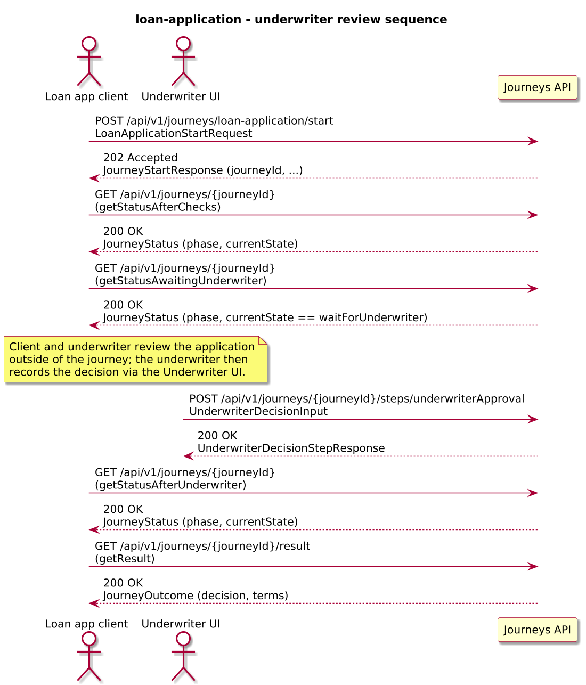
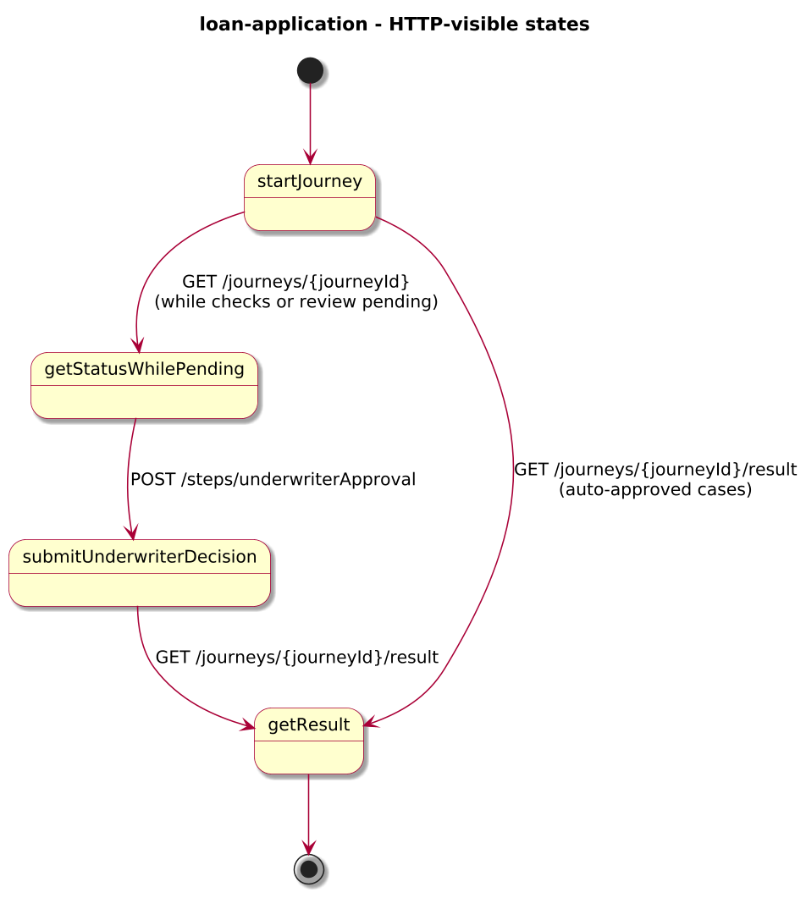
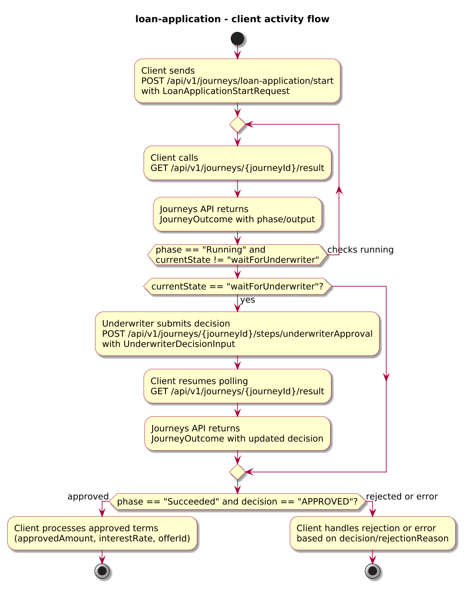
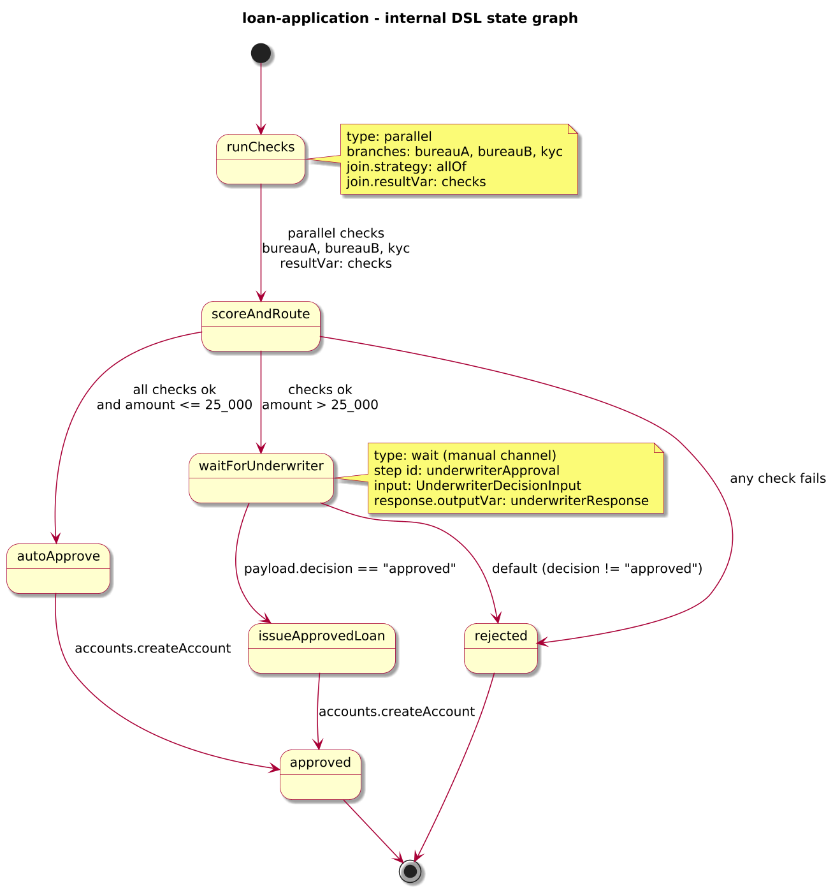

# Journey – loan-application

> Long-lived loan application that runs multi-bureau and KYC checks, then either auto-approves or routes to a manual underwriter step before issuing a loan account.

## Quick links

| Artifact | File |
|---------|------|
| Journey definition | [loan-application.journey.yaml](loan-application.journey.yaml) |
| OpenAPI (per-journey) | [loan-application.openapi.yaml](loan-application.openapi.yaml) |
| Arazzo workflow | [loan-application.arazzo.yaml](loan-application.arazzo.yaml) |
| Docs (this page) | [loan-application.md](loan-application.md) |

## Summary

This journey models a simplified retail loan application:

- It collects an application payload (applicant id, requested amount, currency, term).
- It calls two independent credit bureaus and a KYC API in parallel.
- If all checks pass and the amount is below a threshold, it auto-approves and issues an account.
- Otherwise, it routes the case to a manual underwriter step; the underwriter can approve with adjusted terms or reject.

The journey is long-lived: clients start the journey once, then either poll for the final outcome or call the `underwriterApproval` step when manual review is required.

Actors & systems:
- Loan origination frontend or back-office system that starts the journey and polls status/result.
- Underwriter UI through which an underwriter reviews applications and submits decisions via the `underwriterApproval` step.
- Credit bureau and KYC services called by the journey in parallel to perform checks.
- Accounts or core banking system called by the journey to issue approved loans.
- Journeys API as the orchestrator and HTTP surface for start/status/steps/result.

## Contracts at a glance

- **Input schema** – `LoanApplicationStartRequest` with required `applicantId`, `requestedAmount`, `currency`, `termMonths`; optional `productCode`, `channel`.
- **Output schema** – `LoanApplicationOutcome` exposed via `JourneyOutcome.output` with:
  - `decision: APPROVED | REJECTED | ERROR`.
  - Optional `approvedAmount`, `interestRate`, `termMonths`, `offerId`, `riskSummary`, `rejectionReason`.
- **Manual step input** – `UnderwriterDecisionInput` with:
  - `decision: approved | rejected`, optional `approvedAmount`, `interestRate`, `comment`.
- **Named outcomes** – not used explicitly; the decision is captured inside `JourneyOutcome.output.decision`.

## Step overview (Arazzo + HTTP surface)

Here’s a breakdown of the steps you’ll call over the Journeys API for the underwriter-review workflow described in `loan-application.arazzo.yaml`.

| # | Step ID | Description | Operation ID | Parameters | Success Criteria | Outputs |
|---:|---------|-------------|--------------|------------|------------------|---------|
| 1 | `startJourney` | Start a new `loan-application` journey instance. | `loanApplication_start` | Body: `startRequest` with applicant and loan details. | `$statusCode == 202` and a `journeyId` is returned. | `journeyId` for the new loan application instance. |
| 2 | `getStatusAfterChecks` | Poll status until multi-bureau and KYC checks have completed. | `loanApplication_getStatus` | Path: `journeyId` from step 1. | `$statusCode == 200`; `phase` is `Running` and `currentState` progresses past `runChecks`. | `JourneyStatus` with `phase` and `currentState`. |
| 3 | `getStatusAwaitingUnderwriter` | Poll status until the application is waiting for manual underwriter review. | `loanApplication_getStatus` | Path: `journeyId` from step 1. | `$statusCode == 200`; `currentState == "waitForUnderwriter"`. | `JourneyStatus` indicating the underwriter can now review the case. |
| 4 | `submitUnderwriterDecision` | Submit the manual underwriting decision and adjusted terms for the `underwriterApproval` step. | `loanApplication_underwriterApproval` | Path: `journeyId`; body: `underwriterInput` (`decision`, optional `approvedAmount`, `interestRate`, `comment`). | `$statusCode == 200`; `JourneyStatus.phase` and `currentState` reflect the new decision. | `UnderwriterDecisionStepResponse` (status plus projected decision fields). |
| 5 | `getStatusAfterUnderwriter` | Poll status after the underwriter decision while the engine issues the account (if approved). | `loanApplication_getStatus` | Path: `journeyId` from step 1. | `$statusCode == 200`; `currentState` moves past the account-creation task. | `JourneyStatus` with updated `phase` and `currentState`. |
| 6 | `getResult` | Retrieve the final outcome after the underwriter decision and account creation. | `loanApplication_getResult` | Path: `journeyId` from step 1. | `$statusCode == 200`, `phase == "Succeeded"` or `phase == "Failed"`. | `JourneyOutcome` with `output.decision` and any approved terms or rejection reason. |

For auto-approved applications, the workflow typically uses steps 1, 2, and 6; underwriter-reviewed cases use the full sequence.

## Graphical overview

### Sequence diagram

### State diagram

### Activity diagram

## Internal workflow (DSL state graph)

## Implementation notes

- `runChecks` is a `parallel` state that calls two credit bureaus and a KYC API in parallel; the join mapper collects their results into `checks`.
- `scoreAndRoute` is a `choice` state that:
  - auto-approves small, clean applications (`requestedAmount <= 25000` and all checks ok), or
  - routes to `waitForUnderwriter` when checks are clean but the amount is higher.
- Auto-approved applications call `accounts.createAccount` directly in `autoApprove`; manually approved ones call the same endpoint in `issueApprovedLoan`.
- The `waitForUnderwriter` state is a `wait` state that exposes the `underwriterApproval` step and projects the underwriter’s decision into `underwriterResponse`, which can be surfaced in step responses and final outcomes.
