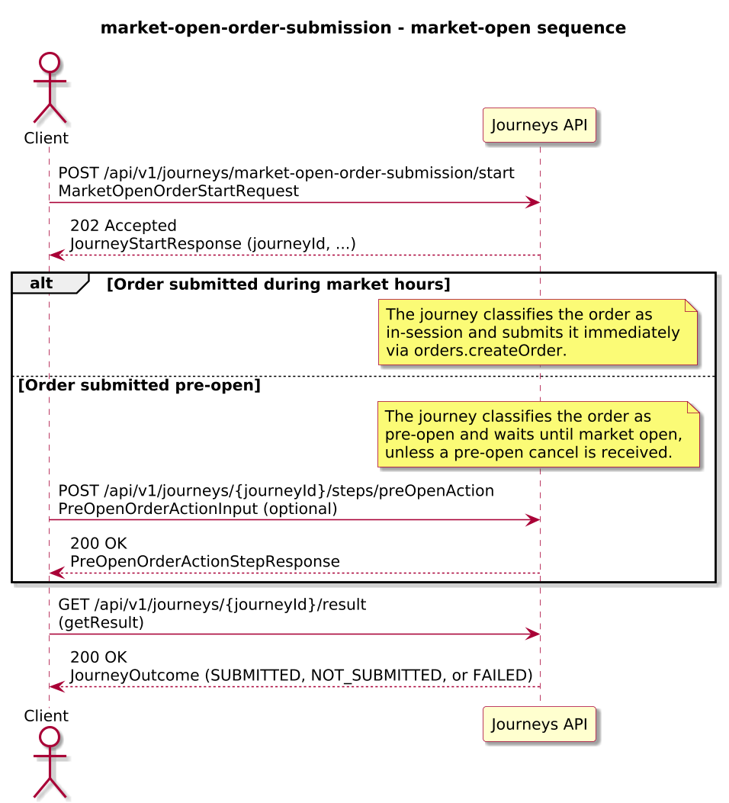
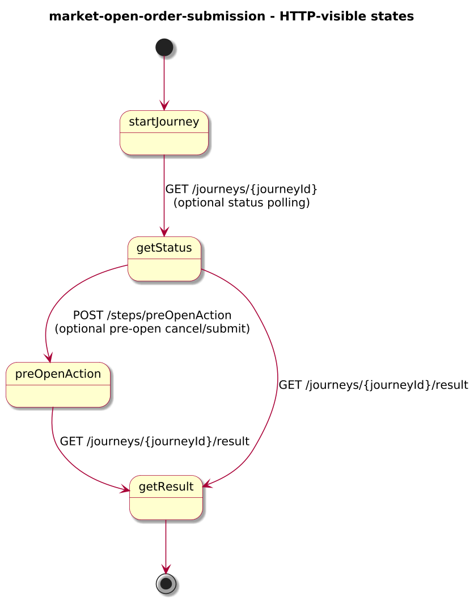
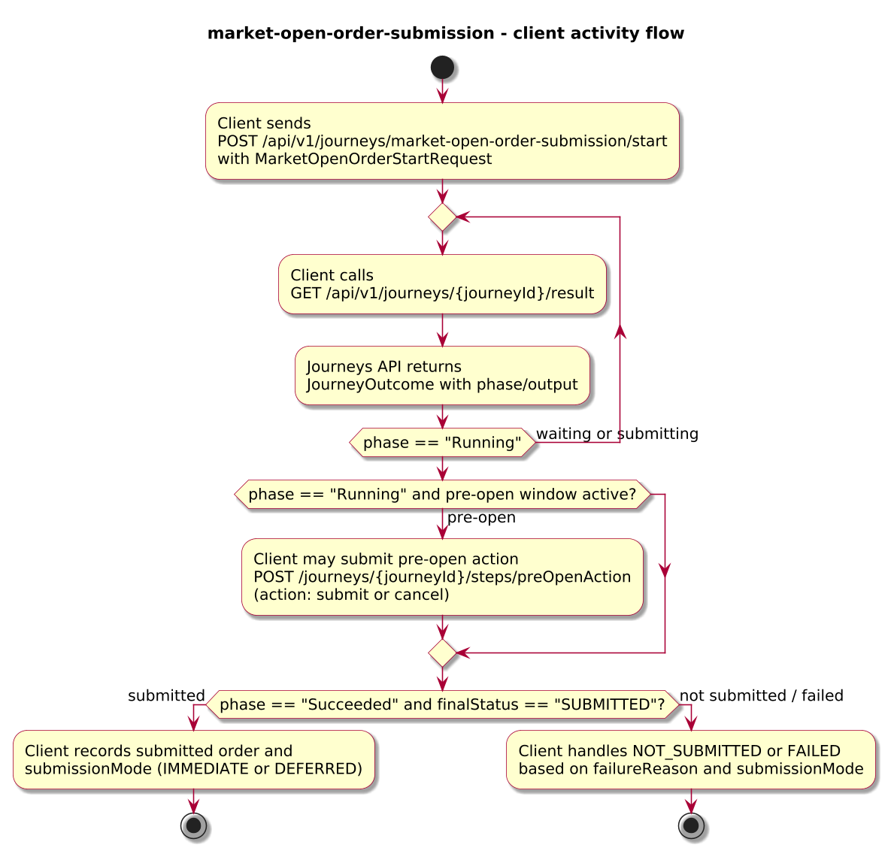
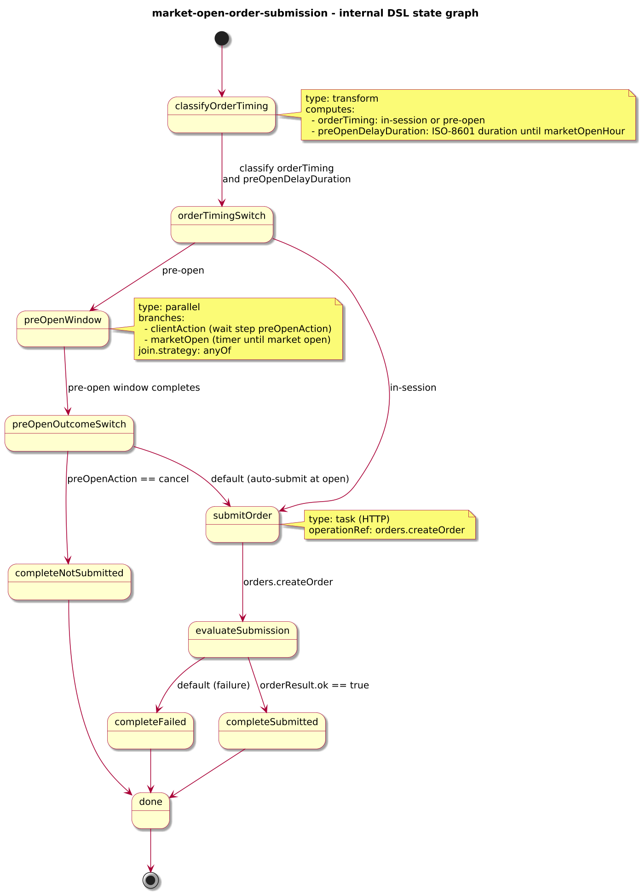

# Journey – market-open-order-submission

> Order submission journey that submits orders immediately during market hours and defers pre-open orders until market open, with an optional pre-open cancel window.

## Quick links

| Artifact | File |
|---------|------|
| Journey definition | [market-open-order-submission.journey.yaml](market-open-order-submission.journey.yaml) |
| OpenAPI (per-journey) | [market-open-order-submission.openapi.yaml](market-open-order-submission.openapi.yaml) |
| Arazzo workflow | [market-open-order-submission.arazzo.yaml](market-open-order-submission.arazzo.yaml) |
| Docs (this page) | [market-open-order-submission.md](market-open-order-submission.md) |

## Summary

This journey models a simple market-open order submission pattern:

- It receives an order submission request with `orderId`, `accountId`, `instrumentId`, `side`, `quantity`, `timeInForce`, and a configured `marketOpenHour`.
- If the current time is already within market hours (on-or-after `marketOpenHour`), it submits the order immediately to an Orders API.
- If the current time is before market open, it enters a pre-open window where the client can optionally cancel the order; otherwise, the journey waits until market open and then submits the order automatically.

The journey is long-lived: clients start it once, may poll status while waiting for market open, optionally send a pre-open cancel, and finally read an outcome indicating whether the order was submitted, not submitted, or failed, and whether it was processed immediately or after deferral.

Actors & systems:
- Trading front-end or order router that starts the journey and polls status/result.
- Orders API called by the journey to create/submit the order.
- Journeys API as the orchestrator and HTTP surface for start/status/pre-open actions/result.

## Contracts at a glance

- **Input schema** – `MarketOpenOrderStartRequest` with required `orderId`, `accountId`, `instrumentId`, `side: BUY | SELL`, `quantity`, `timeInForce: DAY | GTC`, `marketOpenHour`; optional `limitPrice`, `channel`.
- **Pre-open action input** – `PreOpenOrderActionInput` with:
  - `action: "submit" | "cancel"`.
- **Output schema** – `MarketOpenOrderOutcome` exposed via `JourneyOutcome.output` with:
  - `orderId`, `finalStatus: SUBMITTED | NOT_SUBMITTED | FAILED`, `submissionMode: IMMEDIATE | DEFERRED`, `timeInForce`, optional `submittedAt`, `failureReason`.

## Step overview (Arazzo + HTTP surface)

Here’s a breakdown of the steps you’ll call over the Journeys API for the main workflows described in `market-open-order-submission.arazzo.yaml`.

### In-session order (immediate submission)

| # | Step ID | Description | Operation ID | Parameters | Success Criteria | Outputs |
|---:|---------|-------------|--------------|------------|------------------|---------|
| 1 | `startJourney` | Start a new `market-open-order-submission` journey instance. | `marketOpenOrderSubmission_start` | Body: `startRequest` with order details where current time is already at or after marketOpenHour. | `$statusCode == 202` and a `journeyId` is returned. | `journeyId` for the order instance. |
| 2 | `getStatus` | Poll status shortly after start to inspect whether the order is being submitted. | `marketOpenOrderSubmission_getStatus` | Path: `journeyId` from step 1. | `$statusCode == 200`; `phase` is `Running` or already `Succeeded` depending on timing. | `JourneyStatus` with `phase` and `currentState`. |
| 3 | `getResult` | Retrieve the final outcome once order submission has completed. | `marketOpenOrderSubmission_getResult` | Path: `journeyId` from step 1. | `$statusCode == 200`, `phase == "Succeeded"` or `phase == "Failed"`. | `JourneyOutcome` with `output.finalStatus` and `submissionMode = "IMMEDIATE"`. |

### Pre-open order – auto-submit at market open

| # | Step ID | Description | Operation ID | Parameters | Success Criteria | Outputs |
|---:|---------|-------------|--------------|------------|------------------|---------|
| 1 | `startJourney` | Start a new `market-open-order-submission` journey instance before market open. | `marketOpenOrderSubmission_start` | Body: `startRequest` with order details where current time is before marketOpenHour. | `$statusCode == 202` and a `journeyId` is returned. | `journeyId` for the order instance. |
| 2 | `getStatusDuringDeferral` | Poll status while the order is waiting for market open. | `marketOpenOrderSubmission_getStatus` | Path: `journeyId` from step 1. | `$statusCode == 200`; `phase == "Running"` and `currentState` indicates the pre-open window. | `JourneyStatus` with `phase` and `currentState`. |
| 3 | `getResult` | Retrieve the final outcome after market has opened and the order has been submitted. | `marketOpenOrderSubmission_getResult` | Path: `journeyId` from step 1. | `$statusCode == 200`, `phase == "Succeeded"` or `phase == "Failed"`. | `JourneyOutcome` with `output.finalStatus = "SUBMITTED"` and `submissionMode = "DEFERRED"`. |

### Pre-open order – cancelled before market open

| # | Step ID | Description | Operation ID | Parameters | Success Criteria | Outputs |
|---:|---------|-------------|--------------|------------|------------------|---------|
| 1 | `startJourney` | Start a new `market-open-order-submission` journey instance before market open. | `marketOpenOrderSubmission_start` | Body: `startRequest` with order details where current time is before marketOpenHour. | `$statusCode == 202` and a `journeyId` is returned. | `journeyId` for the order instance. |
| 2 | `submitPreOpenCancel` | Submit a pre-open cancel action before market open. | `marketOpenOrderSubmission_preOpenAction` | Path: `journeyId`; body: `cancelAction` (`action: "cancel"`). | `$statusCode == 200`; `JourneyStatus.phase` and `currentState` progress toward terminal state. | `PreOpenOrderActionStepResponse` with `action: "cancel"`. |
| 3 | `getResult` | Retrieve the final outcome once the journey has completed without submitting the order. | `marketOpenOrderSubmission_getResult` | Path: `journeyId` from step 1. | `$statusCode == 200`, `phase == "Succeeded"` or `phase == "Failed"`. | `JourneyOutcome` with `output.finalStatus = "NOT_SUBMITTED"` and `submissionMode = "DEFERRED"`. |

## Graphical overview

### Sequence diagram

### State diagram

### Activity diagram

## Internal workflow (DSL state graph)

## Implementation notes

- `classifyOrderTiming` uses the engine’s current hour and the configured `marketOpenHour` to classify the order as `in-session` or `pre-open` and computes a simple pre-open delay duration when needed.
- `orderTimingSwitch` routes in-session orders directly to `submitOrder`, while pre-open orders go to `preOpenWindow`.
- `preOpenWindow` is a `parallel` state that races:
  - a client-driven `preOpenAction` step (submit or cancel) against
  - an internal `marketOpenTimer` that fires at market open.
- `preOpenOutcomeSwitch` checks whether the client cancelled the order before open; cancelled orders complete as `NOT_SUBMITTED`, while orders without a pre-open cancel proceed to `submitOrder` once market opens.
- `submitOrder` calls `orders.createOrder` to submit the order; `evaluateSubmission` and the `complete*` states build `MarketOpenOrderOutcome` with `submissionMode = IMMEDIATE` for in-session orders and `submissionMode = DEFERRED` for pre-open orders that were submitted at market open.
