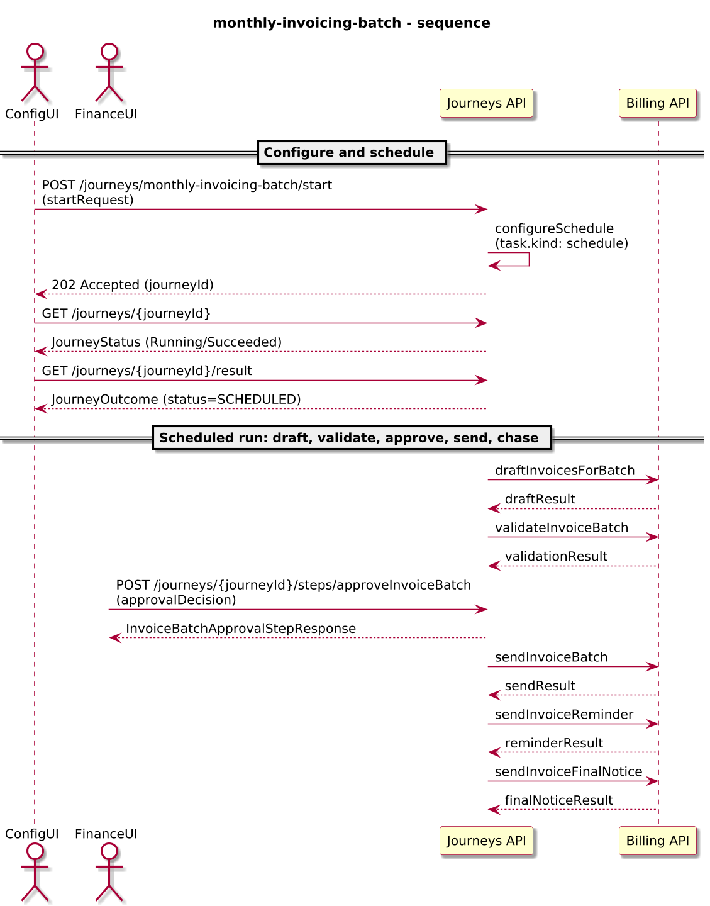
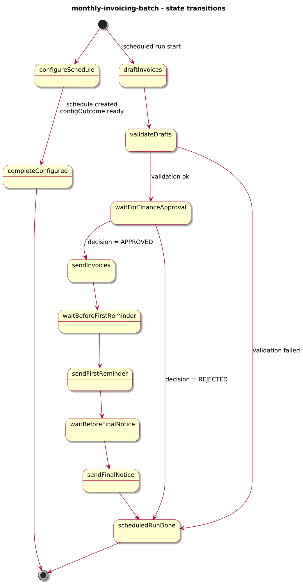
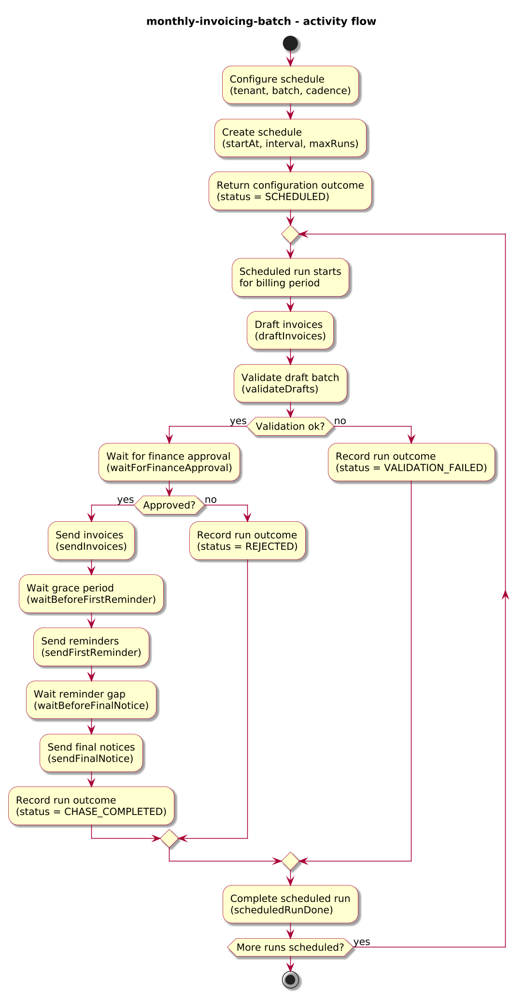
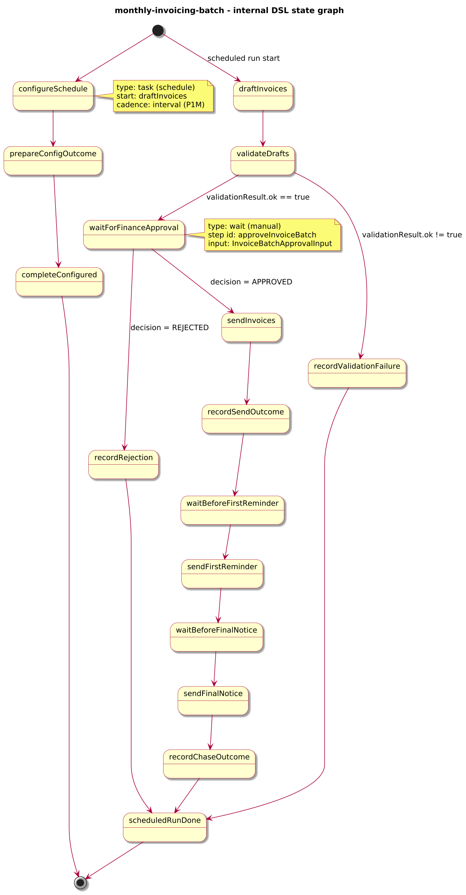

# Journey – monthly-invoicing-batch

> Monthly invoicing journey that configures scheduled batch runs for a tenant, drafts and validates invoices, waits for finance approval, sends invoices, and then triggers reminders and final notices using timers.

## Quick links

| Artifact | File |
|---------|------|
| Journey definition | [monthly-invoicing-batch.journey.yaml](monthly-invoicing-batch.journey.yaml) |
| OpenAPI (per-journey) | [monthly-invoicing-batch.openapi.yaml](monthly-invoicing-batch.openapi.yaml) |
| Arazzo workflow | [monthly-invoicing-batch.arazzo.yaml](monthly-invoicing-batch.arazzo.yaml) |
| Docs (this page) | [monthly-invoicing-batch.md](monthly-invoicing-batch.md) |

## Summary

This journey models a per-tenant monthly invoicing batch with explicit finance approval:

- An interactive run starts the journey for a tenant and batch id, configures the first run time and cadence, and uses `task.kind: schedule` to create a schedule binding for future monthly runs.
- Each scheduled run drafts invoices for the current billing period, validates the draft batch, and then pauses for a finance operator to approve or reject the batch.
- When approved, the journey sends invoices, waits for a grace period, and then triggers reminder and final-notice calls using timers; each run records a compact outcome in `context.lastRun`.

Scheduled runs are non-interactive from a configuration perspective: clients configure the cadence once and then interact with individual runs via the standard Journeys API step endpoint for approval.

Actors & systems:
- Billing or finance configuration UI that starts the journey, supplies tenant and batch parameters, and reads the initial configuration outcome.
- Finance back office UI that calls the `approveInvoiceBatch` step for each scheduled run and monitors journey status.
- Billing system called by the journey to draft, validate, send invoices, and issue reminders/final notices.
- Journeys API as the orchestrator and HTTP surface for start/status/result and the approval step.

## Contracts at a glance

- **Config input** – `MonthlyInvoicingConfigRequest` with required `tenantId`, `batchId`, `firstRunAt` (RFC 3339), `interval` (ISO-8601 duration, typically `P1M`), and `maxRuns`; optional `gracePeriodDuration` and `reminderGapDuration`.
- **Config outcome** – `MonthlyInvoicingConfigOutcome` exposed via `JourneyOutcome.output` (initial run) with:
  - `status: SCHEDULED`, `tenantId`, `batchId`, `firstRunAt`, `interval`, `maxRuns`.
- **Approval input** – `InvoiceBatchApprovalInput` with:
  - `decision: APPROVED | REJECTED`, optional `comment`.

## Step overview (Arazzo + HTTP surface)

Here’s a breakdown of the steps you’ll call over the Journeys API for the configuration and approval flows described in `monthly-invoicing-batch.arazzo.yaml`.

| # | Step ID | Description | Operation ID | Parameters | Success Criteria | Outputs |
|---:|---------|-------------|--------------|------------|------------------|---------|
| 1 | `startJourney` | Configure and schedule the `monthly-invoicing-batch` journey (synchronous schedule configuration). | `monthlyInvoicingBatch_start` | Body: `startRequest` with `tenantId`, `batchId`, `firstRunAt`, `interval`, `maxRuns`, optional `gracePeriodDuration`, `reminderGapDuration`. | `$statusCode == 200`, `phase == "SUCCEEDED"` or `phase == "FAILED"`. | `JourneyOutcome` with `output.status = "SCHEDULED"` and config fields. |
| 2 | `getStatus` | (Optional) Re-fetch status for the configuration run. | `monthlyInvoicingBatch_getStatus` | Path: `journeyId` from step 1 (or from `JourneyOutcome.journeyId`). | `$statusCode == 200`; `phase` is `Running` until configuration completes. | `JourneyStatus` with `phase` and `currentState`. |
| 3 | `getResult` | (Optional) Re-fetch the configuration outcome once the interactive run has completed. | `monthlyInvoicingBatch_getResult` | Path: `journeyId` from step 1 (or from `JourneyOutcome.journeyId`). | `$statusCode == 200`, `phase == "SUCCEEDED"` or `phase == "FAILED"`. | `JourneyOutcome` with `output.status = "SCHEDULED"` and config fields. |
| 4 | `approveInvoiceBatch` | For a scheduled run, approve or reject the drafted invoice batch. | `monthlyInvoicingBatch_approveInvoiceBatch` | Path: `journeyId` for the scheduled run; body: `approvalDecision` (`decision`, `comment`). | `$statusCode == 200`; `JourneyStatus.phase` reflects progress after approval. | `InvoiceBatchApprovalStepResponse` with decision and comment, plus `JourneyStatus`. |

Subsequent sending and chasing behaviour (reminders and final notices) is driven by the journey’s internal timers; external callers observe progress by polling `getStatus` for the scheduled run’s `journeyId`.

## Scenarios and variations

- **Happy path – approved batch**: configuration run succeeds, a scheduled run drafts and validates invoices, finance approves the batch, invoices are sent, and reminders/final notices are issued after the configured delays.
- **Validation failure**: validation finds blocking issues; the scheduled run records `status = "VALIDATION_FAILED"` in `context.lastRun` and terminates without exposing an approval step.
- **Rejected by finance**: finance rejects the batch via `approveInvoiceBatch`; the run records `status = "REJECTED"` with the optional comment and does not send invoices or reminders.

## Graphical overview

Diagrams for this journey live under:

- `docs/3-reference/examples/business/monthly-invoicing-batch/diagrams/`

### Sequence diagram

### State diagram

### Activity diagram

## Internal workflow (DSL state graph)

Internal view of the journey’s DSL (`spec.states`), showing the configuration path (schedule setup and outcome) and the scheduled-run path (draft, validate, wait for approval, send, chase).

## Implementation notes

- `configureSchedule` uses `task.kind: schedule` to configure monthly non-interactive runs starting at `draftInvoices` with cadence `interval` (for example `P1M`) and bound `maxRuns`; it passes the current `context` as the context snapshot for scheduled runs.
- `draftInvoices` calls `billing.draftInvoicesForBatch` to create invoice drafts for the configured batch; `validateDrafts` calls `billing.validateInvoiceBatch` and routes to `waitForFinanceApproval` or `recordValidationFailure` based on `validationResult.ok`.
- `waitForFinanceApproval` exposes the `approveInvoiceBatch` step, storing the decision and optional comment in `context.approval` and projecting a compact `InvoiceBatchApprovalStepResponse` into the step response.
- `sendInvoices` calls `billing.sendInvoiceBatch` with `tenantId` and `channel`; `recordSendOutcome` writes `context.lastRun` with `status = "SENT"` or `"SEND_FAILED"` plus counts from the billing API.
- `waitBeforeFirstReminder` and `waitBeforeFinalNotice` are `timer` states that wait for `gracePeriodDuration` and `reminderGapDuration` respectively before invoking `billing.sendInvoiceReminder` and `billing.sendInvoiceFinalNotice`; `recordChaseOutcome` updates `context.lastRun` with reminder/final notice counts.
