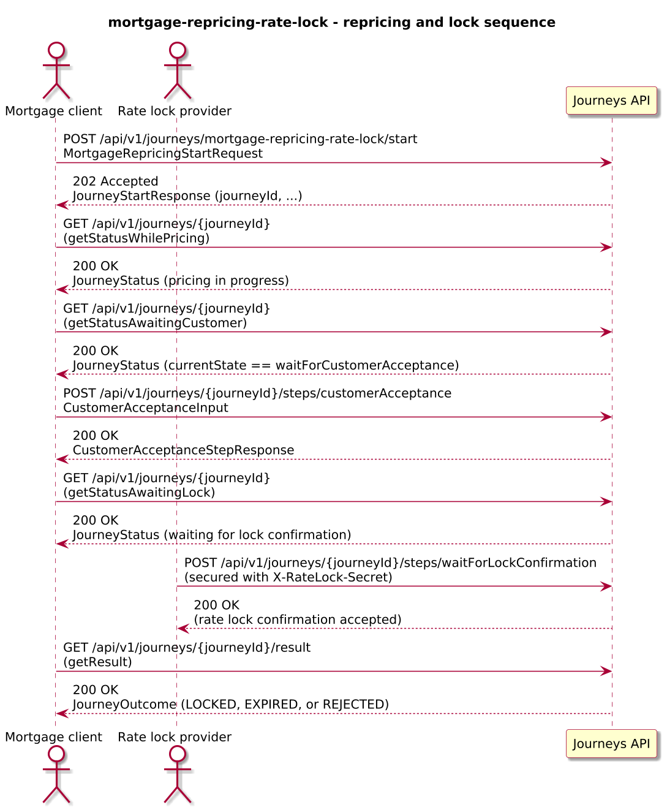
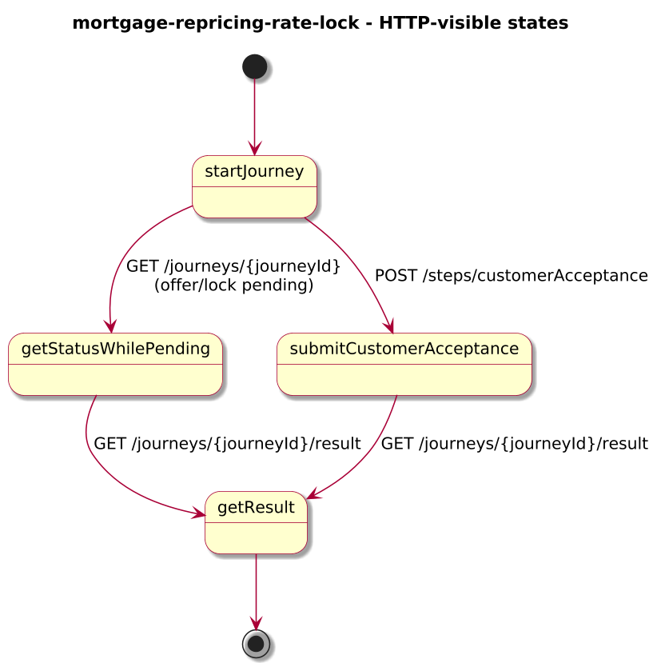
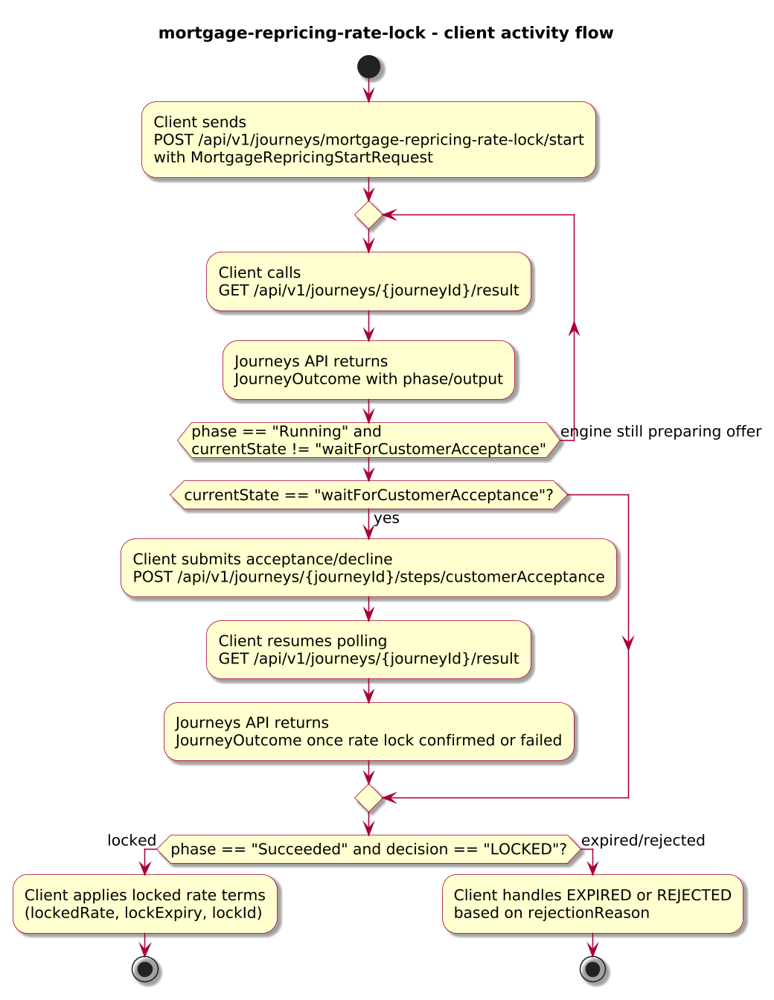
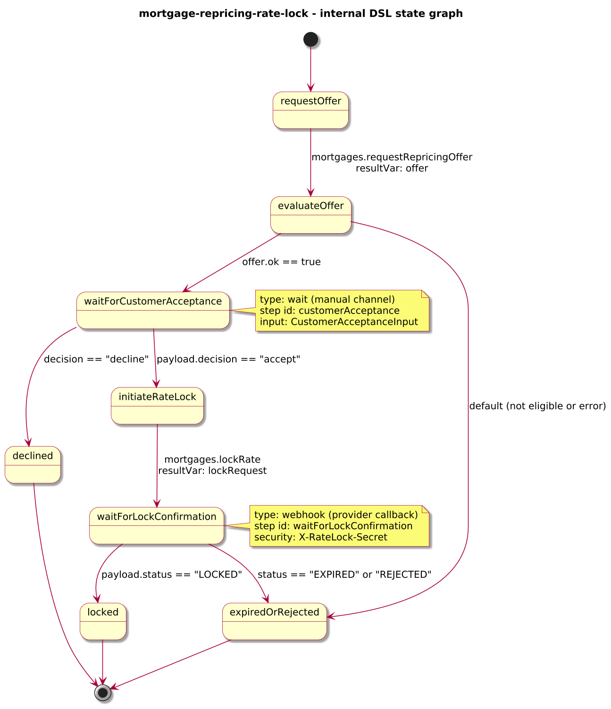

# Journey – mortgage-repricing-rate-lock

> Mortgage repricing journey that requests a new offer, waits for customer acceptance, initiates a rate lock, and completes once the provider confirms the lock or reports expiry/rejection.

## Quick links

| Artifact | File |
|---------|------|
| Journey definition | [mortgage-repricing-rate-lock.journey.yaml](mortgage-repricing-rate-lock.journey.yaml) |
| OpenAPI (per-journey) | [mortgage-repricing-rate-lock.openapi.yaml](mortgage-repricing-rate-lock.openapi.yaml) |
| Arazzo workflow | [mortgage-repricing-rate-lock.arazzo.yaml](mortgage-repricing-rate-lock.arazzo.yaml) |
| Docs (this page) | [mortgage-repricing-rate-lock.md](mortgage-repricing-rate-lock.md) |

## Summary

This journey models repricing an existing mortgage product:

- It receives a repricing request for a `mortgageId` with desired fix term and product code.
- It calls a Mortgages API to obtain a repricing offer.
- If an offer is available, it pauses at a `wait` state for the customer to accept or decline the offer via the `customerAcceptance` step.
- On acceptance, it calls a rate-lock endpoint and then waits for an asynchronous callback from the provider confirming whether the lock is `LOCKED`, `EXPIRED`, or `REJECTED`.

The journey is long-lived: clients start it once, perform customer acceptance via a dedicated step, and poll for the final locked or rejected outcome while the provider processes the rate lock.

Actors & systems:
- Mortgage servicing frontend or advisor desktop that starts the journey, surfaces repricing offers, and polls status/result.
- Customer UI (or advisor-assisted flow) where the customer accepts or declines the repricing offer via the `customerAcceptance` step.
- Mortgages API called by the journey to request offers and lock rates.
- Provider rate-lock system that calls back into the journey via a secured webhook to report lock status.
- Journeys API as the orchestrator and HTTP surface for start/status/steps/webhooks/result.

## Contracts at a glance

- **Input schema** – `MortgageRepricingStartRequest` with required `mortgageId`, `requestedFixYears`, `requestedProductCode`; optional `channel`, `customerId`.
- **Customer acceptance input** – `CustomerAcceptanceInput` with:
  - `decision: "accept" | "decline"`.
  - optional `comment`.
- **Output schema** – `MortgageRepricingOutcome` exposed via `JourneyOutcome.output` with:
  - `decision: LOCKED | EXPIRED | REJECTED`.
  - `mortgageId`, `previousRate`, `lockedRate`, `lockExpiry`, `lockId`, optional `rejectionReason`, `repricingSummary`.

## Step overview (Arazzo + HTTP surface)

Here’s a breakdown of the steps you’ll call over the Journeys API for the main repricing workflow described in `mortgage-repricing-rate-lock.arazzo.yaml`.

| # | Step ID | Description | Operation ID | Parameters | Success Criteria | Outputs |
|---:|---------|-------------|--------------|------------|------------------|---------|
| 1 | `startJourney` | Start a new `mortgage-repricing-rate-lock` journey instance. | `mortgageRepricingRateLock_start` | Body: `startRequest` with mortgage id, requested fix term, product code. | `$statusCode == 202` and a `journeyId` is returned. | `journeyId` for the repricing instance. |
| 2 | `getStatusWhilePricing` | Poll status while the engine is requesting a repricing offer from the Mortgages API. | `mortgageRepricingRateLock_getStatus` | Path: `journeyId` from step 1. | `$statusCode == 200`; `phase` is `RUNNING` and `currentState` reflects pricing progress. | `JourneyStatus` with `phase` and `currentState`. |
| 3 | `getStatusAwaitingCustomer` | Poll status until the journey is waiting for customer acceptance. | `mortgageRepricingRateLock_getStatus` | Path: `journeyId` from step 1. | `$statusCode == 200`; `currentState == "waitForCustomerAcceptance"`. | `JourneyStatus` indicating that the customer can now accept/decline the offer. |
| 4 | `submitCustomerAcceptance` | Provide the customer’s acceptance (or decline) of the repricing offer. | `mortgageRepricingRateLock_customerAcceptance` | Path: `journeyId`; body: `customerAcceptance` (`decision`, optional `comment`). | `$statusCode == 200`; `JourneyStatus.phase` and `currentState` progress based on decision. | `CustomerAcceptanceStepResponse` including the projected decision fields. |
| 5 | `getStatusAwaitingLock` | Poll status while the engine initiates the rate lock and waits for confirmation. | `mortgageRepricingRateLock_getStatus` | Path: `journeyId` from step 1. | `$statusCode == 200`; `currentState` moves through `initiateRateLock` / `waitForLockConfirmation`. | `JourneyStatus` with updated `phase` and `currentState`. |
| 6 | `getResult` | Retrieve the final outcome once the rate lock has been confirmed or failed. | `mortgageRepricingRateLock_getResult` | Path: `journeyId` from step 1. | `$statusCode == 200`, `phase == "SUCCEEDED"` or `phase == "FAILED"`. | `JourneyOutcome` with `output.decision` and lock details or rejection reason. |

Customer decline flows typically use steps 1, 2, 4, and 6 and end in a rejected outcome without locking.

## Graphical overview

### Sequence diagram

### State diagram

### Activity diagram

## Internal workflow (DSL state graph)

## Implementation notes

- `requestOffer` calls the Mortgages API to request a repricing offer; its response is stored in `offer`.
- `evaluateOffer` decides whether to proceed based on `offer.ok`; non-eligible cases go directly to `RATE_LOCK_FAILED` via the `rejected` path.
- `waitForCustomerAcceptance` is a `wait` state that exposes the `customerAcceptance` step and projects the decision into `customerAcceptanceResponse`.
- `initiateRateLock` calls `mortgages.lockRate` with the selected `offer.body.offerId`; the final outcome depends on the subsequent `waitForLockConfirmation` webhook callback.
- `waitForLockConfirmation` is a `webhook` state secured with `X-RateLock-Secret`; it projects lock details into `lockResponse` and routes either to `locked` or `expiredOrRejected`.
