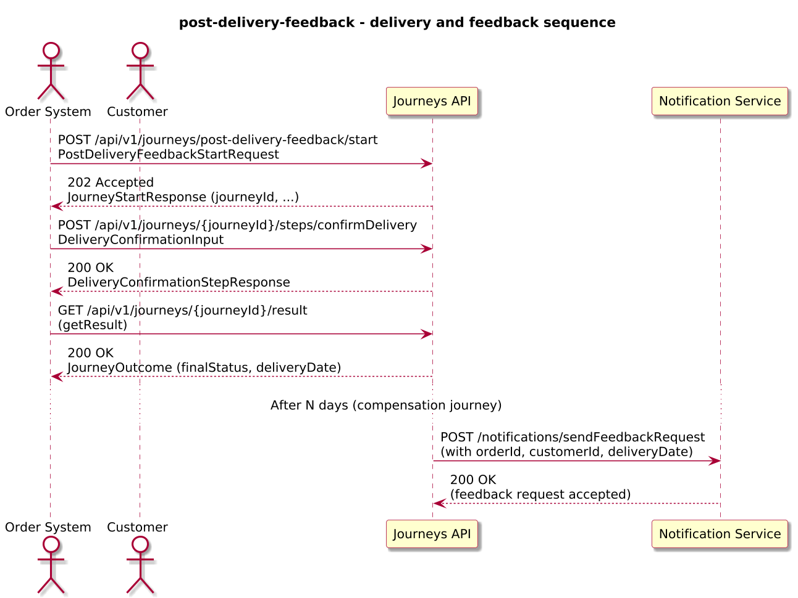
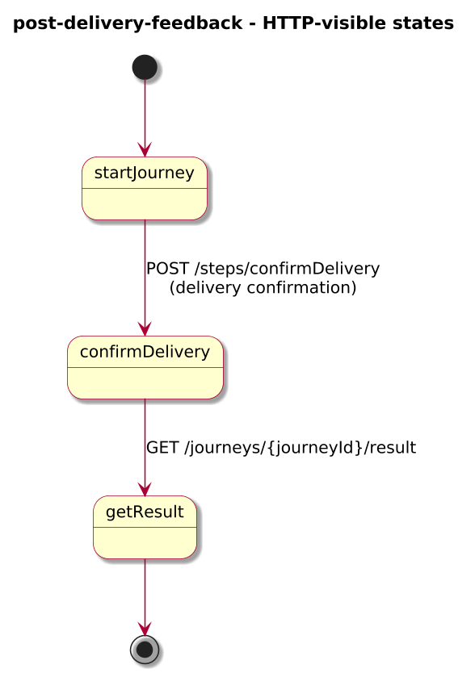
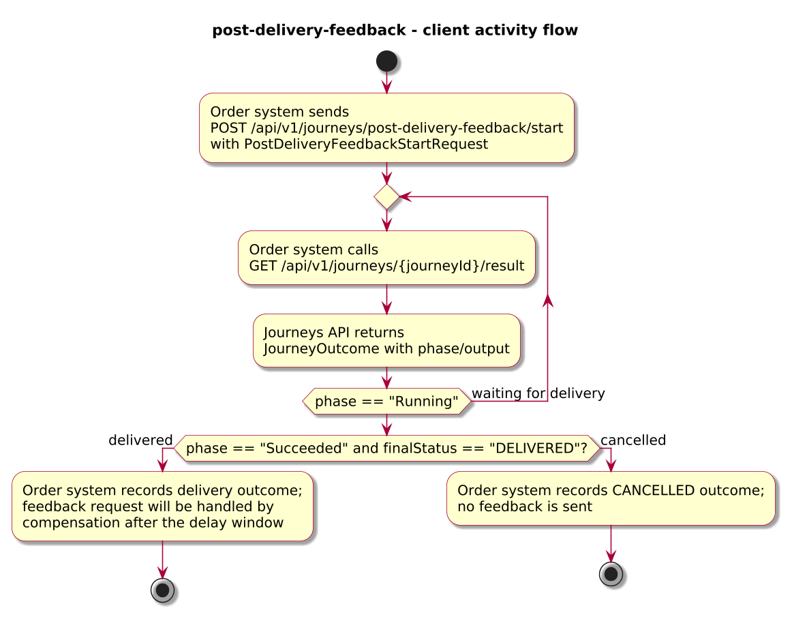
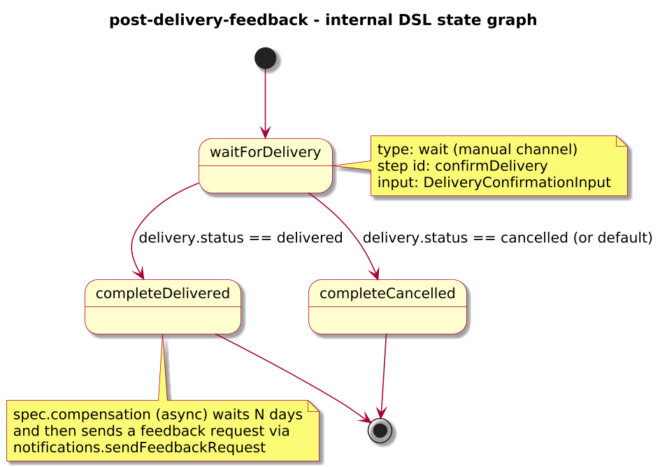

# Journey – post-delivery-feedback

> Order delivery journey that completes on delivery and uses post-delivery timers and compensation-style follow-up to send feedback requests N days after delivery.

## Quick links

| Artifact | File |
|---------|------|
| Journey definition | [post-delivery-feedback.journey.yaml](post-delivery-feedback.journey.yaml) |
| OpenAPI (per-journey) | [post-delivery-feedback.openapi.yaml](post-delivery-feedback.openapi.yaml) |
| Arazzo workflow | [post-delivery-feedback.arazzo.yaml](post-delivery-feedback.arazzo.yaml) |
| Docs (this page) | [post-delivery-feedback.md](post-delivery-feedback.md) |

## Summary

This journey models a simple post-delivery feedback window:

- It starts when an order is created or ready for delivery tracking.
- It waits for a delivery confirmation step that marks the order as delivered or cancelled and completes the main journey with a simple outcome.
- For delivered orders, it uses a compensation-style follow-up path to wait N days after delivery and then send a feedback request to the customer.

The journey is long-lived but has a short interactive surface: the main path is only concerned with confirming delivery and returning a final outcome; follow-up behaviour is handled asynchronously via `spec.compensation`.

Actors & systems:
- Order management or fulfillment system that starts the journey and later confirms delivery.
- Notification service called by the compensation journey to send feedback requests.
- Journeys API as the orchestrator and HTTP surface for start/status/steps/result.

## Contracts at a glance

- **Input schema** – `PostDeliveryFeedbackStartRequest` with required `orderId`, `customerId`, `expectedDeliveryDate`; optional `feedbackDelayDays`, `channel`.
- **Delivery confirmation input** – `DeliveryConfirmationInput` with:
  - `status: "delivered" | "cancelled"`.
  - optional `deliveryDate`.
- **Output schema** – `PostDeliveryFeedbackOutcome` exposed via `JourneyOutcome.output` with:
  - `orderId`, `finalStatus: DELIVERED | CANCELLED`, optional `deliveryDate`.

## Step overview (Arazzo + HTTP surface)

Here’s a breakdown of the steps you’ll call over the Journeys API for the main delivered workflow described in `post-delivery-feedback.arazzo.yaml`.

| # | Step ID | Description | Operation ID | Parameters | Success Criteria | Outputs |
|---:|---------|-------------|--------------|------------|------------------|---------|
| 1 | `startJourney` | Start a new `post-delivery-feedback` journey instance for the order (synchronous to the first wait step). | `postDeliveryFeedback_start` | Body: `startRequest` with order and expected delivery information. | `$statusCode == 200`; `phase == "RUNNING"` and `currentState == "waitForDelivery"`. | `JourneyStatus` for the order instance. |
| 2 | `confirmDelivery` | Confirm that the order has been delivered (or cancelled). | `postDeliveryFeedback_confirmDelivery` | Path: `journeyId`; body: `deliveryConfirmation` (`status`, `deliveryDate`). | `$statusCode == 200`; `JourneyStatus.phase` and `currentState` progress to terminal state. | `DeliveryConfirmationStepResponse` with projected status and deliveryDate. |
| 3 | `getResult` | Retrieve the final outcome once the delivery step has completed. | `postDeliveryFeedback_getResult` | Path: `journeyId` from step 1. | `$statusCode == 200`, `phase == "SUCCEEDED"` or `phase == "FAILED"`. | `JourneyOutcome` with `output.finalStatus` and `deliveryDate`. |

The compensation journey runs asynchronously for delivered orders and is not directly visible in the per-journey OpenAPI surface; its behaviour is described below.

## Graphical overview

### Sequence diagram

### State diagram

### Activity diagram

## Internal workflow (DSL state graph)

## Implementation notes

- `waitForDelivery` exposes the `confirmDelivery` step (a `wait` state) where an upstream system or operator confirms that the order was delivered or cancelled.
- `completeDelivered` and `completeCancelled` are simple terminal states that surface the delivery status as the main journey outcome.
- The `spec.compensation` block attaches a compensation-style follow-up path to the journey:
  - It is configured with `mode: async` so that the main journey outcome is returned immediately on delivery, without blocking on feedback.
  - It uses `alsoFor` to run only for successful deliveries (`output.finalStatus == "DELIVERED"`).
  - `waitBeforeFeedback` is a `timer` state that waits for `feedbackDelayDays` (default 7 days) after delivery.
  - `sendFeedbackRequest` calls `notifications.sendFeedbackRequest` with order and delivery details to ask the customer for feedback or review.
