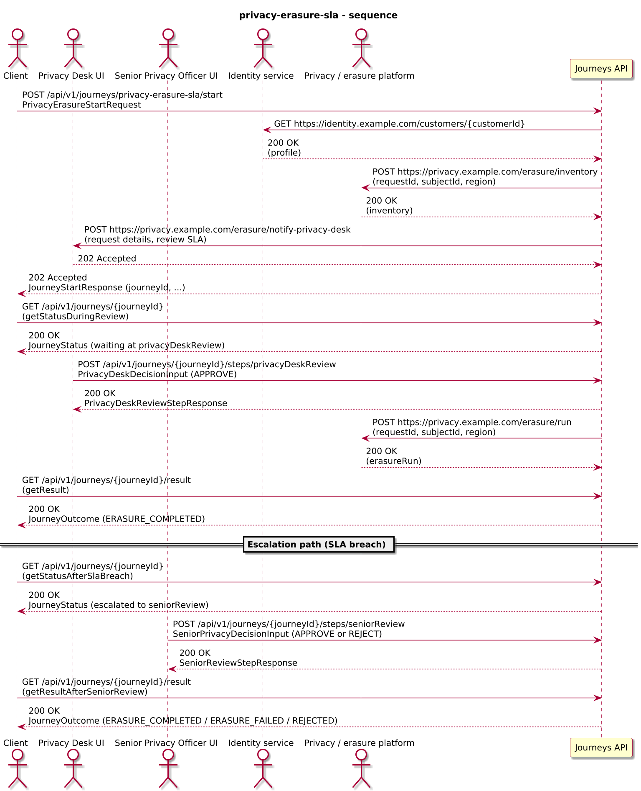
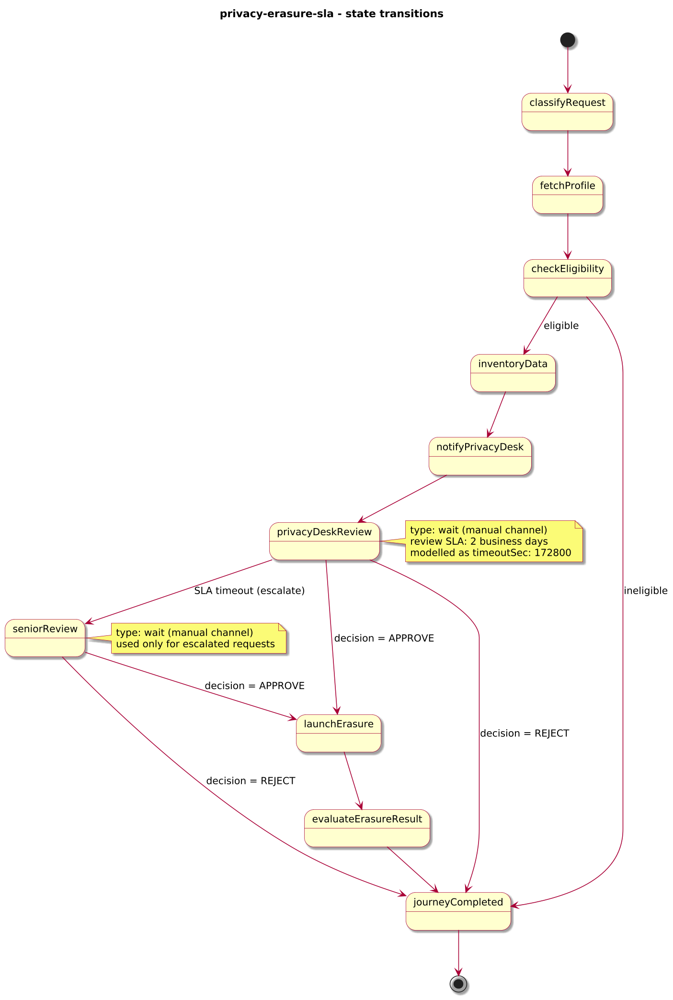
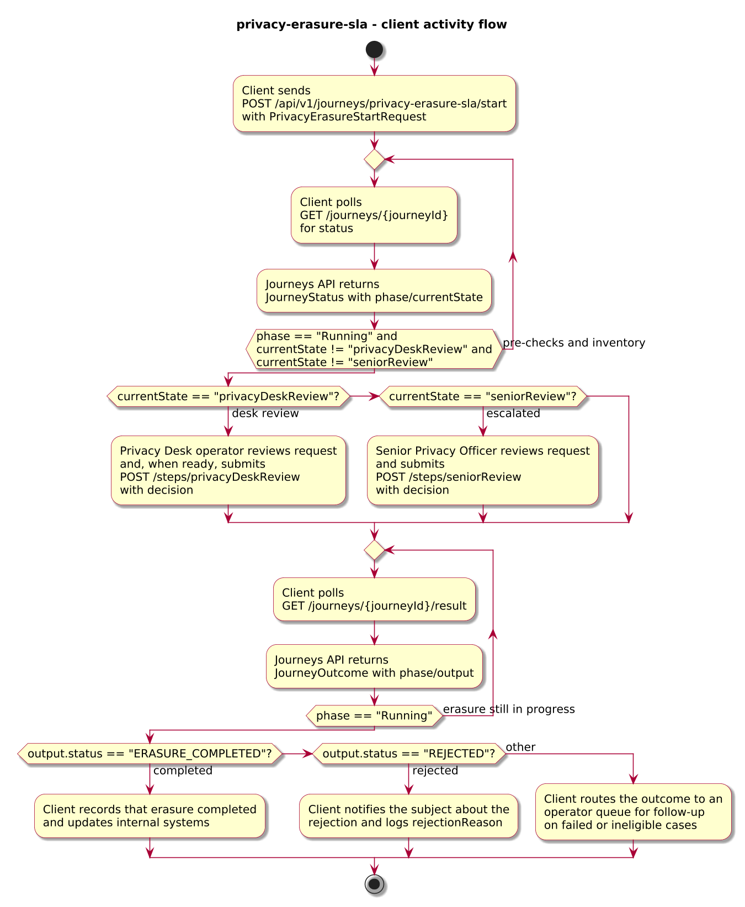
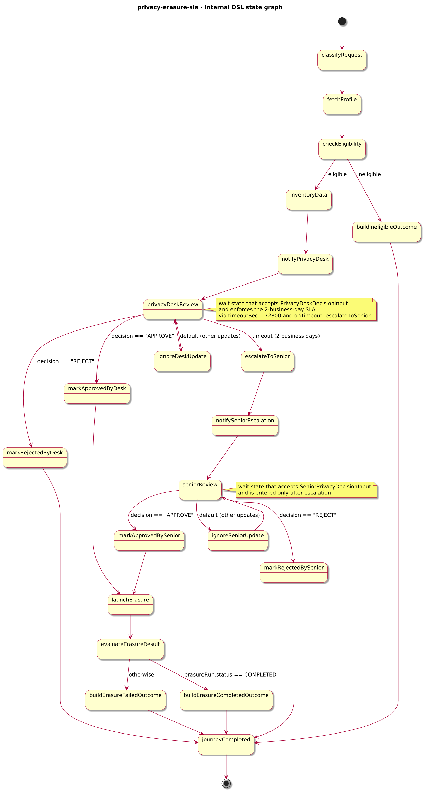

# Journey – privacy-erasure-sla

> Privacy erasure journey that validates a data erasure request, runs pre-checks, enforces a 2-business-day review SLA for the Privacy Desk, escalates overdue requests to a Senior Privacy Officer, and orchestrates the erasure run.

## Quick links

| Artifact | File |
|---------|------|
| Journey definition | [privacy-erasure-sla.journey.yaml](privacy-erasure-sla.journey.yaml) |
| OpenAPI (per-journey) | [privacy-erasure-sla.openapi.yaml](privacy-erasure-sla.openapi.yaml) |
| Arazzo workflow | [privacy-erasure-sla.arazzo.yaml](privacy-erasure-sla.arazzo.yaml) |
| Docs (this page) | [privacy-erasure-sla.md](privacy-erasure-sla.md) |

## Summary

This journey models a subject access / privacy erasure request with explicit review and escalation behaviour:

- It receives a privacy erasure request with `requestId`, `subjectId`, `region`, and optional `customerId`, `channel`, and `requestedAt`.
- It fetches the subject profile and runs basic eligibility checks (for example unsupported regions) before proceeding.
- It calls a data inventory service to identify systems where data should be erased and notifies the Privacy Desk about the new request and its review SLA.
- It waits for a Privacy Desk decision on the request:
  - If the Privacy Desk approves within the SLA, the journey starts the erasure run and completes with an `ERASURE_COMPLETED` or `ERASURE_FAILED` outcome.
  - If the Privacy Desk rejects, the journey completes with a `REJECTED` outcome and captures the rejection reason.
- If the Privacy Desk does not act within the configured SLA window, the journey escalates the request to a Senior Privacy Officer and waits for their decision before orchestrating the erasure or recording a rejection.

The example focuses on review deadlines and escalation rather than the full details of downstream erasure systems. It illustrates how to attach a time-bound SLA to a specific review state, use a single breach path to escalate, and still keep the erasure outcome itself modelled explicitly in the journey output.

Note on “business days”: in this example, the 2-business-day SLA is modelled as a `wait` timeout of 172800 seconds (48 hours) and does not skip weekends or holidays. Future features may introduce explicit business calendar modelling; for now, “business day” is treated as a domain concept configured around the underlying timer.

Actors & systems:
- Client or back-office system that starts the journey and polls status/result.
- Privacy Desk operators who review and approve or reject requests.
- Senior Privacy Officers who handle escalated requests when the SLA is breached.
- Identity / customer profile service used to look up the subject.
- Privacy / erasure platform used to compute data inventory and run erasure.
- Journeys API as the orchestrator and HTTP surface for start/status/steps/result.

## Contracts at a glance

- **Input schema** – `PrivacyErasureStartRequest` with required:
  - `requestId: string`
  - `subjectId: string`
  - `region: string`
  - optional `customerId: string`, `channel: string`, `requestedAt: string (date-time)`.
- **Privacy Desk decision input** – `PrivacyDeskDecisionInput` with:
  - `decision: "APPROVE" | "REJECT"`.
  - optional `reason: string`.
- **Senior review input** – `SeniorPrivacyDecisionInput` with:
  - `decision: "APPROVE" | "REJECT"`.
  - optional `reason: string`.
- **Output schema** – `PrivacyErasureOutcome` exposed via `JourneyOutcome.output` with:
  - `status: "ERASURE_COMPLETED" | "ERASURE_FAILED" | "REJECTED" | "INELIGIBLE"`.
  - `requestId`, `subjectId`, optional `region`.
  - `decisionLevel: "PRIVACY_DESK" | "SENIOR_PRIVACY_OFFICER"` and `decisionAt` when a human decision is recorded.
  - Optional `escalatedAt` plus `escalationReasonCode` and `escalationReason` when the SLA-based escalation path fires.
  - Optional `erasureStartedAt`, `erasureCompletedAt`, and pairs of code + reason fields depending on the path taken:
    - `failureReasonCode` + `failureReason` for erasure engine failures.
    - `rejectionReasonCode` + `rejectionReason` for Privacy Desk or Senior Privacy Officer rejections.
    - `ineligibleReasonCode` + `ineligibleReason` for ineligible requests.

## Step overview (Arazzo + HTTP surface)

Here’s a breakdown of the main steps you’ll call over the Journeys API for the workflows described in `privacy-erasure-sla.arazzo.yaml`.

### Approved within SLA

| # | Step ID | Description | Operation ID | Parameters | Success Criteria | Outputs |
|---:|---------|-------------|--------------|------------|------------------|---------|
| 1 | `startJourney` | Start a new `privacy-erasure-sla` journey instance (synchronous to the initial review state). | `privacyErasureSla_start` | Body: `startRequest` with erasure details. | `$statusCode == 200`; `JourneyStatus.currentState` reflects that the request has been created and is awaiting Privacy Desk review. | `JourneyStatus` for the erasure request instance. |
| 2 | `getStatusDuringReview` | Optional status check while the Privacy Desk review is pending. | `privacyErasureSla_getStatus` | Path: `journeyId` from step 1. | `$statusCode == 200`; `phase == "RUNNING"` and `currentState` indicates that the request is in review. | `JourneyStatus` with `phase` and `currentState`. |
| 3 | `privacyDeskReview` | Provide the Privacy Desk approval decision within the SLA window. | `privacyErasureSla_privacyDeskReview` | Path: `journeyId`; body: `privacyDeskDecision` with `decision: "APPROVE"` and optional `reason`. | `$statusCode == 200`; `JourneyStatus.phase` remains `Running` while the erasure run proceeds. | `PrivacyDeskReviewStepResponse` extending `JourneyStatus`. |
| 4 | `getResult` | Retrieve the final outcome once the erasure run completes. | `privacyErasureSla_getResult` | Path: `journeyId` from step 1. | `$statusCode == 200`, `phase == "SUCCEEDED"` or `phase == "FAILED"`. | `JourneyOutcome` with `output.status == "ERASURE_COMPLETED"` or `output.status == "ERASURE_FAILED"`. |

### Escalated to Senior Privacy Officer

| # | Step ID | Description | Operation ID | Parameters | Success Criteria | Outputs |
|---:|---------|-------------|--------------|------------|------------------|---------|
| 1 | `startJourney` | Start a new `privacy-erasure-sla` journey instance. | `privacyErasureSla_start` | Body: `startRequest` with erasure details. | `$statusCode == 202` and a `journeyId` is returned. | `journeyId` for the erasure request instance. |
| 2 | `getStatusDuringDeskReview` | Optional status check while the request is awaiting Privacy Desk review. | `privacyErasureSla_getStatus` | Path: `journeyId` from step 1. | `$statusCode == 200`; `phase == "RUNNING"`. | `JourneyStatus` with `phase` and `currentState`. |
| 3 | `getStatusAfterSlaBreach` | Status check after the SLA window elapses and the request has been escalated. | `privacyErasureSla_getStatus` | Path: `journeyId` from step 1. | `$statusCode == 200`; `phase == "RUNNING"` and `currentState` indicates the Senior review step. | `JourneyStatus` with `phase` and `currentState`. |
| 4 | `seniorReview` | Provide the Senior Privacy Officer decision after escalation. | `privacyErasureSla_seniorReview` | Path: `journeyId`; body: `seniorDecision` with `decision: "APPROVE"` or `decision: "REJECT"`. | `$statusCode == 200`; `JourneyStatus.phase` remains `Running` while the erasure run proceeds (for approvals). | `SeniorReviewStepResponse` extending `JourneyStatus`. |
| 5 | `getResult` | Retrieve the final outcome after Senior review and erasure execution. | `privacyErasureSla_getResult` | Path: `journeyId` from step 1. | `$statusCode == 200`, `phase == "SUCCEEDED"` or `phase == "FAILED"`. | `JourneyOutcome` with `output.status` reflecting the final decision and erasure result. |

Clients that only need to know whether a request was accepted and completed can call steps 1 and 4 (or 5) and rely on `output.status`; clients that need to drive manual reviews should use the step endpoints for `privacyDeskReview` and `seniorReview`.

## Graphical overview

### Sequence diagram

### State diagram

### Activity diagram

## Internal workflow (DSL state graph)

## Implementation notes

- `classifyRequest` initialises the request context and configures `reviewSlaSeconds: 172800` to represent the 2-business-day review window (modelled here as 48 hours).
- `fetchProfile` calls an identity or customer profile service to look up the subject.
- `checkEligibility` routes ineligible requests (for example unsupported regions or missing profiles) to `buildIneligibleOutcome`, which completes the journey with `status: "INELIGIBLE"`.
- `inventoryData` calls a privacy / data inventory service to identify systems and datasets involved in the erasure.
- `notifyPrivacyDesk` sends the request details and the computed SLA to the Privacy Desk.
- `privacyDeskReview` is a `wait` state that accepts `PrivacyDeskDecisionInput` and:
  - Routes `decision: "APPROVE"` to `markApprovedByDesk`, which records the decision level and timestamp.
  - Routes `decision: "REJECT"` to `markRejectedByDesk`, which builds a `REJECTED` outcome and completes the journey.
  - Uses `timeoutSec: 172800` with `onTimeout: escalateToSenior` to represent the review SLA; when the timeout fires before a decision, `escalateToSenior` sets `escalatedAt` and `escalationReason` and notifies the escalation channel.
- `seniorReview` is a second `wait` state that captures the Senior Privacy Officer’s decision for escalated requests, routing approvals to `markApprovedBySenior` and rejections to `markRejectedBySenior`.
- `launchErasure` starts the erasure run via an HTTP task; `evaluateErasureResult` inspects the result and routes to `buildErasureCompletedOutcome` or `buildErasureFailedOutcome`.
- All terminal paths converge on `journeyCompleted`, a `succeed` state that returns `PrivacyErasureOutcome` via `outputVar: outcome`, ensuring that `JourneyOutcome.phase` is uniformly `Succeeded` for business outcomes while technical failures can still be represented via the error envelope when needed.
