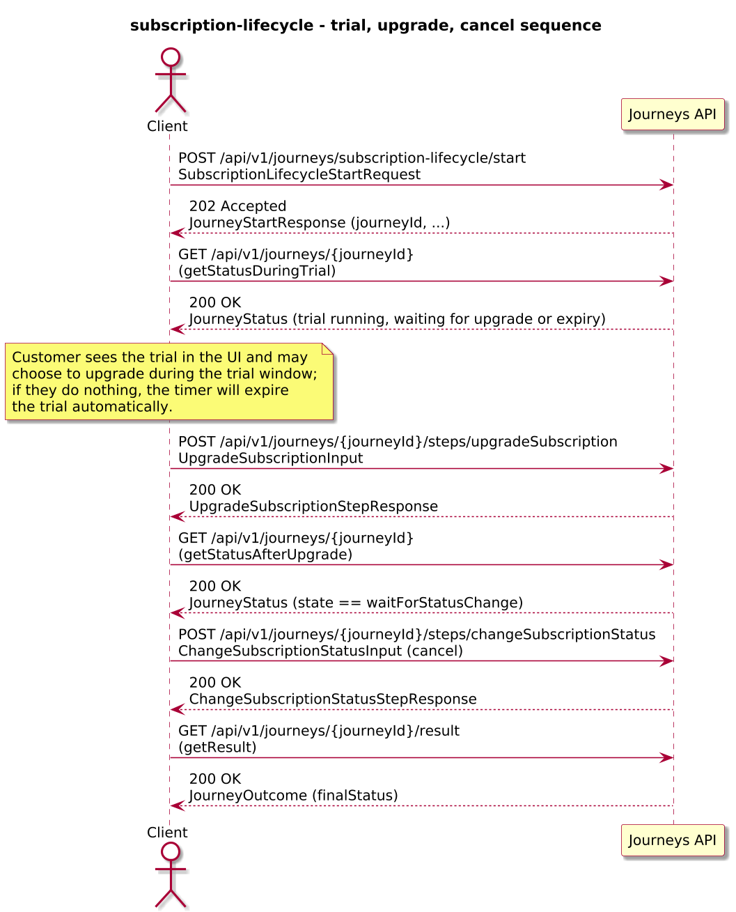
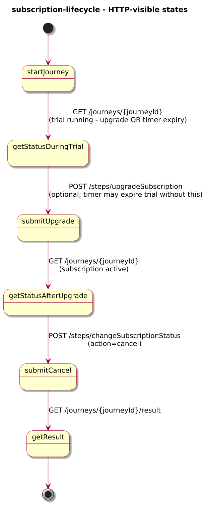
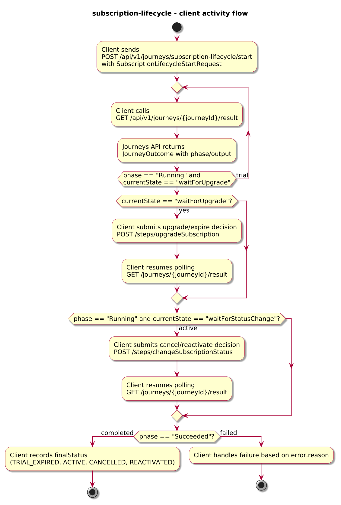

# Journey – subscription-lifecycle

> Subscription lifecycle journey that starts a trial, upgrades to paid, and then allows cancelling or reactivating the subscription.

## Quick links

| Artifact | File |
|---------|------|
| Journey definition | [subscription-lifecycle.journey.yaml](subscription-lifecycle.journey.yaml) |
| OpenAPI (per-journey) | [subscription-lifecycle.openapi.yaml](subscription-lifecycle.openapi.yaml) |
| Arazzo workflow | [subscription-lifecycle.arazzo.yaml](subscription-lifecycle.arazzo.yaml) |
| Docs (this page) | [subscription-lifecycle.md](subscription-lifecycle.md) |

## Summary

This journey models a simplified subscription lifecycle with explicit grace and cooling‑off windows:

- It creates a trial subscription for a customer and plan.
- During the trial, the customer can choose to upgrade to paid; in parallel, a timer enforces a **trial grace window**:
  - The timer duration is derived from `trialDays` when provided, or defaults to 14 days (`P14D`).
  - If the customer upgrades before the timer fires, the journey proceeds to paid activation.
  - If they do nothing before the grace window elapses, the journey treats the trial as expired.
- Once paid, the customer can later cancel or, for a limited **cooling‑off window**, reactivate the subscription:
  - A `statusChangeTimer` branch waits 30 days (`P30D`) in parallel with a `waitForStatusChange` step.
  - If a cancel/reactivate action is posted during this window, the journey calls the corresponding API and completes with a `CANCELLED` or `REACTIVATED` outcome.
  - If no status change is submitted before the cooling‑off window closes, the timer branch wins and the journey automatically completes with an `ACTIVE` outcome.

The journey is long-lived: clients start it once, track progress via status calls, submit upgrade and status-change decisions via dedicated steps, and finally read an outcome that summarises the final subscription status.

Actors & systems:
- Subscription frontend or billing system that starts the journey, polls status/result, and drives upgrade/cancel/reactivate flows.
- Customer UI through which the customer upgrades from trial to paid and later cancels or reactivates via step endpoints.
- Subscriptions/Billing API called by the journey to create, activate, cancel, and reactivate subscriptions.
- Journeys API as the orchestrator and HTTP surface for start/status/steps/result.

## Contracts at a glance

- **Input schema** – `SubscriptionLifecycleStartRequest` with required `customerId`, `planId`; optional `trialDays`, `channel`.
- **Upgrade input** – `UpgradeSubscriptionInput` with:
  - `decision: "upgrade" | "expire"`.
- **Status change input** – `ChangeSubscriptionStatusInput` with:
  - `action: "cancel" | "reactivate"`.
- **Output schema** – `SubscriptionLifecycleOutcome` exposed via `JourneyOutcome.output` with:
  - `subscriptionId`, `finalStatus: TRIAL_EXPIRED | ACTIVE | CANCELLED | REACTIVATED`, optional `activePlanId`, `events`.

## Step overview (Arazzo + HTTP surface)

Here’s a breakdown of the steps you’ll call over the Journeys API for the main upgrade-and-cancel workflow described in `subscription-lifecycle.arazzo.yaml`. Payment charging and retry/backoff happen inside the journey around the activation call:

| # | Step ID | Description | Operation ID | Parameters | Success Criteria | Outputs |
|---:|---------|-------------|--------------|------------|------------------|---------|
| 1 | `startJourney` | Start a new `subscription-lifecycle` journey instance. | `subscriptionLifecycle_start` | Body: `startRequest` with customer id, plan id, and optional trial settings. | `$statusCode == 202` and a `journeyId` is returned. | `journeyId` for the subscription instance. |
| 2 | `getStatusDuringTrial` | Poll status while the trial subscription is active and before upgrade or timer-based expiry. | `subscriptionLifecycle_getStatus` | Path: `journeyId` from step 1. | `$statusCode == 200`; `currentState` indicates the trial is running and `waitForUpgrade`/timer are active. | `JourneyStatus` with `phase` and `currentState`. |
| 3 | `submitUpgrade` | Provide the customer’s decision to upgrade the trial to paid. | `subscriptionLifecycle_upgradeSubscription` | Path: `journeyId`; body: `upgradeDecision` (`decision: "upgrade"`). | `$statusCode == 200`; `JourneyStatus.phase` and `currentState` progress based on decision. | `UpgradeSubscriptionStepResponse` with projected decision fields. |
| 4 | `getStatusAfterUpgrade` | Poll status after the paid subscription has been activated (including any internal retry/backoff). | `subscriptionLifecycle_getStatus` | Path: `journeyId` from step 1. | `$statusCode == 200`; `currentState` reflects the `statusChangeOrTimeout` state (typically `waitForStatusChange` or the timer branch). | `JourneyStatus` indicating the subscription is active and within the cancel/reactivate window. |
| 5 | `submitCancel` | Provide the customer’s decision to cancel the subscription. | `subscriptionLifecycle_changeSubscriptionStatus` | Path: `journeyId`; body: `cancelDecision` (`action: "cancel"`). | `$statusCode == 200`; `JourneyStatus.phase` and `currentState` reflect the cancellation. | `ChangeSubscriptionStatusStepResponse` with projected action. |
| 6 | `getResult` | Retrieve the final outcome after cancellation has been processed. | `subscriptionLifecycle_getResult` | Path: `journeyId` from step 1. | `$statusCode == 200`, `phase == "Succeeded"` or `phase == "Failed"`. | `JourneyOutcome` with `output.finalStatus` and any subscription details. |

The second workflow (`subscription-trial-expires`) covers trial expiry without upgrade and now relies on the timer:

| # | Step ID | Description | Operation ID | Parameters | Success Criteria | Outputs |
|---:|---------|-------------|--------------|------------|------------------|---------|
| 1 | `startJourney` | Start a new `subscription-lifecycle` journey instance. | `subscriptionLifecycle_start` | Body: `startRequest` with customer id and plan id. | `$statusCode == 202` and a `journeyId` is returned. | `journeyId` for the subscription instance. |
| 2 | `getStatusDuringTrial` | (Optional) Poll status while the trial subscription is active. | `subscriptionLifecycle_getStatus` | Path: `journeyId` from step 1. | `$statusCode == 200`; `phase == "Running"`. | `JourneyStatus` with `phase` and `currentState`. |
| 3 | `getResult` | Retrieve the final outcome after the trial has expired via the timer. | `subscriptionLifecycle_getResult` | Path: `journeyId` from step 1. | `$statusCode == 200`, `phase == "Succeeded"` or `phase == "Failed"`. | `JourneyOutcome` with `output.finalStatus == "TRIAL_EXPIRED"`. |

## Graphical overview

### Sequence diagram

### State diagram

### Activity diagram

## Internal workflow (DSL state graph)

## Implementation notes

- `createTrial` calls `subscriptions.createTrialSubscription` and stores the created trial in `trial`.
- `waitForUpgrade` exposes the `upgradeSubscription` step; it projects the decision into `upgradeResponse` and either routes to the activation path or completes as `trialExpired`.
- `activatePaid` performs the first activation/billing attempt via `subscriptions.activateSubscription`; if the HTTP call succeeds (`activation.ok == true`), the journey proceeds to `statusChangeOrTimeout`. If it fails, the journey waits 4 hours (`activationRetryDelay` timer with `PT4H`) and then performs a second activation attempt (`retryActivatePaid`). If the second attempt also fails, the journey terminates with `errorCode: ACTIVATION_FAILED`.
- `statusChangeOrTimeout` is a `parallel` state that races the `waitForStatusChange` step (which can cancel or reactivate) against a 30-day timer; the status-change branch routes to `cancelSubscription`, `reactivateSubscription`, or `completeActive`, while the timer branch auto-completes as `ACTIVE` when no status change is submitted in time.
- `cancelSubscription` and `reactivateSubscription` call the corresponding Subscriptions API endpoints before completing with dedicated terminal states.
