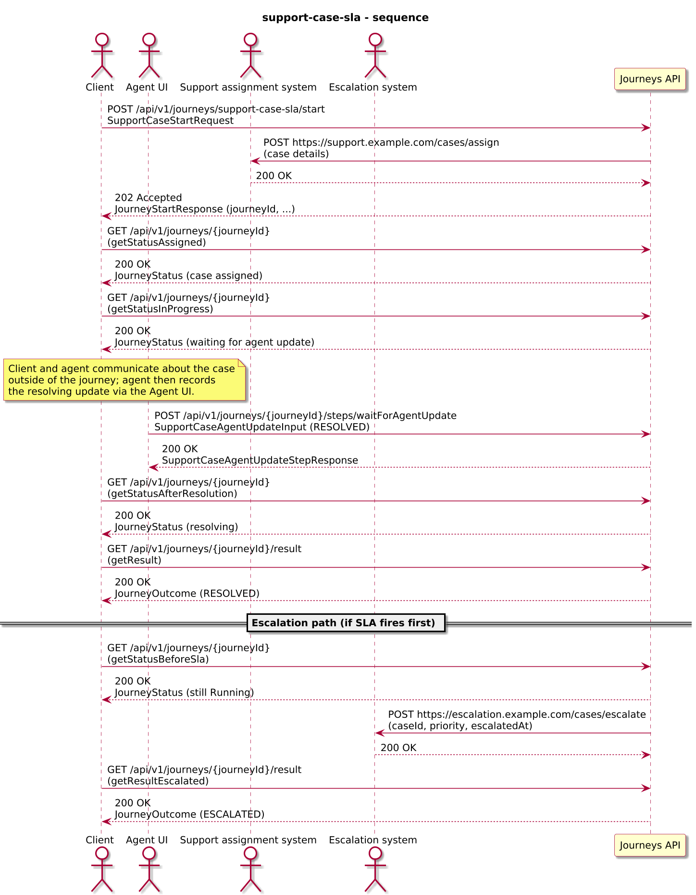
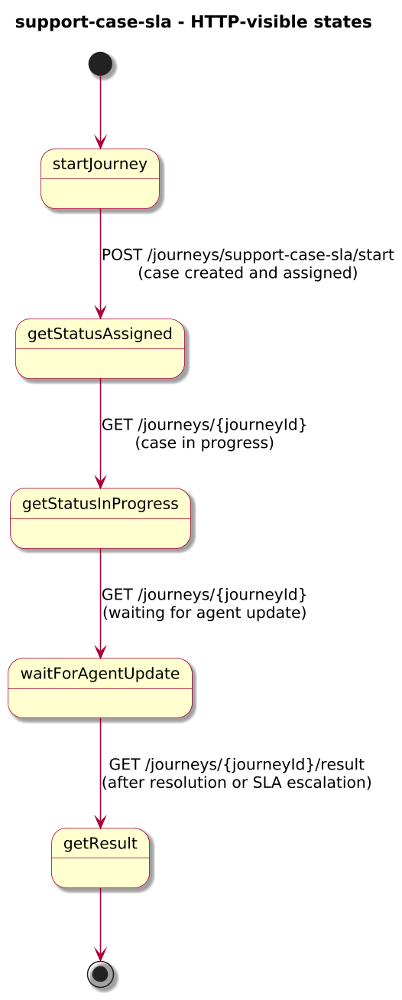
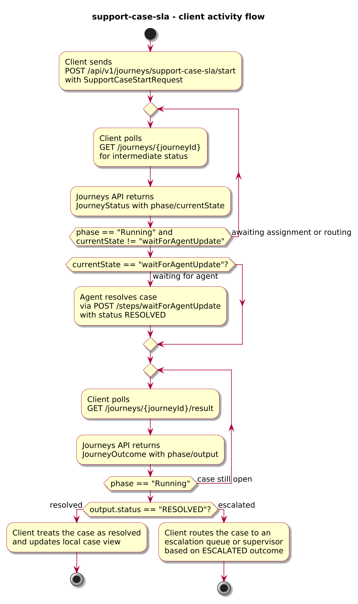
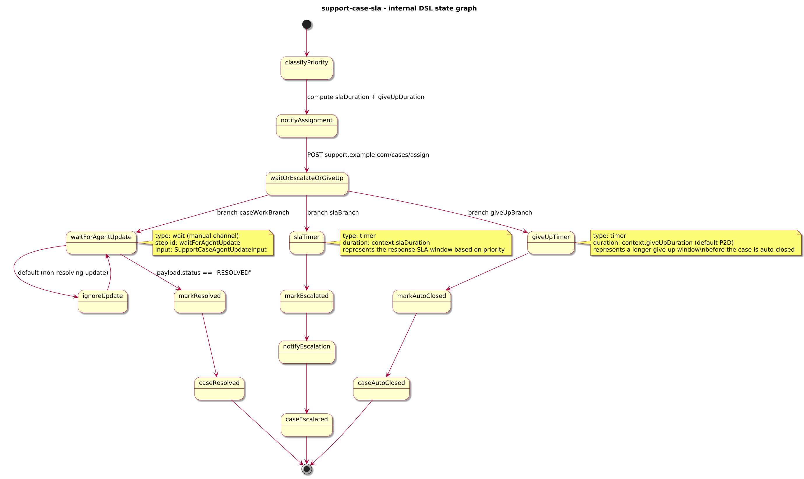

# Journey – support-case-sla

> Support case journey that tracks resolution against an SLA, escalates cases that miss their response window, and auto-closes unresolved cases after a longer give-up period.

## Quick links

| Artifact | File |
|---------|------|
| Journey definition | [support-case-sla.journey.yaml](support-case-sla.journey.yaml) |
| OpenAPI (per-journey) | [support-case-sla.openapi.yaml](support-case-sla.openapi.yaml) |
| Arazzo workflow | [support-case-sla.arazzo.yaml](support-case-sla.arazzo.yaml) |
| Docs (this page) | [support-case-sla.md](support-case-sla.md) |

## Summary

This journey models a support case with a priority-based response SLA and a longer give-up window:

- It starts when a client submits a support case with `caseId`, `customerId`, `priority`, and `summary`.
- The journey classifies the case priority into an SLA duration (for example P1 = 1h, P2 = 4h, P3 = 8h) and configures a longer give-up window (for example 2 days), using `spec.platform.config` keys such as `slaP1Duration`, `slaP2Duration`, `slaP3Duration`, and `giveUpDuration` that are injected into DataWeave as `platform.config.*`.
- It notifies a support assignment system that a new case needs attention.
- It then enters a `parallel` state with three branches:
  - An agent work branch that waits for agent updates and, when an update with `status: "RESOLVED"` arrives, records a RESOLVED outcome.
  - An SLA branch that waits for the computed response SLA duration and, when it fires, records an ESCALATED outcome and calls an escalation system.
  - A give-up branch that waits for the longer give-up duration and, when it fires before resolution, auto-closes the case with an AUTO_CLOSED outcome.
- Whichever branch completes first determines the final outcome:
  - If the agent resolves the case within the SLA/give-up windows, the journey succeeds with `status: "RESOLVED"`.
  - If the SLA timer fires first, the journey succeeds with `status: "ESCALATED"`.
  - If neither resolution nor escalation leads to a terminal outcome before the give-up window elapses (for example when escalation is not acted on), the give-up timer wins and the journey auto-closes the case with `status: "AUTO_CLOSED"`.

The journey illustrates how to combine `timer`, `parallel`, and `wait` to express “agent action OR SLA escalation after N OR give-up after M” while keeping the SLA and auto-close logic inside the journey.

## Contracts at a glance

- **Input schema** – `SupportCaseStartRequest` with required:
  - `caseId: string`
  - `customerId: string`
  - `priority: "P1" | "P2" | "P3"`
  - `summary: string`
  - optional `channel: string`.
- **Agent update input** – `SupportCaseAgentUpdateInput` with:
  - `status: "RESOLVED"`
  - optional `resolutionSummary: string`.
- **Output schema** – `SupportCaseOutcome` exposed via `JourneyOutcome.output` with:
  - `status: "RESOLVED" | "ESCALATED" | "AUTO_CLOSED"`.
  - `caseId`, `customerId`, `priority`, optional `resolvedAt`, `escalatedAt`, `autoClosedAt`, `autoCloseReason`, `resolutionSummary`.

## Step overview (Arazzo + HTTP surface)

The main workflows are described in `support-case-sla.arazzo.yaml`. At a high level:

| # | Step ID | Description | Operation ID | Parameters | Success Criteria | Outputs |
|---:|---------|-------------|--------------|------------|------------------|---------|
| 1 | `startJourney` | Start a new `support-case-sla` journey instance (synchronous to initial classification and assignment). | `supportCaseSla_start` | Body: `startRequest` with case id, customer id, priority, and summary. | `$statusCode == 200`; `JourneyStatus.currentState` reflects that the case has been classified and assigned. | `JourneyStatus` for the support case instance. |
| 2 | `getStatusAssigned` | (Optional) Re-fetch status after initial priority classification and assignment. | `supportCaseSla_getStatus` | Path: `journeyId` from step 1 (or from `JourneyStatus.journeyId`). | `$statusCode == 200`; `JourneyStatus.currentState` reflects that the case has been classified and assigned. | `JourneyStatus` with `phase` and `currentState`. |
| 3 | `getStatusInProgress` | Poll status while the case is in progress and waiting for agent updates. | `supportCaseSla_getStatus` | Path: `journeyId` from step 1. | `$statusCode == 200`; `currentState` eventually reaches `waitForAgentUpdate`. | `JourneyStatus` indicating the agent can now update the case. |
| 4 | `agentResolves` | Provide an agent update that resolves the case. | `supportCaseSla_waitForAgentUpdate` | Path: `journeyId` from step 1; body: `agentUpdate` with `status: "RESOLVED"` and optional `resolutionSummary`. | `$statusCode == 200`; `JourneyStatus.phase` remains `Running` until the journey reaches its terminal state. | `SupportCaseAgentUpdateStepResponse` extending `JourneyStatus`. |
| 5 | `getStatusAfterResolution` | Check status after the resolving agent update. | `supportCaseSla_getStatus` | Path: `journeyId` from step 1. | `$statusCode == 200`; `currentState` moves beyond `waitForAgentUpdate`. | `JourneyStatus` with updated `phase` and `currentState`. |
| 6 | `getResult` | Retrieve the final case outcome. | `supportCaseSla_getResult` | Path: `journeyId` from step 1. | `$statusCode == 200`, `phase == "SUCCEEDED"` or `phase == "FAILED"`. | `JourneyOutcome` with `output.status == "RESOLVED"` (when step 4 was called before the SLA fired) or `output.status == "ESCALATED"` (when the SLA timer fired first). |

Clients that want to observe escalation without explicit agent updates can still call steps 1, 2, 3, and 6 only, after allowing the SLA window (for example 1–8 hours depending on priority) to elapse.

## Scenarios and variations

- **Happy path – resolved within SLA**:
  - Client starts the journey and logs the case.
  - Agent resolves the case within the SLA and submits an update via `waitForAgentUpdate`.
  - The journey completes with `status: "RESOLVED"` and `resolvedAt` set.
- **Escalated – no resolution within SLA**:
  - Client starts the journey but no resolving agent update is submitted in time.
  - The `slaTimer` branch fires after the priority-based SLA duration and the journey completes with `status: "ESCALATED"`, `escalatedAt` set, and an escalation notification sent to the escalation system.
- **Auto-closed – no resolution after give-up window**:
  - Client starts the journey and logs the case.
  - No resolving agent update is submitted, and any escalation does not result in a resolution before the give-up window ends.
  - The give-up timer fires and the journey completes with `status: "AUTO_CLOSED"`, `autoClosedAt` and `autoCloseReason` set.
- **Non-resolving updates**:
  - Agents may post non-resolving updates via `waitForAgentUpdate` with different `status` values in a real system; this example treats only `status: "RESOLVED"` as meaningful and loops on any other updates via `ignoreUpdate`.

## Graphical overview

### Sequence diagram

### State diagram

### Activity diagram

## Internal workflow (DSL state graph)

## Implementation notes

- `notifyAssignment` calls a support assignment endpoint to inform the queue or case management system about the new case.
- `classifyPriority` uses `platform.config.slaP1Duration`, `platform.config.slaP2Duration`, `platform.config.slaP3Duration`, and `platform.config.giveUpDuration` (declared under `spec.platform.config`) to derive `context.slaDuration` and `context.giveUpDuration` so different environments can tune SLA and give-up windows without editing the journey definition.
- `waitForAgentUpdate` is a `wait` state that expects `SupportCaseAgentUpdateInput`; when `status == "RESOLVED"`, it routes to `markResolved`, otherwise it loops via `ignoreUpdate`.
- `slaTimer` is a `timer` state (`duration: context.slaDuration`) that represents the response SLA window for this case; when it fires first, `markEscalated` records an ESCALATED outcome and `notifyEscalation` calls an escalation endpoint.
- `giveUpTimer` is a `timer` state (`duration: context.giveUpDuration`, currently defaulting to `P2D`) that represents a longer give-up window; when it fires first, `markAutoClosed` records an AUTO_CLOSED outcome to indicate that the case was closed without resolution after the give-up window.
- `runCaseLifecycle` is a `subjourney` state that calls the local `caseLifecycle` subjourney under `spec.subjourneys`, passing case metadata and derived SLA durations and capturing the computed `outcome` as its result; it demonstrates local, intra-spec reuse with propagate-style failure semantics.
- Inside `caseLifecycle`, `waitOrEscalateOrGiveUp` is a `parallel` state with `join.strategy: anyOf`, which implements the “agent resolves OR SLA timer escalates OR give-up auto-closes” pattern.
