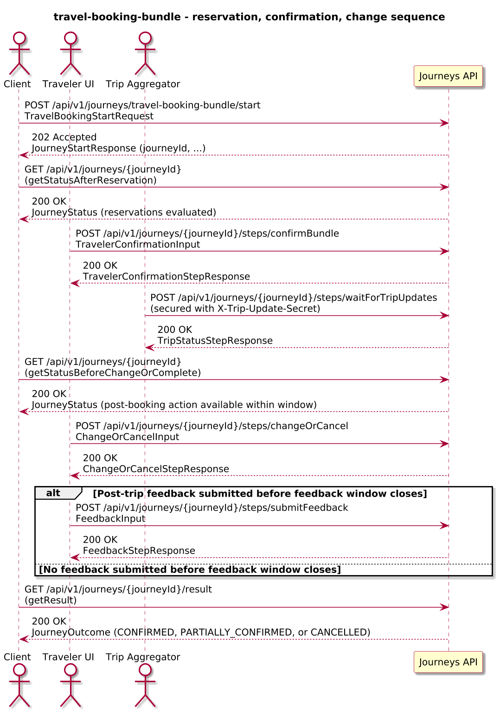
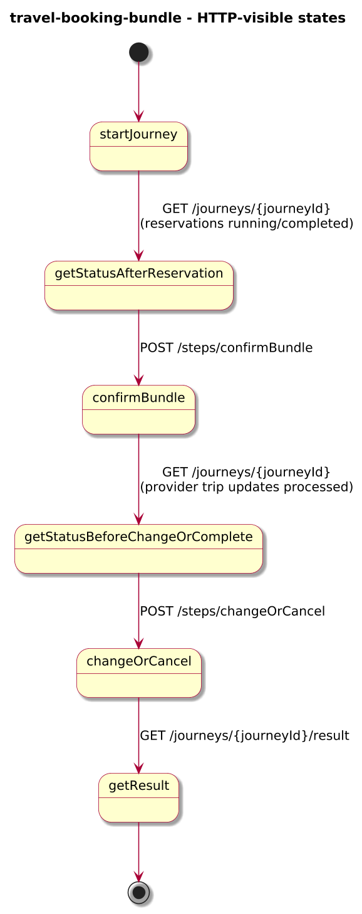
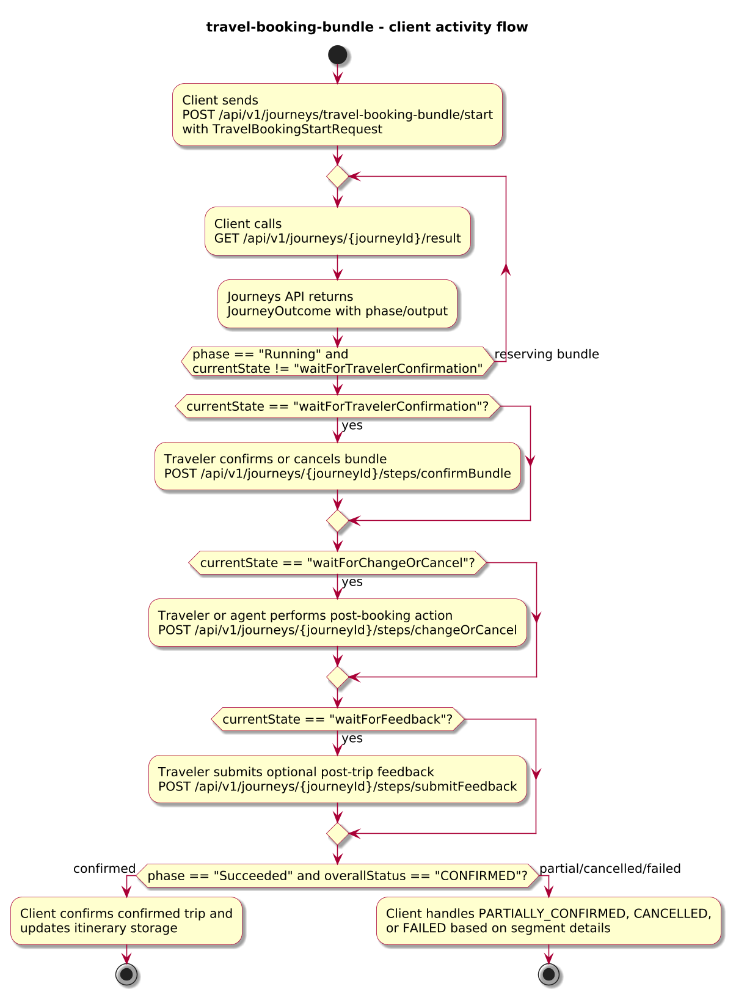
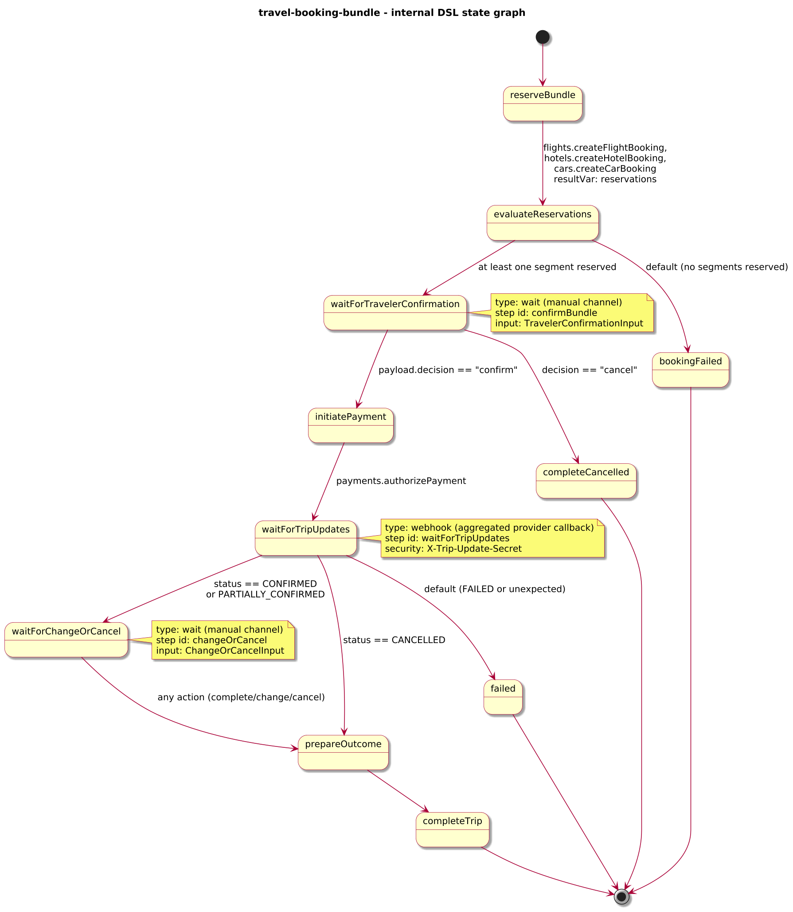

# Journey – travel-booking-bundle

> Travel booking journey that reserves a flight, hotel, and car as a bundle, waits for provider trip status updates, and supports post-booking change or cancel actions.

## Quick links

| Artifact | File |
|---------|------|
| Journey definition | [travel-booking-bundle.journey.yaml](travel-booking-bundle.journey.yaml) |
| OpenAPI (per-journey) | [travel-booking-bundle.openapi.yaml](travel-booking-bundle.openapi.yaml) |
| Arazzo workflow | [travel-booking-bundle.arazzo.yaml](travel-booking-bundle.arazzo.yaml) |
| Docs (this page) | [travel-booking-bundle.md](travel-booking-bundle.md) |

## Summary

This journey orchestrates a travel bundle for a traveler:

- It reserves a flight, hotel, and car using separate provider APIs.
- It asks the traveler to confirm the initial bundle before payment is authorised.
- It waits for aggregated trip status updates (confirmed, partially confirmed, cancelled, or failed) from a provider-facing webhook.
- After confirmation, it allows a single post-booking change or cancel action within a bounded window before completing with a confirmed, partially confirmed, or cancelled outcome, and optionally collects post-trip feedback in a separate window.

The journey is long-lived: clients start it once, track progress via status calls, submit confirmation and change/cancel decisions via dedicated steps, and finally read an outcome that summarises overall trip status and segment-level details.

Actors & systems:
- Travel booking frontend or agent desktop that starts the journey, shows bundle proposals, and polls status/result.
- Traveler UI where the traveler confirms or cancels the bundle and later requests change/cancel via step endpoints.
- Flights, Hotels, and Car provider APIs called by the journey to reserve and manage segment bookings.
- Payments or billing system called by the journey to authorise payments for the bundle.
- Trip/status aggregator or provider system that sends trip updates via webhook into the journey.
- Journeys API as the orchestrator and HTTP surface for start/status/steps/webhooks/result.

## Contracts at a glance

- **Input schema** – `TravelBookingStartRequest` with required `tripId`, `travelerId`; optional `flightOption`, `hotelOption`, `carOption`, `totalAmount`, `currency`, `channel`.
- **Step inputs**:
  - `TravelerConfirmationInput` – traveler decision with `decision: "confirm" | "cancel"`, optional `notes`.
  - `ChangeOrCancelInput` – post-booking action with `action: "complete" | "change" | "cancel"`, optional `notes`, subject to a bounded change window.
  - `FeedbackInput` – optional post-trip feedback with `rating` and optional `comments`.
- **Output schema** – `TravelBookingOutcome` exposed via `JourneyOutcome.output` with:
  - `tripId`, `overallStatus: CONFIRMED | PARTIALLY_CONFIRMED | CANCELLED | FAILED`, optional `flightBooking`, `hotelBooking`, `carBooking`, `change`, `notes`.

## Step overview (Arazzo + HTTP surface)

Here’s a breakdown of the steps you’ll call over the Journeys API for the main confirmed workflow described in `travel-booking-bundle.arazzo.yaml`.

| # | Step ID | Description | Operation ID | Parameters | Success Criteria | Outputs |
|---:|---------|-------------|--------------|------------|------------------|---------|
| 1 | `startJourney` | Start a new `travel-booking-bundle` journey instance (synchronous to the first confirmation/webhook branches). | `travelBookingBundle_start` | Body: `startRequest` with trip id, traveler id, and optional segment options and pricing. | `$statusCode == 200`; `JourneyStatus.currentState` reflects that reservations have been evaluated and the journey is awaiting traveler confirmation. | `JourneyStatus` for the trip instance. |
| 2 | `getStatusAfterReservation` | (Optional) Re-fetch status after initial provider reservations have completed. | `travelBookingBundle_getStatus` | Path: `journeyId` from step 1 (or from `JourneyStatus.journeyId`). | `$statusCode == 200`; `currentState` progresses past `reserveBundle`. | `JourneyStatus` with `phase` and `currentState`. |
| 3 | `confirmBundle` | Confirm the initial bundle reservation. | `travelBookingBundle_confirmBundle` | Path: `journeyId`; body: `confirmationInput`. | `$statusCode == 200`; `JourneyStatus.phase` and `currentState` progress toward payment/confirmation. | `TravelerConfirmationStepResponse` with projected decision and notes. |
| 4 | `getStatusBeforeChangeOrComplete` | Poll status until provider trip status updates have been processed. | `travelBookingBundle_getStatus` | Path: `journeyId` from step 1. | `$statusCode == 200`; `currentState` indicates post-booking action is available within the change window. | `JourneyStatus` with updated `phase` and `currentState`. |
| 5 | `changeOrCancel` | Perform a post-booking action (complete or change) for the trip within the allowed window. | `travelBookingBundle_changeOrCancel` | Path: `journeyId`; body: `changeOrCompleteInput`. | `$statusCode == 200`; `JourneyStatus.phase` and `currentState` reflect the post-booking decision. | `ChangeOrCancelStepResponse` with projected action and notes. |
| 6 | `submitFeedback` | Submit optional post-trip feedback for the bundle. | `travelBookingBundle_submitFeedback` | Path: `journeyId`; body: `feedbackInput`. | `$statusCode == 200`; `JourneyStatus.phase` remains `Running` until the feedback window closes, then becomes terminal. | `FeedbackStepResponse` with projected rating and comments. |
| 7 | `getResult` | Retrieve the final outcome once the journey has completed and the feedback window has closed (or feedback was submitted). | `travelBookingBundle_getResult` | Path: `journeyId` from step 1. | `$statusCode == 200`, `phase == "SUCCEEDED"` or `phase == "FAILED"`. | `JourneyOutcome` with `output.overallStatus`, segment-level booking details, and any recorded feedback. |

The second workflow covers cancellation during traveler confirmation and ends with a CANCELLED outcome.

## Graphical overview

### Sequence diagram



### State diagram



### Activity diagram



## Internal workflow (DSL state graph)



## Implementation notes

- `reserveBundle` is a `parallel` state that calls the Flights, Hotels, and Car APIs to create bookings; the join collects raw results into `reservations`.
- `evaluateReservations` checks whether at least one segment was reserved successfully and routes to traveler confirmation or fails if nothing could be reserved.
- `waitForTravelerConfirmation` exposes the `confirmBundle` step and records the traveler’s decision; cancellations here complete as `completeCancelled`.
- `initiatePayment` calls `payments.authorizePayment` to authorise bundle payment before final provider confirmations.
- `waitForTripUpdates` is a `webhook` state (secured by `X-Trip-Update-Secret`) that projects aggregated trip status and segment-level booking details into `tripStatusUpdate`.
- `changeOrCancelOrTimeout` is a `parallel` state that races the `changeOrCancel` step (single post-booking action) against a fixed change window timer; the change branch records `changeRequest` and optional `overrideStatus`, while the timer branch marks `changeWindowExpired` and ends the window without forcing cancellation.
- `prepareOutcome` projects the final `TravelBookingOutcome` based on provider status and any post-booking actions.
- `feedbackOrTimeout` is a `parallel` state that races the `submitFeedback` step against a feedback window timer; feedback is recorded in `feedback`, and if no feedback is submitted before the timer fires the journey simply completes without feedback while still returning the main booking outcome via `completeTrip`.

### Compensation for partial success

In some deployments, providers may leave a trip in a partially confirmed state (for example, flight confirmed but hotel/car failed) and still require cleanup for unconfirmed segments. In these cases, `spec.compensation` can be configured to run for partial-success outcomes while the main journey still terminates with `JourneyOutcome.phase = Succeeded`. A sketch of this pattern for `travel-booking-bundle` is:

```yaml
spec:
  output:
    schema:
      properties:
        overallStatus:
          type: string
          enum: [CONFIRMED, PARTIALLY_CONFIRMED, CANCELLED, FAILED]

  compensation:
    mode: async
    start: waitBeforeCleanup
    alsoFor:
      - when:
          predicate:
            lang: dataweave
            expr: |
              output.overallStatus == "PARTIALLY_CONFIRMED"
    states:
      waitBeforeCleanup:
        type: timer
        timer:
          duration: "P3D"
        next: cleanupPartialSegments

      cleanupPartialSegments:
        type: task
        task:
          kind: httpCall:v1
          operationRef: providers.releaseUnconfirmedSegments
          resultVar: cleanupResult
        next: done

      done:
        type: succeed
```

In this configuration, full confirmations (`overallStatus = CONFIRMED`) do not trigger compensation, but partial confirmations do. The compensation journey waits for a short post-trip window, then inspects the same `context` and `output` as the main run to decide which provider resources to release, without changing the final `JourneyOutcome.phase`.
