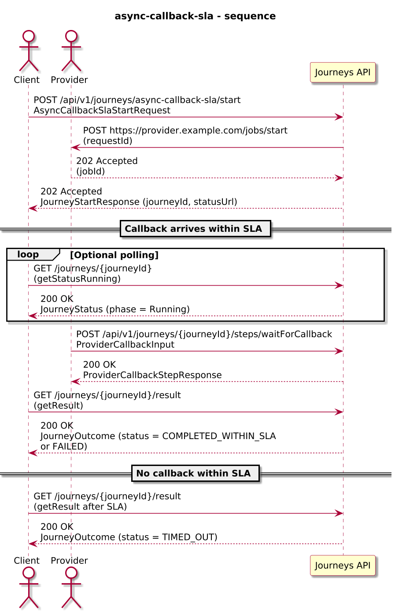
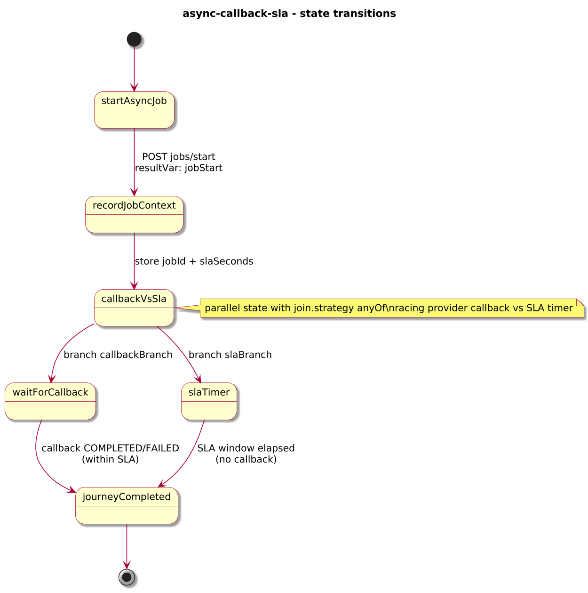
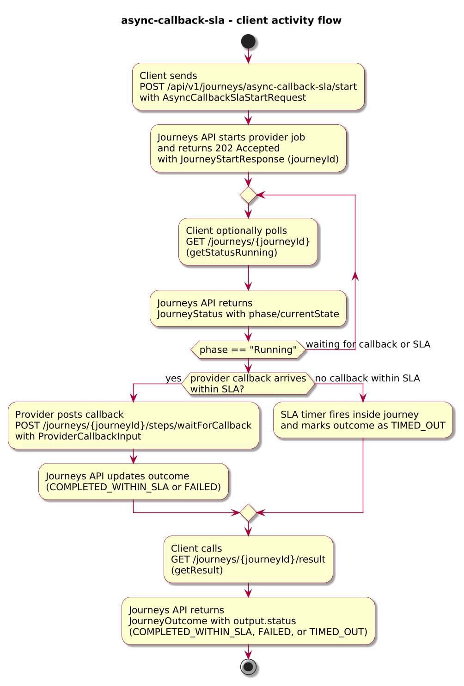
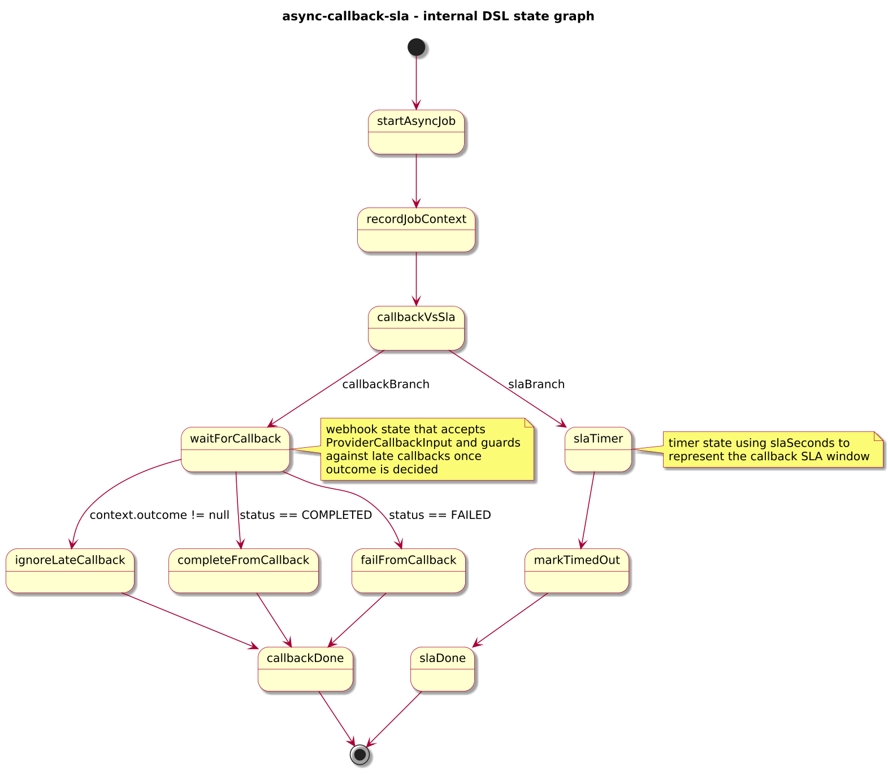

# Journey – async-callback-sla

> Async callback + SLA race pattern where a provider callback is raced against a durable timer, with `/start` returning HTTP 202.

## Quick links

| Artifact | File |
|---------|------|
| Journey definition | [async-callback-sla.journey.yaml](../technical/async-callback-sla/async-callback-sla.journey.yaml) |
| OpenAPI (per-journey) | [async-callback-sla.openapi.yaml](../technical/async-callback-sla/async-callback-sla.openapi.yaml) |
| Arazzo workflow | [async-callback-sla.arazzo.yaml](../technical/async-callback-sla/async-callback-sla.arazzo.yaml) |

## Summary

This journey models an async external process where:

- A provider accepts a job and later posts a **callback** with the final status.
- The journey races the callback against a **durable SLA timer** (`timer` state in a `parallel` join).
- Whichever branch wins first sets the outcome:
  - `COMPLETED_WITHIN_SLA` when the callback arrives in time.
  - `TIMED_OUT` when the SLA timer fires first.
  - `FAILED` when the callback reports failure.
- Late callbacks after a timeout are ignored via a guard on `context.outcome`.

It is the smallest end-to-end example of `spec.lifecycle.startMode: async` for a journey that combines **callbacks, timers, and a race**.

## Contracts at a glance

- **Input schema** – `AsyncCallbackSlaStartRequest` with required:
  - `requestId: string`.
  - optional `slaSeconds: integer` (default 300).
- **Callback input** – `ProviderCallbackInput` with:
  - `jobId: string`.
  - `status: "COMPLETED" | "FAILED"`.
- **Output schema** – `AsyncCallbackSlaOutcome` with:
  - `status: "COMPLETED_WITHIN_SLA" | "TIMED_OUT" | "FAILED"`.
  - `requestId`, `providerStatus`, `completionSource`, optional `failureReason`, `timeoutReason`.

## Step overview (Arazzo + HTTP surface)

Here’s a breakdown of the main steps you’ll call over the Journeys API for the workflows described in `async-callback-sla.arazzo.yaml`.

### Callback arrives within SLA

| # | Step ID | Description | Operation ID | Parameters | Success Criteria | Outputs |
|---:|---------|-------------|--------------|------------|------------------|---------|
| 1 | `startJourney` | Start a new `async-callback-sla` journey instance asynchronously. | `asyncCallbackSla_start` | Body: `startRequest` with `requestId`, optional `slaSeconds`. | `$statusCode == 202`; body is `JourneyStartResponse` with `journeyId`. | `journeyId` for the new instance. |
| 2 | `callback` | Provider posts the callback within the SLA window. | `asyncCallbackSla_waitForCallback` | Path: `journeyId`; body: `callbackInput` with `jobId`, `status`. | `$statusCode == 200`; `JourneyStatus.phase` moves towards terminal. | `ProviderCallbackStepResponse` extending `JourneyStatus`. |
| 3 | `getResult` | Retrieve the final outcome. | `asyncCallbackSla_getResult` | Path: `journeyId` from step 1. | `$statusCode == 200`, `phase == "SUCCEEDED"` or `phase == "FAILED"`. | `JourneyOutcome` with `status == "COMPLETED_WITHIN_SLA"` or `"FAILED"` (mirroring `output.status`). |

### Callback does not arrive in time

| # | Step ID | Description | Operation ID | Parameters | Success Criteria | Outputs |
|---:|---------|-------------|--------------|------------|------------------|---------|
| 1 | `startJourney` | Start a new `async-callback-sla` journey instance asynchronously. | `asyncCallbackSla_start` | Body: `startRequest` with `requestId`, optional `slaSeconds`. | `$statusCode == 202`; body is `JourneyStartResponse` with `journeyId`. | `journeyId` for the new instance. |
| 2 | `getStatusDuringSla` | Optional status checks while the SLA timer is running. | `asyncCallbackSla_getStatus` | Path: `journeyId` from step 1. | `$statusCode == 200`; `phase == "RUNNING"`. | `JourneyStatus` with `phase` and `currentState`. |
| 3 | `getResult` | Retrieve the final outcome after the SLA timer fires. | `asyncCallbackSla_getResult` | Path: `journeyId` from step 1. | `$statusCode == 200`, `phase == "SUCCEEDED"` or `phase == "FAILED"`. | `JourneyOutcome` with `status == "TIMED_OUT"` (mirroring `output.status`). |

## Graphical overview

### Sequence diagram

### State diagram

### Activity diagram

### Internal workflow (DSL state graph)

