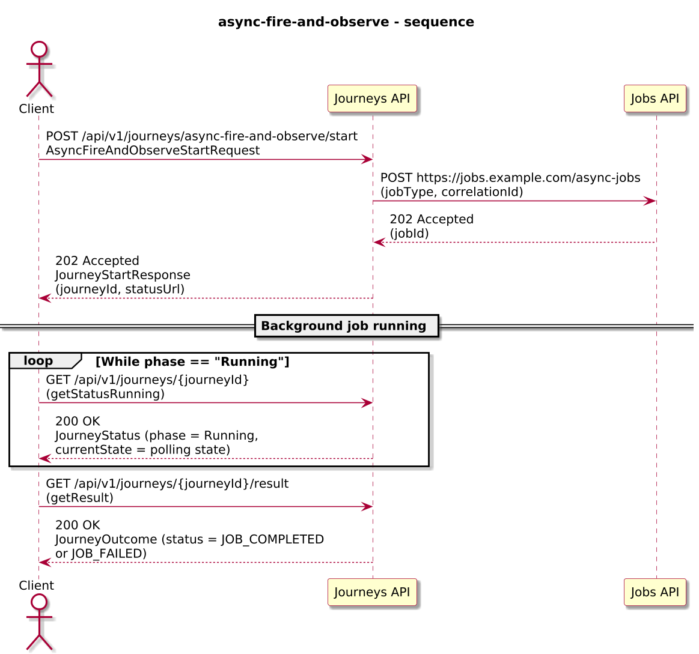
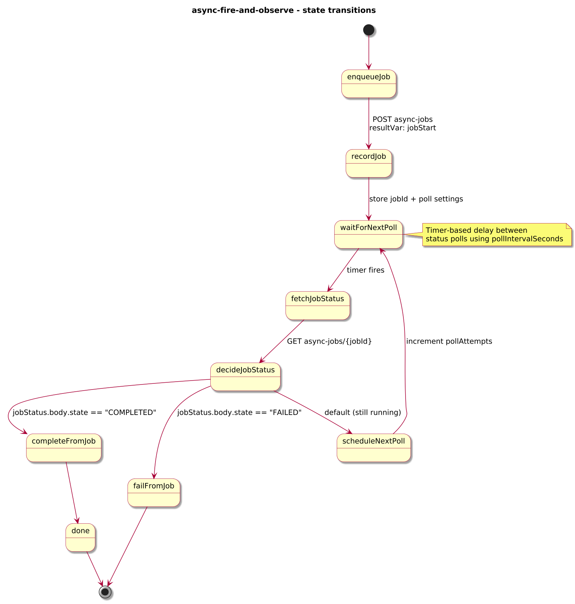
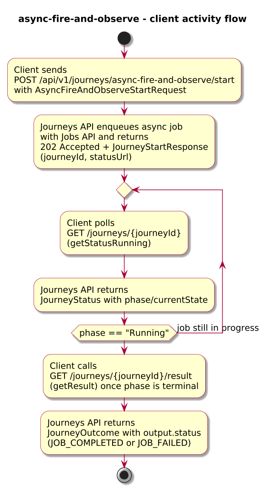
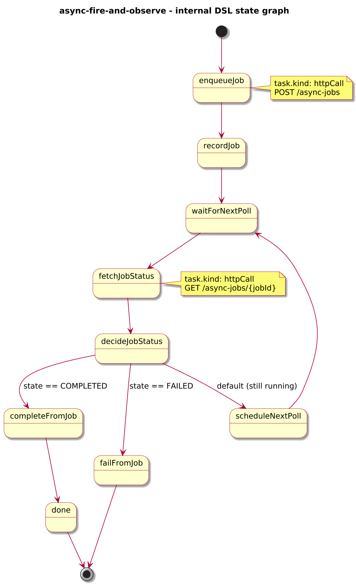

# Journey – async-fire-and-observe

> Simple async fire-and-observe pattern where `/start` returns HTTP 202 and the journey polls a long-running background job to completion.

## Quick links

| Artifact | File |
|---------|------|
| Journey definition | [async-fire-and-observe.journey.yaml](../technical/async-fire-and-observe/async-fire-and-observe.journey.yaml) |
| OpenAPI (per-journey) | [async-fire-and-observe.openapi.yaml](../technical/async-fire-and-observe/async-fire-and-observe.openapi.yaml) |
| Arazzo workflow | [async-fire-and-observe.arazzo.yaml](../technical/async-fire-and-observe/async-fire-and-observe.arazzo.yaml) |

## Summary

This journey demonstrates a **fire-and-observe** pattern:

- The client starts a long-running job via `POST /journeys/async-fire-and-observe/start` and receives **HTTP 202 + JourneyStartResponse**.
- The engine enqueues a background job with an external provider and periodically polls its status using `timer` + `httpCall` states.
- When the provider reports completion, the journey marks the job as `JOB_COMPLETED` and exposes a normalised outcome via `JourneyOutcome.output`.
- If the provider reports failure, the journey fails with `ASYNC_JOB_FAILED` and `JOB_FAILED` status.

It is the smallest end-to-end example of `spec.lifecycle.startMode: async` for a journey that uses **polling only** (no callbacks).

## Contracts at a glance

- **Input schema** – `AsyncFireAndObserveStartRequest` with required:
  - `jobType: string`
  - `correlationId: string`
  - optional `pollIntervalSeconds: integer` (default 30).
- **Output schema** – `AsyncFireAndObserveOutcome` exposed via `JourneyOutcome.output` with:
  - `status: "JOB_COMPLETED" | "JOB_FAILED"`.
  - `jobId: string`.
  - `providerStatus: string`.
  - optional `completedAt`, `failureReason`.

## Step overview (Arazzo + HTTP surface)

Here’s a breakdown of the main steps you’ll call over the Journeys API for the workflow described in `async-fire-and-observe.arazzo.yaml`.

| # | Step ID | Description | Operation ID | Parameters | Success Criteria | Outputs |
|---:|---------|-------------|--------------|------------|------------------|---------|
| 1 | `startJourney` | Start a new `async-fire-and-observe` journey instance asynchronously. | `asyncFireAndObserve_start` | Body: `startRequest` with `jobType`, `correlationId`, optional `pollIntervalSeconds`. | `$statusCode == 202`; body is `JourneyStartResponse` with `journeyId`. | `journeyId` for the new instance. |
| 2 | `getStatusRunning` | Optional status check while the background job is running. | `asyncFireAndObserve_getStatus` | Path: `journeyId` from step 1. | `$statusCode == 200`; `phase == "RUNNING"`. | `JourneyStatus` with `phase` and `currentState`. |
| 3 | `getResult` | Retrieve the final outcome once the job is completed. | `asyncFireAndObserve_getResult` | Path: `journeyId` from step 1. | `$statusCode == 200`, `phase == "SUCCEEDED"` or `phase == "FAILED"`. | `JourneyOutcome` whose `output.status` is `JOB_COMPLETED` or `JOB_FAILED`. |

## Graphical overview

### Sequence diagram

### State diagram

### Activity diagram

### Internal workflow (DSL state graph)

