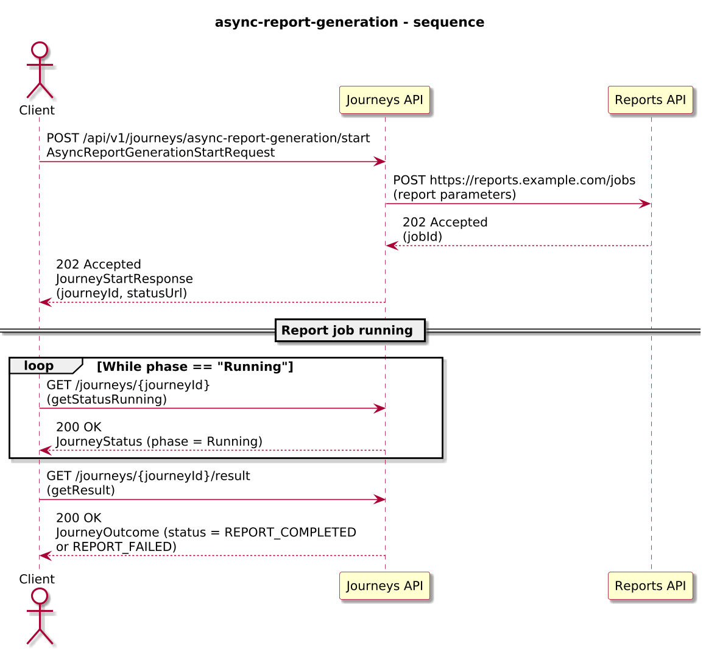
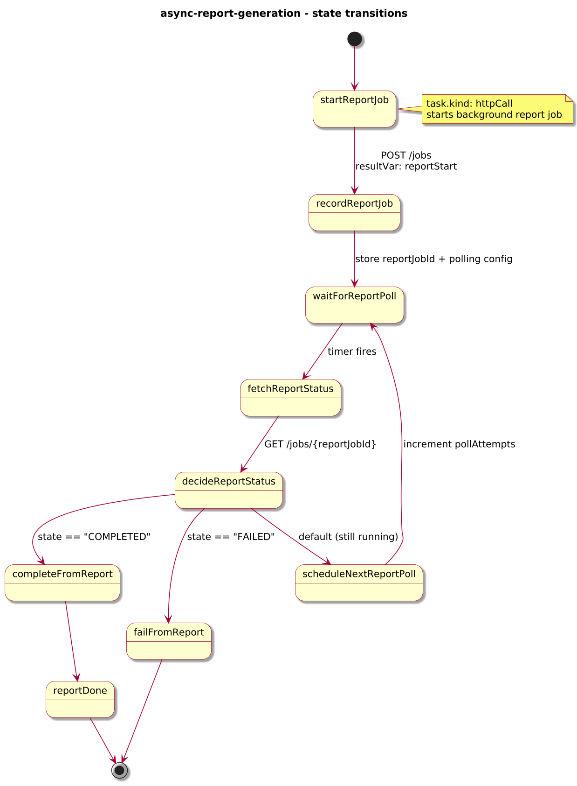
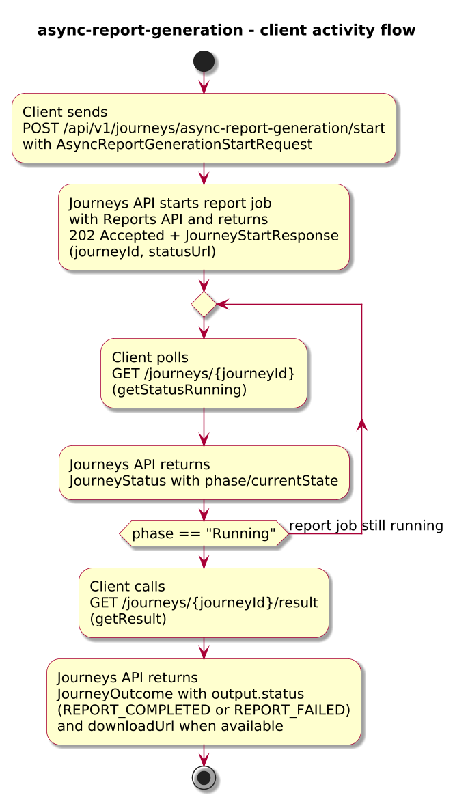
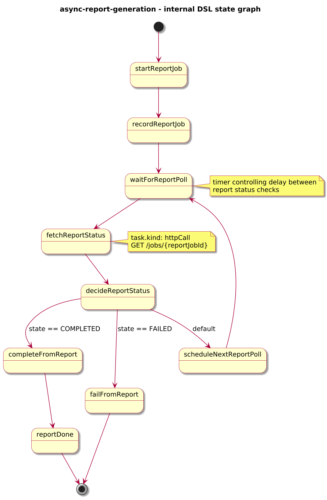

# Journey – async-report-generation

> Business journey that starts a long-running report generation job asynchronously and exposes status/result for clients to observe completion.

## Quick links

| Artifact | File |
|---------|------|
| Journey definition | [async-report-generation.journey.yaml](../business/async-report-generation/async-report-generation.journey.yaml) |
| OpenAPI (per-journey) | [async-report-generation.openapi.yaml](../business/async-report-generation/async-report-generation.openapi.yaml) |
| Arazzo workflow | [async-report-generation.arazzo.yaml](../business/async-report-generation/async-report-generation.arazzo.yaml) |

## Summary

This journey models a long-running **report generation** process:

- A client requests a report for a tenant and date range.
- The journey calls a reporting service to start a background job and then returns **HTTP 202 + JourneyStartResponse** from `/start`.
- The engine periodically polls the reporting API using `timer` + `httpCall` until the job completes.
- When the report is ready, the journey exposes `REPORT_COMPLETED` with a `downloadUrl`; if the job fails, it surfaces `REPORT_FAILED`.

This is the business counterpart to `async-fire-and-observe`, showing how async start and polling apply to a real-world reporting domain.

## Contracts at a glance

- **Input schema** – `AsyncReportGenerationStartRequest` with required:
  - `reportId: string`
  - `tenantId: string`
  - optional `rangeFrom`, `rangeTo` (date-time), `notifyEmail`, `pollIntervalSeconds`.
- **Output schema** – `AsyncReportGenerationOutcome` with:
  - `status: "REPORT_COMPLETED" | "REPORT_FAILED"`.
  - `reportId`, `tenantId`.
  - optional `downloadUrl`, `completedAt`, `failureReason`.

## Step overview (Arazzo + HTTP surface)

Here’s a breakdown of the main steps you’ll call over the Journeys API for the workflow described in `async-report-generation.arazzo.yaml`.

| # | Step ID | Description | Operation ID | Parameters | Success Criteria | Outputs |
|---:|---------|-------------|--------------|------------|------------------|---------|
| 1 | `startJourney` | Start a new `async-report-generation` journey instance asynchronously. | `asyncReportGeneration_start` | Body: `startRequest` with report and tenant details. | `$statusCode == 202`; body is `JourneyStartResponse` with `journeyId`. | `journeyId` for the new instance. |
| 2 | `getStatusRunning` | Optional status check while the report job is running. | `asyncReportGeneration_getStatus` | Path: `journeyId` from step 1. | `$statusCode == 200`; `phase == "RUNNING"`. | `JourneyStatus` with `phase` and `currentState`. |
| 3 | `getResult` | Retrieve the final outcome once the report job has completed. | `asyncReportGeneration_getResult` | Path: `journeyId` from step 1. | `$statusCode == 200`, `phase == "SUCCEEDED"` or `phase == "FAILED"`. | `JourneyOutcome` whose `status` (mirroring `output.status`) is `REPORT_COMPLETED` or `REPORT_FAILED`. |

## Graphical overview

### Sequence diagram

### State diagram

### Activity diagram

### Internal workflow (DSL state graph)

