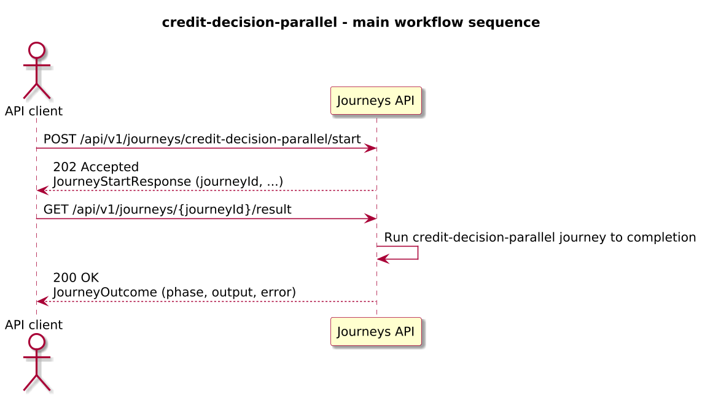
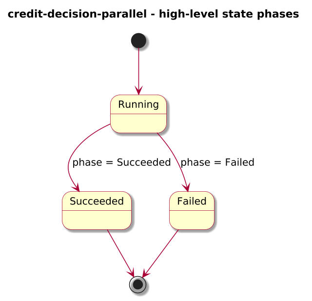
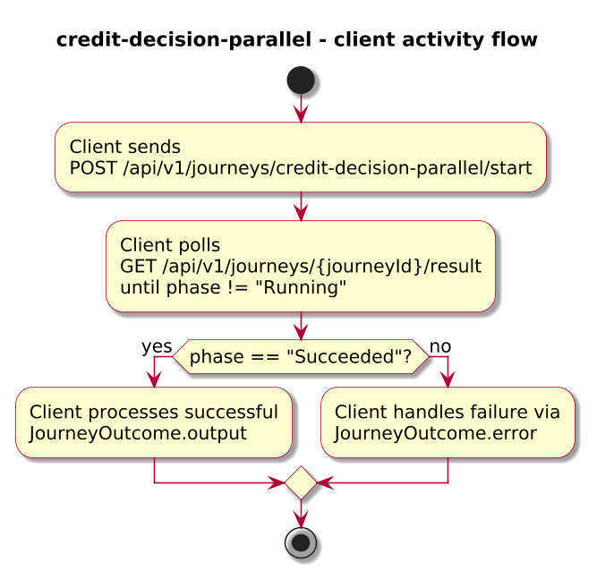

# Journey – credit-decision-parallel

> Credit decision journey that calls risk, limits, and KYC services in parallel and joins the results into a single decision.

## Quick links

| Artifact | File |
|---------|------|
| Journey definition | [credit-decision-parallel.journey.yaml](../technical/credit-decision-parallel/credit-decision-parallel.journey.yaml) |
| OpenAPI (per-journey) | [credit-decision-parallel.openapi.yaml](../technical/credit-decision-parallel/credit-decision-parallel.openapi.yaml) |
| Arazzo workflow | [credit-decision-parallel.arazzo.yaml](../technical/credit-decision-parallel/credit-decision-parallel.arazzo.yaml) |

## Technical pattern

See [credit-decision-parallel.md](../technical/credit-decision-parallel/credit-decision-parallel.md).

## Summary

Credit decision journey that calls risk, limits, and KYC services in parallel and joins the results into a single decision.

## Contracts at a glance

- **Input schema** – see `spec.input.schema` in `credit-decision-parallel.journey.yaml` and the `JourneyStartRequest` schema in `credit-decision-parallel.openapi.yaml`.
- **Output schema** – see `spec.output.schema` in `credit-decision-parallel.journey.yaml` and the `JourneyOutcome.output` schema in `credit-decision-parallel.openapi.yaml`.
- **Named outcomes** – if this journey uses `spec.outcomes`, see the journey definition for outcome labels; otherwise it relies on `JourneyOutcome.phase` and `error.code` only.

## Step overview (Arazzo workflow)

Here’s a breakdown of the steps you’ll call over the Journeys API for the primary workflow described in `credit-decision-parallel.arazzo.yaml`.

| # | Step ID | Description | Operation ID | Parameters | Success Criteria | Outputs |
|---:|---------|-------------|--------------|------------|------------------|---------|
| 1 | `startJourney` | Start a new `credit-decision-parallel` journey instance (synchronous). | `creditDecisionParallel_start` | Body: `startRequest` as defined by JourneyStartRequest. | `$statusCode == 200`, `phase == "SUCCEEDED"` or `"FAILED"`. | `JourneyOutcome` for this journey. |
| 2 | `getResult` | (Optional) Re-fetch the final journey outcome by id. | `creditDecisionParallel_getResult` | Path: `journeyId` from step 1 (or from `JourneyOutcome.journeyId`). | `$statusCode == 200` and `phase` is `SUCCEEDED` or `FAILED`. | `JourneyOutcome` for this journey. |

## Graphical overview

### Sequence diagram

### State diagram

### Activity diagram

## Implementation notes

- See `credit-decision-parallel.journey.yaml` for the full set of states, transitions, and DataWeave expressions that implement this journey.
- The per-journey OpenAPI file `credit-decision-parallel.openapi.yaml` describes the HTTP surface (start, status, result, and any step endpoints).
- The Arazzo workflow `credit-decision-parallel.arazzo.yaml` documents the recommended client workflow over the Journeys API, including polling and any step calls.
