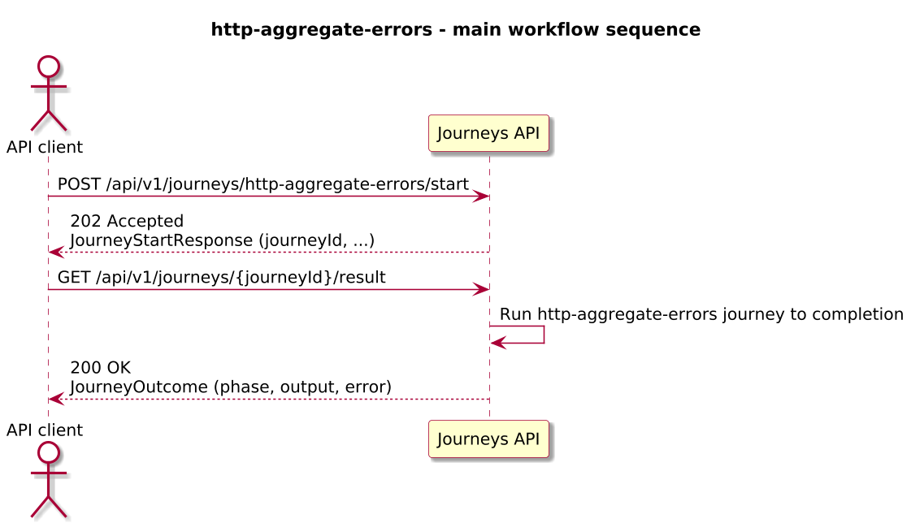
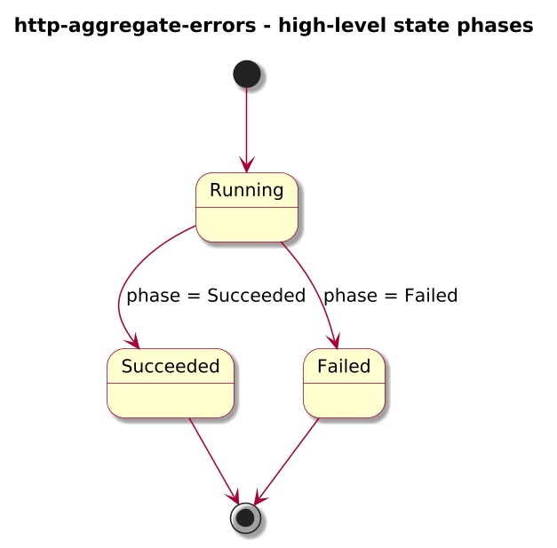
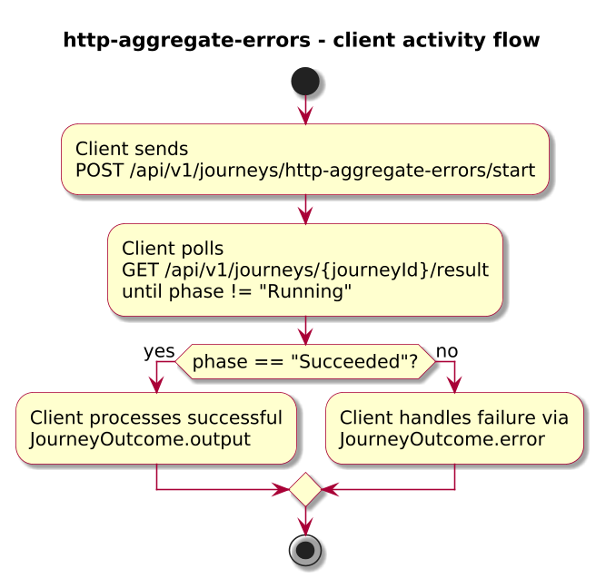

# Journey – http-aggregate-errors

> HTTP journey that calls two upstream services and aggregates failures into a single custom error envelope while keeping Problem Details as the internal model.

## Quick links

| Artifact | File |
|---------|------|
| Journey definition | [http-aggregate-errors.journey.yaml](../technical/http-aggregate-errors/http-aggregate-errors.journey.yaml) |
| OpenAPI (per-journey) | [http-aggregate-errors.openapi.yaml](../technical/http-aggregate-errors/http-aggregate-errors.openapi.yaml) |
| Arazzo workflow | [http-aggregate-errors.arazzo.yaml](../technical/http-aggregate-errors/http-aggregate-errors.arazzo.yaml) |

## Summary

HTTP journey that calls two upstream services and aggregates failures into a single custom error envelope while keeping Problem Details as the internal model.

## Contracts at a glance

- **Input schema** – see `spec.input.schema` in `http-aggregate-errors.journey.yaml` and the `JourneyStartRequest` schema in `http-aggregate-errors.openapi.yaml`.
- **Output schema** – see `spec.output.schema` in `http-aggregate-errors.journey.yaml` and the `JourneyOutcome.output` schema in `http-aggregate-errors.openapi.yaml`.
- **Named outcomes** – if this journey uses `spec.outcomes`, see the journey definition for outcome labels; otherwise it relies on `JourneyOutcome.phase` and `error.code` only.

## Step overview (Arazzo workflow)

Here’s a breakdown of the steps you’ll call over the Journeys API for the primary workflow described in `http-aggregate-errors.arazzo.yaml`.

| # | Step ID | Description | Operation ID | Parameters | Success Criteria | Outputs |
|---:|---------|-------------|--------------|------------|------------------|---------|
| 1 | `startJourney` | Start a new `http-aggregate-errors` journey instance. | `httpAggregateErrors_start` | Body: `startRequest` as defined by JourneyStartRequest. | `$statusCode == 202` and a `journeyId` is returned. | `journeyId` for the new journey instance. |
| 2 | `getResult` | Poll for the final journey outcome once terminal. | `httpAggregateErrors_getResult` | Path: `journeyId` from step 1. | `$statusCode == 200` and `phase` is `Succeeded` or `Failed`. | `JourneyOutcome` for this journey. |

## Graphical overview

### Sequence diagram

### State diagram

### Activity diagram

## Implementation notes

- See `http-aggregate-errors.journey.yaml` for the full set of states, transitions, and DataWeave expressions that implement this journey.
- The per-journey OpenAPI file `http-aggregate-errors.openapi.yaml` describes the HTTP surface (start, status, result, and any step endpoints).
- The Arazzo workflow `http-aggregate-errors.arazzo.yaml` documents the recommended client workflow over the Journeys API, including polling and any step calls.
