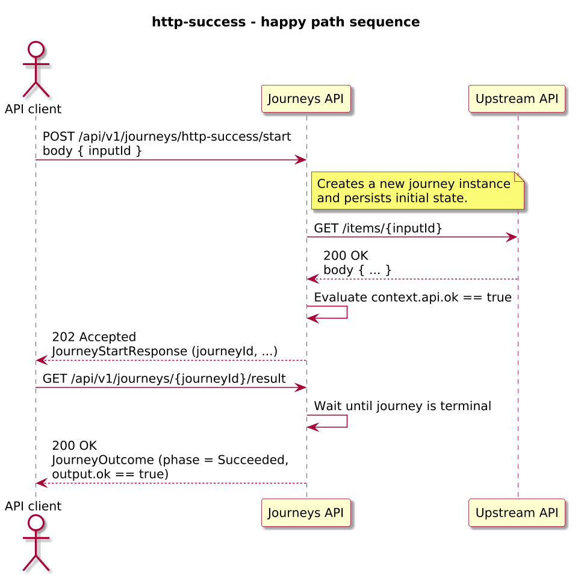
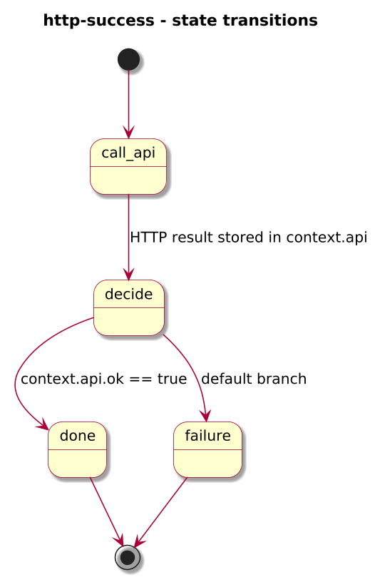
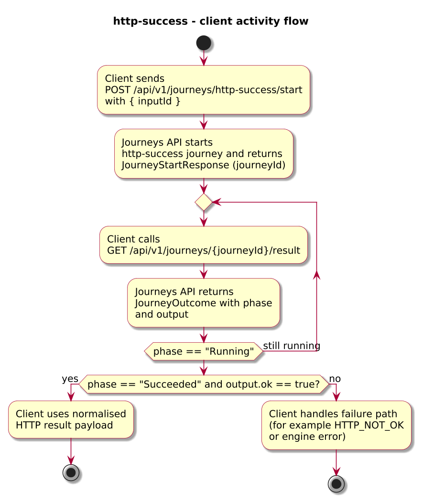

# Journey – http-success

> Simple HTTP 200 success path with JSON body, returning a normalised `{ status, ok, headers, body, error }` envelope from an upstream `GET` call.

## Quick links

| Artifact | File |
|---------|------|
| Journey definition | [http-success.journey.yaml](../technical/http-success/http-success.journey.yaml) |
| OpenAPI (per-journey) | [http-success.openapi.yaml](../technical/http-success/http-success.openapi.yaml) |
| Arazzo workflow | [http-success.arazzo.yaml](../technical/http-success/http-success.arazzo.yaml) |

## Summary

This journey issues a single `GET` request to an upstream HTTP service, checks that the call succeeded, and then returns a structured HTTP result object to the caller. It is the smallest end-to-end example of:

- Making an HTTP call via `task.kind: httpCall`.
- Branching on `context.api.ok`.
- Surfacing the HTTP envelope as the journey’s final `output`.

## Contracts at a glance

- **Input schema** – `JourneyStartRequest` with required `inputId: string`; additional properties are allowed.
- **Output schema** – `HttpSuccessOutput` with:
  - `status: integer` – HTTP status from the upstream call.
  - `ok: boolean` – normalised success flag derived from status.
  - `headers: object<string,string>` – selected response headers.
  - `body: any` – raw JSON response body.
  - `error: { type: string, message?: string, ... }` – populated only on error paths.
- **Named outcomes** – not used for this journey; success/failure are expressed via `JourneyOutcome.phase` and `error.code`.

## Step overview (Arazzo workflow)

Here’s a breakdown of the steps you’ll call over the Journeys API for the happy path described in `http-success.arazzo.yaml`.

| # | Step ID | Description | Operation ID | Parameters | Success Criteria | Outputs |
|---:|---------|-------------|--------------|------------|------------------|---------|
| 1 | `startJourney` | Start a new `http-success` journey instance. | `httpSuccess_start` | Body: `startRequest` with `inputId`. | `$statusCode == 202` and a `journeyId` is returned. | `journeyId` for the new journey instance. |
| 2 | `getResult` | Poll for the final journey outcome once terminal. | `httpSuccess_getResult` | Path: `journeyId` from step 1. | `$statusCode == 200`, `phase == "Succeeded"`, and `output.ok == true`. | `JourneyOutcome` with `output` matching `HttpSuccessOutput`. |

## Graphical overview

### Sequence diagram

### State diagram

### Activity diagram

## Implementation notes

- The journey definition in `http-success.journey.yaml` uses a `task` state (`call_api`) that performs the upstream `GET` and writes the HTTP result into `context.api`.
- A `choice` state (`decide`) evaluates `context.api.ok == true` to decide whether to proceed to `done` or fail with `HTTP_NOT_OK`.
- The `succeed` state (`done`) exposes the `api` object as the final `output` for the journey, which is reflected in the `JourneyOutcome.output` schema in `http-success.openapi.yaml`.
