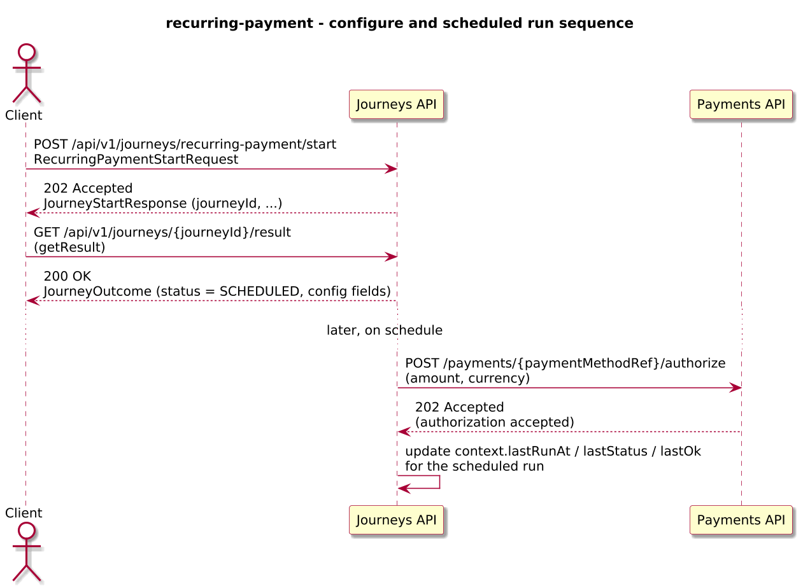
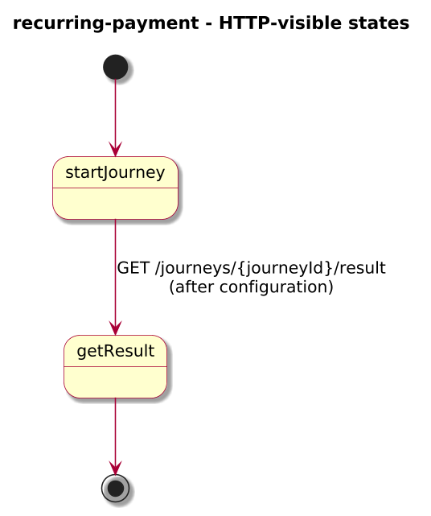
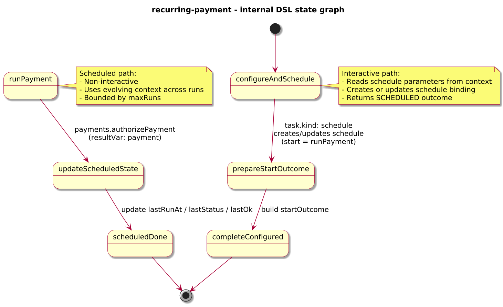

# Journey – recurring-payment

> Recurring payment journey that lets a user configure periodic charges once and then runs non-interactive scheduled payments using `task.kind: schedule:v1`.

## Quick links

| Artifact | File |
|---------|------|
| Journey definition | [recurring-payment.journey.yaml](../technical/recurring-payment/recurring-payment.journey.yaml) |
| OpenAPI (per-journey) | [recurring-payment.openapi.yaml](../technical/recurring-payment/recurring-payment.openapi.yaml) |
| Arazzo workflow | [recurring-payment.arazzo.yaml](../technical/recurring-payment/recurring-payment.arazzo.yaml) |

## Summary

This journey models a simple recurring payment pattern:

- It starts with an interactive run that receives recurring payment configuration (user id, payment method reference, amount, currency, interval, and number of runs).
- The interactive run uses `task.kind: schedule:v1` to create or update a schedule binding that will start future, non-interactive runs at a dedicated state.
- Each scheduled run executes an outbound payment call and updates internal context with basic run metadata (for example `lastRunAt`, `lastStatus`), while the interactive run immediately returns a summary of the schedule configuration.

Scheduled runs are non-interactive: once the schedule is in place, payments execute in the background without additional step calls, aligned with ADR-0017.

## Contracts at a glance

- **Input schema** – `RecurringPaymentStartRequest` with required `userId`, `paymentMethodRef`, `amount`, `currency`, `interval` (ISO-8601 duration such as `P1M`), and `maxRuns`.
- **Output schema** – `RecurringPaymentStartOutcome` exposed via `JourneyOutcome.output` for the interactive run with:
  - `status: "SCHEDULED"`, `userId`, `paymentMethodRef`, `amount`, `currency`, `interval`, and `maxRuns`.
  - Scheduled runs reuse the same journey definition but are triggered by the engine and primarily update internal context fields such as `lastRunAt`, `lastStatus`, and `lastOk`.

## Step overview (Arazzo + HTTP surface)

Here’s a breakdown of the steps you’ll call over the Journeys API for the main “configure and read schedule outcome” workflow described in `recurring-payment.arazzo.yaml`.

| # | Step ID | Description | Operation ID | Parameters | Success Criteria | Outputs |
|---:|---------|-------------|--------------|------------|------------------|---------|
| 1 | `startJourney` | Start a new `recurring-payment` journey instance and create or update the underlying schedule (synchronous). | `recurringPayment_start` | Body: `startRequest` with user id, payment method reference, amount, currency, interval, and maxRuns. | `$statusCode == 200`, `phase == "SUCCEEDED"` or `phase == "FAILED"`. | `JourneyOutcome` with `status == "SCHEDULED"` (mirroring `output.status`) and schedule configuration fields. |
| 2 | `getResult` | (Optional) Re-fetch the initial outcome that summarises the configured schedule. | `recurringPayment_getResult` | Path: `journeyId` from step 1 (or from `JourneyOutcome.journeyId`). | `$statusCode == 200`, `phase == "SUCCEEDED"` or `phase == "FAILED"`. | `JourneyOutcome` with `status == "SCHEDULED"` (mirroring `output.status`) and schedule configuration fields. |

Subsequent scheduled runs are started by the engine based on the created schedule; they do not introduce additional HTTP-visible steps.

## Graphical overview

### Sequence diagram

### State diagram

### Activity diagram

## Internal workflow (DSL state graph)

## Implementation notes

- The interactive path (`configureAndSchedule` → `prepareStartOutcome` → `completeConfigured`) reads schedule parameters from `context`, calls `task.kind: schedule:v1` to create or update a schedule binding (using `subjectId: context.userId`), and then returns a `RecurringPaymentStartOutcome`.
- The scheduled path starts at `runPayment`, which calls `payments.authorizePayment` with the configured `paymentMethodRef`, `amount`, and `currency`, recording the HTTP result in `context.payment`.
- `updateScheduledState` updates `context` with `lastRunAt`, `lastStatus`, and `lastOk` based on the latest run, and `scheduledDone` completes the scheduled instance.
- The journey relies on ADR-0017 semantics: scheduled runs are non-interactive, evolve `context` across runs, and are bounded by `maxRuns`; scheduling configuration lives entirely in the `task.kind: schedule:v1` state.
