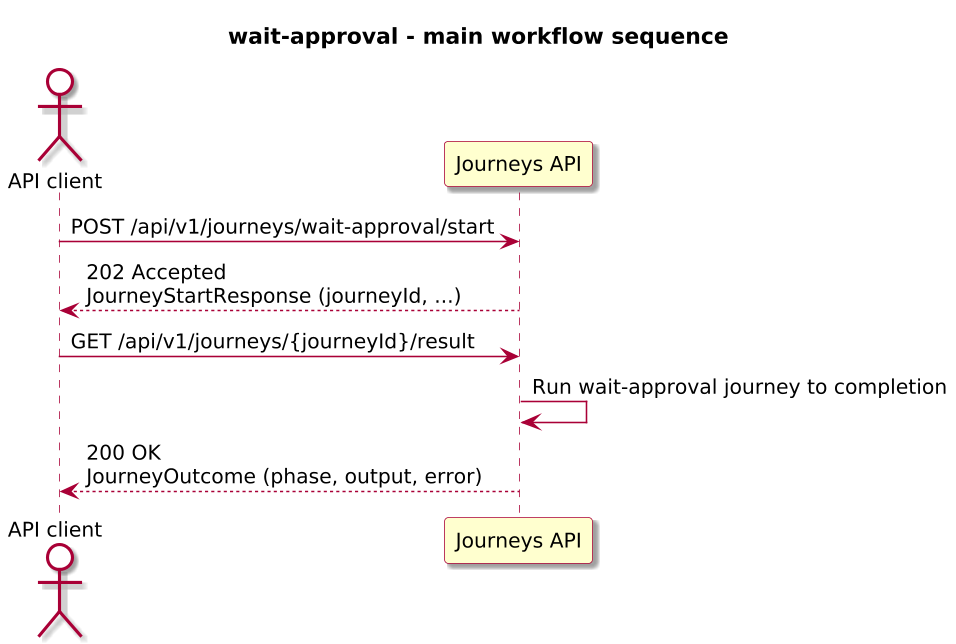
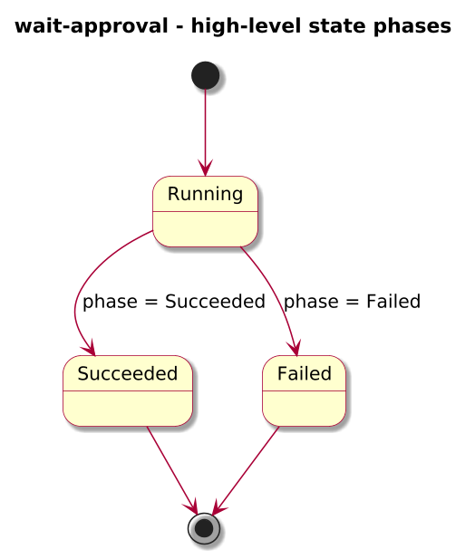
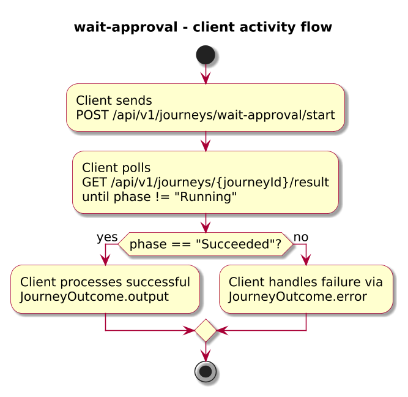
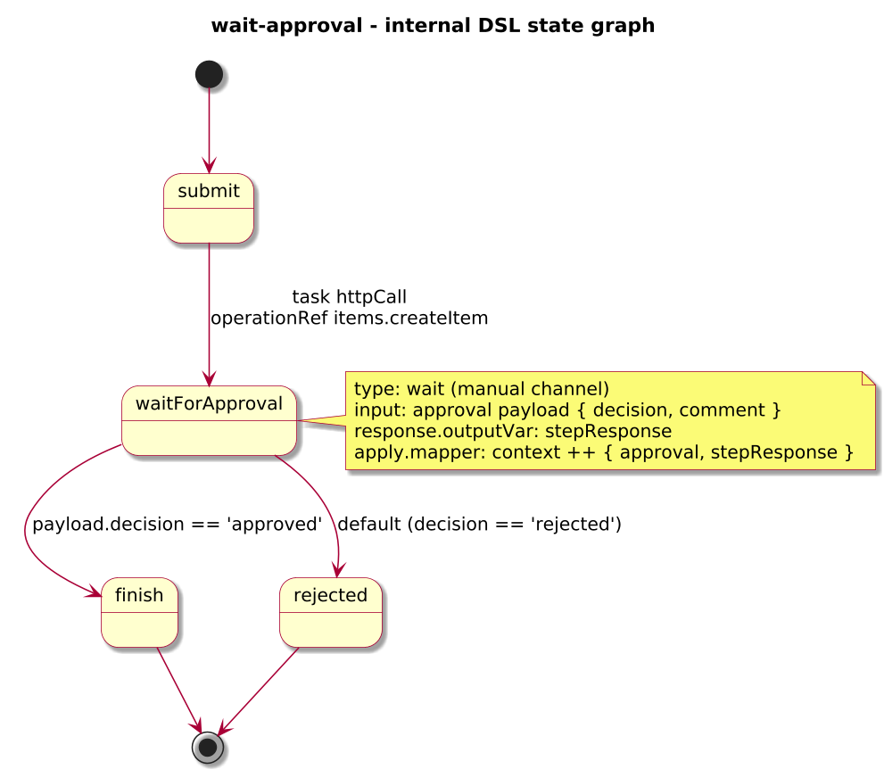

# Journey – wait-approval

> Journey that waits for a manual approval or rejection input before completing, using a `wait` state and step response projection.

## Quick links

| Artifact | File |
|---------|------|
| Journey definition | [wait-approval.journey.yaml](../technical/wait-approval/wait-approval.journey.yaml) |
| OpenAPI (per-journey) | [wait-approval.openapi.yaml](../technical/wait-approval/wait-approval.openapi.yaml) |
| Arazzo workflow | [wait-approval.arazzo.yaml](../technical/wait-approval/wait-approval.arazzo.yaml) |

## Technical pattern

See [wait-approval.md](../technical/wait-approval/wait-approval.md).

## Summary

Journey that waits for a manual approval or rejection input before completing, using a `wait` state and step response projection.

## Contracts at a glance

- **Input schema** – see `spec.input.schema` in `wait-approval.journey.yaml` and the `JourneyStartRequest` schema in `wait-approval.openapi.yaml`.
- **Output schema** – see `spec.output.schema` in `wait-approval.journey.yaml` and the `JourneyOutcome.output` schema in `wait-approval.openapi.yaml`.
- **Named outcomes** – if this journey uses `spec.outcomes`, see the journey definition for outcome labels; otherwise it relies on `JourneyOutcome.phase` and `error.code` only.

## Step overview (Arazzo workflow)

Here’s a breakdown of the steps you’ll call over the Journeys API for the primary workflow described in `wait-approval.arazzo.yaml`.

| # | Step ID | Description | Operation ID | Parameters | Success Criteria | Outputs |
|---:|---------|-------------|--------------|------------|------------------|---------|
| 1 | `startJourney` | Start a new `wait-approval` journey instance (synchronous to the first wait step). | `waitApproval_start` | Body: `startRequest` as defined by JourneyStartRequest. | `$statusCode == 200`, `phase == "RUNNING"`, and `currentState` points at `waitForApproval`. | `JourneyStatus` at the first external-input state. |
| 2 | `provideApproval` | Submit manual approval or rejection for the `waitForApproval` step. | `waitApproval_waitForApproval` | Path: `journeyId`; body: approval payload (for example `decision`, `comment`). | `$statusCode == 200` and `JourneyStatus.phase` reflects the new decision. | Updated `JourneyStatus` after processing the approval input. |
| 3 | `getResult` | Poll for the final journey outcome once terminal. | `waitApproval_getResult` | Path: `journeyId` from step 1. | `$statusCode == 200` and `phase` is `Succeeded` or `Failed`. | `JourneyOutcome` for this journey. |

## Graphical overview

### Sequence diagram

### State diagram

### Activity diagram

## Internal workflow (DSL state graph)

## Implementation notes

- See `wait-approval.journey.yaml` for the full set of states, transitions, and DataWeave expressions that implement this journey.
- The per-journey OpenAPI file `wait-approval.openapi.yaml` describes the HTTP surface (start, status, result, and any step endpoints).
- The Arazzo workflow `wait-approval.arazzo.yaml` documents the recommended client workflow over the Journeys API, including polling and any step calls.
