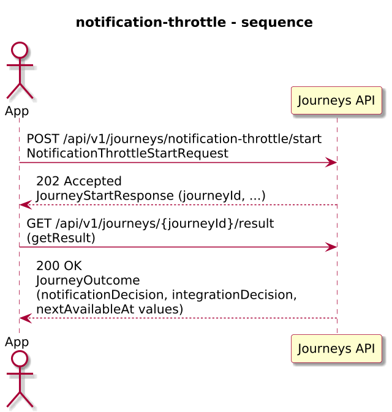
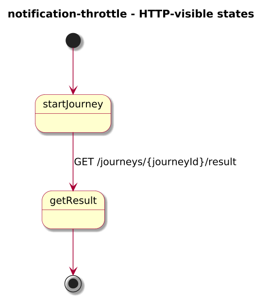
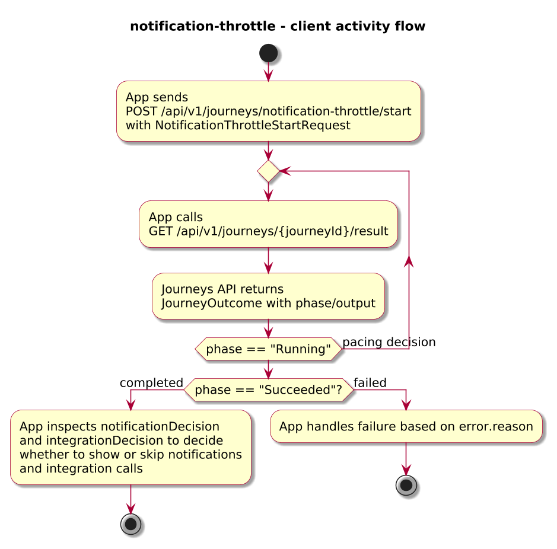
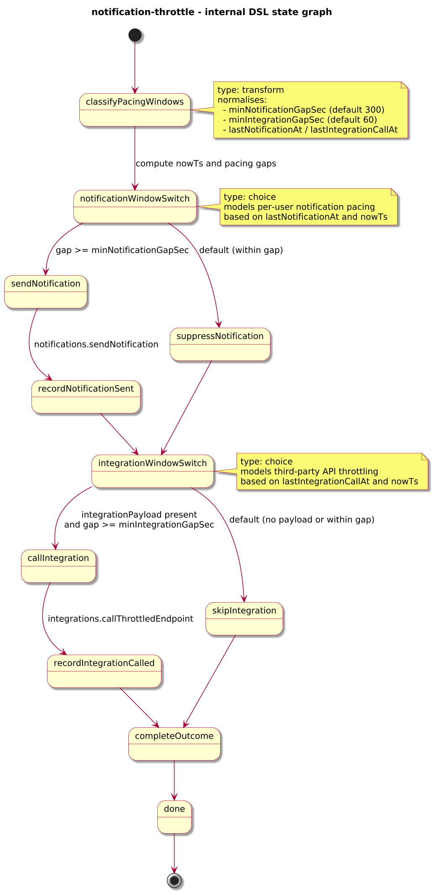

# Journey – notification-throttle

> Combined notification and third-party integration throttling journey that paces user notifications and integration calls using per-user timing windows stored in context.

## Quick links

| Artifact | File |
|---------|------|
| Journey definition | [notification-throttle.journey.yaml](notification-throttle.journey.yaml) |
| OpenAPI (per-journey) | [notification-throttle.openapi.yaml](notification-throttle.openapi.yaml) |
| Arazzo workflow | [notification-throttle.arazzo.yaml](notification-throttle.arazzo.yaml) |
| Docs (this page) | [notification-throttle.md](notification-throttle.md) |

## Summary

This journey models simple user-experience pacing and anti-spam rules:

- It receives a notification request for a user and channel, with an optional integration payload to send to a third-party API.
- It uses `context.lastNotificationAt` and `context.lastIntegrationCallAt` (from previous runs or external seeding) to decide whether enough time has passed since the last notification or integration call.
- If the minimum gap has elapsed, it sends the notification and/or calls the integration; otherwise, it suppresses the notification and skips the integration call.

The journey is typically invoked via a per-user stream of triggers; external systems can inspect and update `lastNotificationAt`/`lastIntegrationCallAt` across runs to implement “no more than once per N seconds/minutes” pacing per user and channel.

Actors & systems:
- Application or back-end service that starts the journey for each notification trigger and inspects the outcome to decide whether a notification was sent or suppressed.
- Notification service called by the journey via HTTP to deliver notifications.
- Third-party integration or webhook endpoint called by the journey for auxiliary actions (for example, CRM updates, analytics).

## Contracts at a glance

- **Input schema** – `NotificationThrottleStartRequest` with required `userId`, `channel`, `message`; optional `integrationPayload`, `minNotificationGapSec`, `minIntegrationGapSec`.
- **Output schema** – `NotificationThrottleOutcome` exposed via `JourneyOutcome.output` with:
  - `userId`, `channel`, `notificationDecision: SENT | SUPPRESSED`, `integrationDecision: CALLED | SKIPPED`, optional `nextNotificationAvailableAt`, `nextIntegrationAvailableAt`.

## Step overview (Arazzo + HTTP surface)

For the main workflow (`notification-throttle-send-and-call`), the steps are:

| # | Step ID | Description | Operation ID | Parameters | Success Criteria | Outputs |
|---:|---------|-------------|--------------|------------|------------------|---------|
| 1 | `startJourney` | Start a new `notification-throttle` journey instance. | `notificationThrottle_start` | Body: `startRequest` with user, channel, message, and optional integration payload. | `$statusCode == 202` and a `journeyId` is returned. | `journeyId` for this pacing decision. |
| 2 | `getResult` | Retrieve the final outcome once notification and integration decisions have been applied. | `notificationThrottle_getResult` | Path: `journeyId` from step 1. | `$statusCode == 200`, `phase == "Succeeded"` or `phase == "Failed"`. | `JourneyOutcome` with `output.notificationDecision` and `output.integrationDecision`. |

Additional runs for the same user/channel can use `nextNotificationAvailableAt` and `nextIntegrationAvailableAt` as inputs into downstream logic to decide when to re-trigger.

## Graphical overview

### Sequence diagram

### State diagram

### Activity diagram

## Internal workflow (DSL state graph)

## Implementation notes

- `classifyPacingWindows` calculates `nowTs`, applies defaults for `minNotificationGapSec` (for example 300 seconds) and `minIntegrationGapSec` (for example 60 seconds), and normalises `lastNotificationAt` and `lastIntegrationCallAt` in `context`.
- `notificationWindowSwitch` compares `nowTs` against `lastNotificationAt` using a conceptual `durationBetween` helper:
  - If enough time has passed, `sendNotification` calls `notifications.sendNotification`; `recordNotificationSent` updates `lastNotificationAt` and computes `nextNotificationAvailableAt`.
  - Otherwise, `suppressNotification` sets `notificationDecision = "SUPPRESSED"` and computes `nextNotificationAvailableAt` based on `lastNotificationAt + minNotificationGapSec`.
- `integrationWindowSwitch` uses the same pattern for `integrationPayload` and `lastIntegrationCallAt`:
  - When allowed, `callIntegration` calls `integrations.callThrottledEndpoint`, and `recordIntegrationCalled` updates `lastIntegrationCallAt` and `nextIntegrationAvailableAt`.
  - When not allowed or `integrationPayload` is missing, `skipIntegration` sets `integrationDecision = "SKIPPED"` and computes `nextIntegrationAvailableAt` from context.
- `completeOutcome` returns a compact `NotificationThrottleOutcome` that callers can use to decide whether to log, show, or retry notifications and integration calls.
